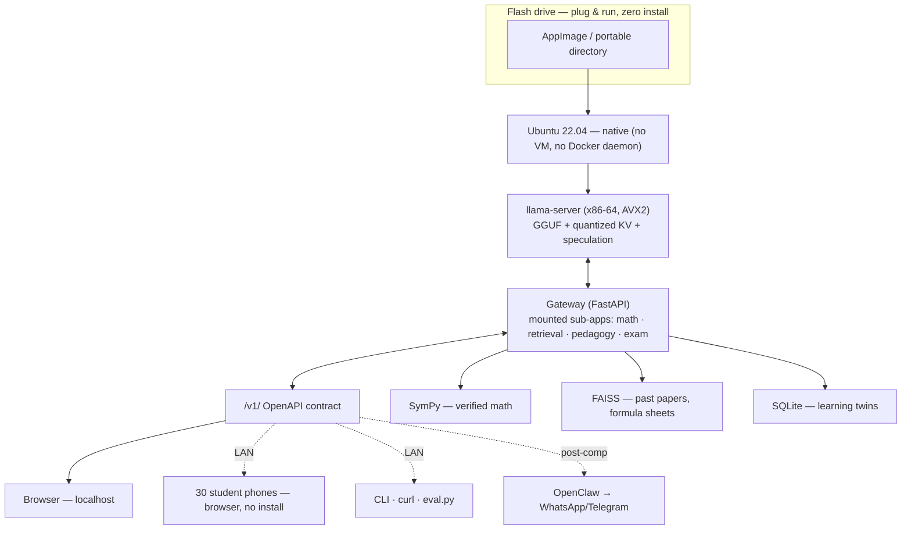

# ADTC 2026 — Offline Adaptive Math Tutor
## Day-by-Day Build Roadmap · Tue 14 Jul → Wed 12 Aug 2026 (30 days)

---

## Operating Parameters

**Deadline:** Wed 12 Aug 2026.
**Build environment:** MacBook Pro M2 Pro, 16 GB. All development inside Docker containers built for `linux/amd64`.
**Target hardware:** i5 (10th–12th gen) / Ryzen 5 (3000–5000), 8 GB DDR4, integrated graphics, 256 GB SSD, Ubuntu 22.04, CPU-only.
**Target hardware access window:** Sun 9 Aug → Wed 12 Aug (borrowed x86 machine, 4 days).
**Deployment form:** container contents extracted to a native portable build on a flash drive; plug into target, run zero-shot, no install.

### The scoring function

$$
S_{\text{total}} = 0.50\,S_{\text{acc}} + 0.30\,S_{\text{perf}} + 0.20\,S_{\text{eff}} - P_{\text{thermal}}
$$

$$
S_{\text{perf}} = 100 \times \frac{\mathrm{TPS}_{\text{act}}}{\mathrm{TPS}_{\text{max}}}, \qquad \mathrm{TPS}_{\text{max}} \approx 15 \ \text{(provisional)}
$$

$$
S_{\text{eff}} = 100 \times \frac{7\,\mathrm{GB} - \mathrm{Peak\ RAM}}{7\,\mathrm{GB}}
$$

$P_{\text{thermal}} = -10$ if package temperature exceeds 85 °C or thermal throttling is flagged.
Hard failure conditions (not point deductions): OOM kill, sandbox execution crash, illegal-instruction fault.

### What $S_{\text{acc}}$ actually measures (README line 24)

The README reads the 50% term as **"tutoring quality → Section 3"**, not as answer accuracy — and that reading is almost certainly right, because ADTC's published scoring describes accuracy and quality as *multiple-choice benchmarks **plus qualitative evaluation***. **This has a large strategic consequence that is easy to miss: the pedagogy work in Phase 4 feeds the 50%-weighted term, not merely the 10-point African Use Case bonus.** A model that answers correctly but tutors badly loses points on the heaviest term in the function.

Two things follow. First, `eval.py` (18 Jul) must measure more than final-answer correctness — a Socratic response that never states the answer is *correct behaviour* and would score zero under exact-match, so the harness needs a mode-aware rubric alongside the accuracy track. Second, the README's pointer to **Section 3** is the claim that tutoring quality is won by SymPy routing, RAG grounding, self-consistency, and safety — the correctness machinery, not the prose. Confirm the qualitative component's exact form in the 14 Jul rules digest; it determines how much of Phase 4 is scored rather than merely demonstrated.

### The README's dependency order (README lines 6–9)

Every phase below is sequenced against this chain. Each group rests on the one above it; nothing is built before the thing it depends on exists.

```
Constraint → Model → Inference → Correctness/Safety → Pedagogy
   → Exam Prep → Interface → Collaboration/Distribution
   → Evaluation/Business → Competition Strategy → Story
(Team Study Shelf runs alongside all of the above.)
```

### The three product bars (README line 3)

The README sets three standards to hit simultaneously, and they are design constraints rather than marketing: **Brilliant's / Marble's interactivity**, **Khan Academy's curriculum breadth**, and **Encarta/Britannica's self-containedness — no server required**. The third is the hardest and the most distinctive: self-containedness means the product is complete in itself on a flash drive, with no network, no account, and no degradation when offline. Every architecture decision in §1 serves it. Judge each feature against all three: an interactive canvas that needs a CDN fails the third bar; a tutor that only covers one topic fails the second.

### The central thesis (README line 38)

> **A small quantized model combined with retrieval and verified tool calls beats a large model squeezed onto constrained hardware.**

This is the project's load-bearing claim, and the roadmap is an argument for it. It is why SymPy routing (25 Jul) precedes every other correctness task, why RAG (27 Jul) is scored on whether it earns its RAM, and why the bake-off (19–22 Jul) ranks on accuracy-per-GB rather than accuracy. If the thesis is right, the report's ablation table (31 Jul) proves it: model-alone versus model+retrieval+verified-tools, measured in points. **The ablation table is the thesis under test** — it is the one artifact that could falsify the whole design, which is exactly why it is worth building.

### Worked example from the README (line 34)

Peak RAM reduction from **4 GB → 3 GB** raises $S_{\text{eff}}$ from **42.9 → 57.1** — a 14.2-point swing on the efficiency term, worth 2.84 points of $S_{\text{total}}$ at the 20% weight. This is the README's own illustration of why one gigabyte matters, and it generalises into the exchange rate below.

### The exchange rate — the most-used number in this project

Differentiating the scoring function gives the marginal value of each resource. Every optimization decision is checked against these three constants.

$$
\frac{\partial S_{\text{total}}}{\partial \mathrm{TPS}} = 0.30 \times \frac{100}{15} = 2.00 \ \text{pts per tok/s}
$$

$$
\frac{\partial S_{\text{total}}}{\partial \mathrm{PeakRAM}} = -0.20 \times \frac{100}{7} = -2.86 \ \text{pts per GB}
$$

$$
\frac{\partial S_{\text{total}}}{\partial \mathrm{Accuracy}} = 0.50 \ \text{pts per accuracy point}
$$

**Break-even rule for any RAM-spending optimization:**

$$
\Delta\mathrm{TPS}_{\text{required}} = \frac{2.86}{2.00} \times \Delta\mathrm{RAM}_{\text{GB}} = 1.43 \times \Delta\mathrm{RAM}_{\text{GB}}
$$

A draft model costing 1 GB must return **≥ 1.43 tok/s** or it is net-negative. A 0.5 GB draft model must return ≥ 0.72 tok/s.

**Break-even rule for any TPS-spending optimization:** an accuracy technique must buy **4 accuracy points per 1 tok/s surrendered**. Self-consistency at N=3 cuts TPS roughly 3× (12 → 4 tok/s = −16 pts) and would need **+32 accuracy points** to pay for itself. It therefore cannot run globally — it must be gated to a small, high-value subset. This is a calculation, not an opinion, and it is why the roadmap gates it.

**Consequences worth internalizing:**
- 1 GB of RAM saved = 2.86 pts = the same as +1.43 tok/s = the same as +5.7 accuracy points.
- Zero-RAM-cost speedups are strictly dominant. Hence draftless n-gram speculation and prompt caching are Phase 1 work, not Phase 3 work.
- The RAM term is linear and the thermal penalty is a cliff: RAM is a dial, temperature is a wall.

### The one fact that governs CPU optimization

**Autoregressive decode on CPU is memory-bandwidth bound, not compute bound.** The processor spends most of its time waiting for weights to stream from DDR4, not doing arithmetic. Everything follows from this:
- Shrinking bytes-moved-per-token (quantization, KV compression) buys more than making arithmetic faster.
- Speculative decoding wins because verifying k tokens costs roughly one weight-read instead of k — but on an *already-small, already-fast* model the draft overhead can exceed the gain and make generation slower.
- More threads stop helping once bandwidth saturates, but keep producing heat — which is why the thread cap is a scoring decision, not a performance one.

[*LLM Inference Unveiled: Survey and Roofline Model Insights* (arXiv:2402.16363): https://arxiv.org/abs/2402.16363 · LLM Inference Optimization practical guide (2026): https://jobsbyculture.com/blog/llm-inference-optimization-guide-2026 · llama.cpp speculative decoding overview: https://deepwiki.com/ggml-org/llama.cpp/8.3-speculative-decoding]

### Team lanes

- **Lane A — Systems/Runtime:** containers, build flags, llama.cpp, quantization, profiling, packaging.
- **Lane B — ML/Correctness:** bake-off, SymPy routing, RAG, fine-tune, evaluation harness.
- **Lane C — Product/Pedagogy:** curriculum graph, tutoring modes, exam generator, UI, demo.

**Standing rule:** every optimization is recorded as a before/after row the day it lands, scored through `score.py`. The report table is built continuously.

### Optimization priority ladder (highest value-per-day first)

Derived from the exchange rate, not from taste. The phases execute this order.

| Tier | Technique | RAM cost | Expected effect | Phase |
|---|---|---|---|---|
| **0 — free** | Draftless n-gram / prompt-lookup speculation | **zero** | TPS ↑ on math + RAG-echo output | 1 |
| **0 — free** | Prompt/prefix caching (`--cache-reuse`) | tunable | TTFT ↓ up to ~93% on repeated prefixes | 1 |
| **0 — free** | `mmap` loading, thread cap, ctx trim | negative | RAM ↓, thermal margin ↑ | 1 |
| **0 — free** | Unsloth Dynamic 2.0 GGUFs vs stock quants | zero | accuracy ↑ for a download | 1–2 |
| **1 — core** | Weight quantization ladder (F16→Q8→Q4_K_M) | large ↓ | RAM ↓↓, TPS ↑ | 1–2 |
| **1 — core** | KV-cache quantization (q8_0 → q4_0) | large ↓ | RAM ↓↓ | 1–2 |
| **2 — model** | Bake-off on accuracy-per-GB at optimized settings | — | picks the operating point | 2 |
| **2 — model** | Adaptive precision routing (Q4 arithmetic / Q8 proofs) | medium | accuracy ↑ where it matters | 3 |
| **3 — spec** | Native MTP drafting (`--spec-type draft-mtp`) | small | TPS ↑ if model has MTP heads | 3 |
| **3 — spec** | Draft-model speculation (`draft-simple`) | ~0.4–1 GB | must clear the 1.43×ΔRAM bar | 3 |
| **4 — frontier** | TurboQuant 3-bit KV (ICLR 2026) | large ↓ | RAM ↓↓↓ if merged/portable | 3 (innovation window) |
| **4 — frontier** | EAGLE-3 / DFlash drafting | model-specific | TPS ↑↑ if checkpoint exists | 3 (innovation window) |
| **4 — frontier** | 3-bit / sub-4-bit weights (ParetoQ regime) | large ↓ | needs care; QAT below 3-bit | 3 (innovation window) |

### Foundational viewing — before Phase 1 work begins

- Andrej Karpathy, *Deep Dive into LLMs like ChatGPT* (~3.5 h) — [chapter index](https://www.classcentral.com/course/youtube-deep-dive-into-llms-like-chatgpt-428188)
- Karpathy, [nanochat](https://github.com/karpathy/nanochat) (Oct 2025) — full-stack LLM in ~8,000 readable lines: tokenizer → pretrain → SFT → GRPO → KV-cached inference → web UI. The current successor to nanoGPT and capstone of the in-development [LLM101n](https://github.com/karpathy/LLM101n).
- Karpathy, [nanoGPT](https://github.com/karpathy/nanoGPT) · [Neural Networks: Zero to Hero](https://karpathy.ai/zero-to-hero.html)
- 3Blue1Brown, [Neural Networks series](https://www.3blue1brown.com/topics/neural-networks)
- [*On-Device LLMs: State of the Union, 2026*](https://v-chandra.github.io/on-device-llms/) (Meta) — the best current map of the edge-inference landscape.
- [*On-Device LLMs in 2026: What Changed, What Matters, What's Next*](https://www.edge-ai-vision.com/2026/01/on-device-llms-in-2026-what-changed-what-matters-whats-next/) (Edge AI & Vision Alliance)

---

---

## Architecture

### A.1 Deployment form — native portable application

Docker is the **development** environment, not the deployment target. On the target machine there is no daemon, no compose, no VM: the container's `linux/amd64` contents are extracted into a native portable build (AppImage or portable directory) that launches zero-shot from a flash drive. The reasoning, worth recording because the report scores rejected alternatives:

- **VM — rejected.** 1–2 GB of the 7 GB budget consumed before the model loads, at 2.86 pts/GB, plus boot friction that kills the plug-and-run demo.
- **Container at deployment — rejected.** Requires the Docker daemon pre-installed on a machine that will not have it; "install Docker first" is not zero-shot.
- **Container in development — adopted.** Reproducible, `linux/amd64` from day one so the binaries inside are already x86-64 ELF, and CI-buildable. The 9 Aug step is extraction and verification, not a rebuild.

### A.2 Service architecture — logical microservices, collapsed process topology

**Build backend-first, contract-first, headless.** The backend is a container exposing HTTP endpoints any frontend can connect to; the browser UI is the first client, not a privileged one. Everything the product does is reachable by `curl` before a single pixel exists.

**Four things this buys that the project needs anyway:**
- **The 50%-weighted term gets validated headless.** $S_{\text{acc}}$ is tutoring quality; if it is only testable through a UI, it is only testable late. `eval.py` hits the same endpoints the UI will.
- **The classroom demo stops being special.** Thirty phones are thirty API clients. Shared-laptop mode is not a feature to build — it is what an HTTP server already is.
- **OpenClaw (README §6) becomes a client, not an integration.** WhatsApp/Telegram → the same `/v1/chat`.
- **A slipping UI stops being fatal.** A demoable backend with a bare client beats a beautiful client with no backend.

**The decomposition (logical boundaries):**

| Service | Owns | Why it is its own boundary |
|---|---|---|
| `inference` | `llama-server`, GGUF, KV cache, speculation | Already a separate process with an HTTP API — the boundary exists whether or not we draw it |
| `math` | SymPy routing, verification, units | Must be sandboxed and timeout-bounded; a hang here cannot take the gateway with it |
| `retrieval` | FAISS index, embedder, context assembly | The one service with a real memory footprint of its own |
| `pedagogy` | Curriculum DAG, learning twin, modes, personas | Pure logic + SQLite; changes daily, so benefits most from isolation |
| `exam` | Question generator, marking schemes, WAEC-Bench | Independently testable against known-good items |
| `gateway` | Contract surface, routing, static UI | The only service any client addresses |

**The deploy-time decision.** Docker is rejected at deployment (A.1), so nothing orchestrates N processes on the target — a supervisor would have to launch, health-check and restart them, and **a crash in any one service is a sandbox execution crash: disqualification, not a deduction.** Each Python service also costs an interpreter plus framework, roughly **60–100 MB RSS**; five is ~300–500 MB ≈ **1.4 points of $S_{\text{eff}}$**, with no shared memory between them.

So: **separate services in dev, mounted sub-applications in one process at deploy.** FastAPI's `app.mount()` makes the collapse a config change, not a refactor. Each service is developed, tested and adversarially reviewed independently against its own contract; at ship time they co-locate. **The HTTP contract is what buys frontend independence — not the process count.** Target topology on the target machine: **two processes**, `llama-server` and the mounted gateway.

This is also the Four-Step method (14 Jul) in structural form: the service boundaries *are* Step 3's clean partition, and the frozen OpenAPI contract is the Step 2 tribal knowledge that lets parallel lanes work without real-time coordination.

### A.3 The stack



Read it in dependency order: flash drive carries a portable app → runs natively on Ubuntu → `llama-server` hosts the model behind localhost HTTP → the gateway does the product work (tool routing, retrieval, persona assembly, mastery) → **every client speaks only `/v1/`**. The model is a component inside the system, never the system.

### A.4 Mac → x86 discipline

Model files, corpus, RAG index, all Python, all frontend and all config port cleanly — none care about CPU architecture. The container is built `linux/amd64` from 14 Jul so the compiled binaries are already correct for the target. Benchmarks are the one thing that does not port: **every number in the report comes from the target box (9–11 Aug), never the Mac.**

---

# PHASE 1 — Foundation, Instrumentation & Free Optimizations
### Tue 14 Jul – Sat 18 Jul (5 days)

**Phase exit criteria:** `linux/amd64` container builds `llama.cpp` reproducibly with AVX2 baseline; `llama-server` answers; the harness emits accuracy/TPS/RAM/temp through `score.py`; **every zero-RAM-cost optimization measured and enabled**; quantization and KV ladders mapped on the stock model; exam corpus parsed.

**Rationale for the sequencing:** the ladders are learned here, on a throwaway stock model, *before* the bake-off. A bake-off run at naive FP16 settings measures an operating point the project will never ship. Candidates must be compared at the settings they would actually be deployed under.

---

## Tue 14 Jul
**Tasks and Resources**

* **[Lane A]** Initialize monorepo: `/runtime` (llama.cpp build + Dockerfiles), `/orchestrator` (FastAPI), `/ui`, `/corpus`, `/bench`, `/docs`. Add `.gitattributes` for LFS on GGUF artifacts. [Git LFS: https://git-lfs.com · Repo conventions: https://docs.github.com/en/repositories]

* **[Lane A]** Create the base `Dockerfile` targeting `linux/amd64` explicitly (`FROM --platform=linux/amd64 ubuntu:22.04`), matching the target OS exactly. Install build-essential, cmake, git, python3.10, pip, lm-sensors. Confirm buildx emulation via `docker buildx ls`. Because the image is built `linux/amd64` from day one, the binaries inside are already x86-64 ELF — 9 Aug becomes extraction and verification, not a rebuild. [Docker multi-platform: https://docs.docker.com/build/building/multi-platform/ · buildx: https://docs.docker.com/reference/cli/docker/buildx/ · QEMU setup: https://docs.docker.com/build/building/multi-platform/#qemu]

* **[Lane A]** Document the build-flag decision in `/docs/build-flags.md`: **AVX2 baseline**, runtime feature detection for wider ISA, never `-mavx512`. Rationale for the record: Ryzen 5000 (Zen 3) has no AVX-512; 12th-gen Intel consumer parts have it fused off; an AVX-512 binary faults with illegal instruction on much of the target field, which is a hard failure. [Intel ISA lookup: https://www.intel.com/content/www/us/en/support/articles/000058054/processors.html · llama.cpp build docs: https://github.com/ggml-org/llama.cpp/blob/master/docs/build.md · AVX-512 CPU matrix: https://en.wikipedia.org/wiki/AVX-512#CPUs_with_AVX-512]

* **[All]** Read the full ADTC 2026 rules, scoring breakdown, submission requirements, report template and local profiler. Extract into `/docs/rules-digest.md`. **Answer these six questions specifically — each changes a design decision:**
  1. **Does the profiler measure raw model TPS or end-to-end system TPS?** Decides whether SymPy routing, RAG and self-consistency are free or expensive. Highest-value unknown in the project.
  2. Is $\mathrm{TPS}_{\text{max}}$ fixed at 15, or set by the fastest submission observed?
  3. Is peak RAM measured as RSS or PSS, whole-process-tree or single PID?
  4. Is prompt-processing (prefill) throughput scored, or only generation (decode)?
  5. What triggers the thermal flag — a sustained average or an instantaneous spike?
  6. What is in the official validation set, and is a sample published?
  
  [ADTC 2026 Devpost: https://adtc-2026.devpost.com/ · Africa AI X-Prize: https://africaaixprize.org/#challenge]

* **[Lane B]** Implement `/bench/score.py`. **Inputs:** `accuracy` (0–100), `tps_actual`, `tps_max` (default 15), `peak_ram_gb`, `ram_budget_gb` (7.0), `max_temp_c`, `throttled` (bool), `oom_or_crash` (bool). **Process:** (1) if `oom_or_crash`, return a `DISQUALIFIED` sentinel — never a number, so a crashed config can never be silently ranked against working ones; (2) $S_{\text{acc}}$ = accuracy; (3) $S_{\text{perf}} = 100 \times \min(\mathrm{tps\_act}/\mathrm{tps\_max},\ 1.0)$, clamped because beating the fastest observed should not score above 100; (4) $S_{\text{eff}} = 100 \times (7 - \mathrm{peak\_ram})/7$, clamped to $[0,100]$ but **emitting a loud warning if the raw value is negative**, since that means the run exceeded budget and is a disqualification risk; (5) $P_{\text{thermal}} = 10$ if temp > 85 or throttled; (6) combine. **Outputs:** a dataclass carrying `S_total`, all four components, the points each contributed, the disqualification flag, and **the exchange-rate block** — marginal points per tok/s, per GB, per accuracy point, plus the break-even ΔTPS for a given ΔRAM. The exchange rate is what makes this a decision tool rather than a scoreboard. Add `compare(run_a, run_b)` reporting which component drove the delta. [Formulas above · dataclasses: https://docs.python.org/3/library/dataclasses.html · pytest: https://docs.pytest.org/]

* **[Lane B]** Write `/bench/test_score.py` covering the cases that matter: peak RAM > 7 GB, TPS > TPS_max, exactly 85.0 °C, OOM sentinel propagation, break-even calculation. The scoring function is the compass; a silent bug in it misdirects a month.

* **[Lane C]** Draft the product one-pager: two MVP tutoring modes (Socratic, subgoal worked-solutions), one exam board (WAEC/WASSCE math), shared-laptop classroom mode, English + one African language. Circulate for sign-off so scope is fixed before code. [README.md Sections 4–7 · Brilliant: https://brilliant.org · Khan Academy: https://www.khanacademy.org · Marble: https://withmarble.com/]

* **[All]** Work through the agent-skills setup referenced in the README before tooling decisions harden — it is the project's nominated dev-environment baseline. [addyosmani/agent-skills: https://github.com/addyosmani/agent-skills]

* **[Lane A]** **Start the continuous paper-reading habit today, not in Phase 7 — the README is explicit that this is how you find things you would not otherwise figure out, even with AI.** Its own example is AWQ: you do not stumble onto activation-aware quantization by prompting; you find it by reading edge-optimization papers and **chasing their references**, because the citation graph is the map. Budget ~45 minutes daily per systems-lane member, log each paper in `/docs/reading-log.md` with one line on whether it is actionable here, and treat reference lists as the primary artifact rather than the abstracts. The 28–30 Jul innovation window is only as good as what this habit surfaces before it — everything adopted there was found by someone reading. [llm-awq (the README's own example): https://github.com/mit-han-lab/llm-awq · AWQ (arXiv:2306.00978): https://arxiv.org/abs/2306.00978 · arXiv cs.LG recent: https://arxiv.org/list/cs.LG/recent · Connected Papers: https://www.connectedpapers.com/ · Semantic Scholar: https://www.semanticscholar.org/ · Papers with Code — model compression: https://paperswithcode.com/task/model-compression · Kernel & systems study shelf, Appendix A]

* **[Lane A]** Schedule the **kernel study shelf** (README §2) as real reading rather than a bookmark list: one worklog per week for the systems lane, starting with the **CPU-side companion** of the salykova GEMM tutorial, since the deployment target has no GPU. The README's own justification is that the methodology — tiling, memory hierarchies, why a kernel is bandwidth-bound — transfers to CPU AVX2 even with no GPU to deploy on, and it is the intellectual grounding for both the 30% throughput term and the Sprint 3 build-your-own-engine track. [Kernel & systems study shelf, Appendix A · salykova GEMM (CPU companion): https://salykova.github.io/gemm-gpu · siboehm CUDA MMM worklog: https://siboehm.com/articles/22/CUDA-MMM · GPU Puzzles: https://github.com/srush/GPU-Puzzles · Modal GPU glossary: https://modal.com/gpu-glossary · Everything I learned about local LLMs: https://nullprogram.com/blog/2024/11/10/]

* **[All]** **Adopt the README's Four-Step Guide to AI-Assisted Codebase Work as the team's standing engineering protocol (README lines 174–181), and record it in `/docs/working-method.md`.** Two of the four steps this roadmap already implements without having named them; two are genuinely absent and need building.

  **Step 1 — have the model study before it writes.** Before generating code for any task, the model reads the existing code (or the spec) and produces an explicit plan describing what must happen and why. Skipping it means pattern-matching starts before the constraints are understood. *Status: this roadmap is that artifact at project level; at task level it is not yet a habit.* **Make it one:** every task above 50 lines of code opens with a written plan committed to `/docs/plans/` before implementation, reviewed by one other lane. The cost is minutes; the failure it prevents is a day.

  **Step 2 — externalize the tribal knowledge.** Force the ownership rules, lifetimes, invariants and "why this weird workaround exists" out of developers' heads and into explicit structured form, because implementation agents cannot ask clarifying questions mid-task and unwritten knowledge gets guessed at, with guesses compounding into bugs. *Status: already deeply implemented and worth recognising as such* — `/docs/build-flags.md` (why AVX2, not AVX-512), `/docs/rules-digest.md`, `/runtime/VERSIONS.md`, `/bench/PROTOCOL.md`, `/docs/quant-types.md`, `/docs/model-decision.md`, `/docs/smoke-fixture.md`, `/docs/frontier-log.md`, `/docs/native-extraction-plan.md`, `/docs/target-day-runbook.md`. Each exists precisely because the reasoning behind a decision is worthless in someone's head. **Keep the discipline:** no decision is made in a standup and left there.

  **Step 3 — parallelize, but partition cleanly.** Split into independent units and assign parallel agents, which works *only* because Step 2 resolved the cross-cutting knowledge first — parallel agents cannot coordinate in real time, so ambiguity must be eliminated before they start, not discovered after. *Status: this is exactly what Lane A / Lane B / Lane C are*, and the roadmap's directory partition (`/runtime`, `/orchestrator`, `/ui`, `/corpus`, `/bench`) is the clean boundary the step requires. **Strengthen it:** give each lane its own git worktree so parallel work never contends on the same tree, and treat the API contract (19 Jul) and the corpus schema (16 Jul) as the two cross-cutting artifacts that must be frozen before parallel work begins — they are the ambiguity that would otherwise be discovered late.

  **Step 4 — pair every writer with an adversarial reviewer.** Each implementer gets a separate reviewer in an *isolated context window* whose only job is to assume the output is wrong and find why. Parallel agents move fast and do not self-correct, so the review layer must be structurally separate — not the same context, not optimistic by default — or errors get rubber-stamped. **Status: entirely absent from this roadmap, and it is the gap that matters most**, because Phases 1–3 are exactly the "parallel agents moving fast" condition the step is designed to catch. **Build it:** every implementation task gets a reviewer from a different lane, in a fresh context, briefed adversarially. Apply it hardest where a silent bug is most expensive — `score.py` (a wrong compass misdirects a month), `profile.py` (a wrong number invalidates the report), the Paper 2 rubric grader (an unvalidated grader is a random number generator), and the memory guard (a failure here is disqualification, not a deduction).

  [README lines 174–181 · Git worktrees: https://git-scm.com/docs/git-worktree · Sebastian Raschka on local coding agents: https://magazine.sebastianraschka.com/p/using-local-coding-agents · addyosmani/agent-skills: https://github.com/addyosmani/agent-skills]

* **[All]** Assign lanes, set a daily 15-minute standup, create `/bench/optimization-log.md` with columns: date, change, before, after, ΔTPS, ΔRAM, ΔAcc, Δ$S_{\text{total}}$, verdict. **Add the standing review rule from Step 4: no task is marked done until an adversarial reviewer from another lane has tried to break it and failed.**

---

## Wed 15 Jul
**Tasks and Resources**

* **[Lane A]** Clone `llama.cpp` into `/runtime`, build inside the `linux/amd64` container with CMake. Flags: `-DGGML_NATIVE=OFF` (so the build does not auto-tune to the build host), `-DGGML_AVX2=ON`, `-DGGML_AVX512=OFF`, `-DGGML_F16C=ON`, `-DGGML_FMA=ON`. Confirm ELF x86-64 output via `file`. [llama.cpp: https://github.com/ggml-org/llama.cpp · Build docs: https://github.com/ggml-org/llama.cpp/blob/master/docs/build.md · CMake: https://cmake.org/cmake/help/latest/]

* **[Lane A]** Launch `llama-server` inside the container with a mapped port. Confirm `/v1/chat/completions`, `/v1/completions`, `/health`, `/props`, `/slots` respond. Record the command in `/runtime/run.sh`. [llama-server README — full flag reference: https://github.com/ggml-org/llama.cpp/blob/master/tools/server/README.md · OpenAI schema: https://platform.openai.com/docs/api-reference/chat]

* **[Lane A]** Pin versions in `/runtime/VERSIONS.md`: llama.cpp commit SHA, Ubuntu base image digest, Python version. Reproducibility is load-bearing because the 9 Aug extraction must produce the same binaries as the container.

* **[Lane B]** **Download the smoke-test fixture: Qwen3-0.6B-Instruct at Q4_K_M (~400 MB), plus Q8_0 (~600 MB) to prove the quant path.** Record the selection rationale in `/docs/smoke-fixture.md`: the fixture's job is proving the *pipeline*, so the criterion is the smallest architecturally boring model that is definitely supported — every exotic feature is a place a pipeline bug can hide. (a) ~400 MB loads in seconds even under QEMU emulation, keeping the loop tight; (b) plain dense transformer with standard GQA — no vision projector, no MTP heads, no linear-attention layers, so a failure means the build, not the model; (c) long-supported in llama.cpp, so failures are unambiguous; (d) deliberately *not* a shipping candidate, so fixture is never confused with contender; (e) Qwen tokenizer family, so it doubles as a draft-model rehearsal later. **Rejected:** Qwen3.5-4B is a likely candidate and ships a separate mmproj vision file (which currently breaks Ollama GGUF loading), adding moving parts; R1-Distill-1.5B emits long `<think>` blocks, making smoke runs slow and noisy; TinyLlama is obsolete; anything 7B+ wastes days under emulation. [Qwen3-0.6B: https://huggingface.co/Qwen/Qwen3-0.6B · GGUF quant types: https://huggingface.co/docs/hub/gguf#quantization-types · Unsloth Dynamic 2.0 collection: https://huggingface.co/collections/unsloth/unsloth-dynamic-20-quants]

* **[Lane B]** Load the fixture via `llama-server`, send a math prompt, confirm a coherent completion. First end-to-end proof of life.

* **[Lane B]** Build `/docs/quant-types.md`: decision table mapping each GGUF type (Q4_0, Q4_K_M, Q5_K_M, Q6_K, Q8_0, F16, plus Unsloth's UD-Q4_K_XL / UD-Q3_K_XL / UD-Q2_K_XL dynamic variants) to expected size, expected quality, intended role. [nor-blog quantization walkthrough: https://nor-blog.pages.dev/posts/2025-05-14-quantization/ · HF quantization overview: https://huggingface.co/docs/transformers/main/en/quantization/overview · Unsloth Dynamic 2.0: https://unsloth.ai/docs/basics/unsloth-dynamic-2.0-ggufs]

* **[Lane C]** Inventory exam sources for WAEC/WASSCE, JAMB, NECO, BECE, KCSE, Matric: format, years, licensing status, whether worked solutions accompany questions. Output `/corpus/sources.md`. [WAEC: https://www.waecdirect.org · JAMB: https://www.jamb.gov.ng · Kolibri: https://learningequality.org/kolibri/ · Kiwix: https://library.kiwix.org]

---

## Thu 16 Jul
**Tasks and Resources**

* **[Lane A]** Write `/bench/profile.py`. **Inputs:** `server_url`, prompt fixture set, run tags (model/quant/flags/env), fixed sampling params, `n_repeats`. **Process:** (1) record provenance — CPU model, core count, ISA flags, RAM, OS, git SHA, llama.cpp SHA, full launch flags — because a number without provenance is unusable in the report; (2) measure idle RSS and temperature as a baseline so deltas mean something; (3) **start the sampler thread at 100 ms intervals *before* issuing the request** — model load is typically the RAM high-water mark, and a sampler started afterwards misses it entirely; (4) issue the request with `stream: true`; (5) capture `t_request_sent`, `t_first_token` (TTFT), `t_last_token`, token counts; (6) read `llama-server`'s own `timings` object (`prompt_n`, `prompt_ms`, `predicted_n`, `predicted_ms`) and cross-check against wall clock — divergence means a measurement bug; (7) stop the sampler, compute peak/mean RSS, peak/mean temperature, whether throttling fired; (8) emit one JSON line. **Outputs:** JSONL of `{run_id, timestamp, env, git_sha, llamacpp_sha, model, quant, flags, ctx_size, threads, prompt_tokens, gen_tokens, ttft_ms, prompt_tps, gen_tps, peak_rss_mb, peak_pss_mb, idle_rss_mb, peak_temp_c, throttled, energy_j, notes}`, concatenating into a dataset that feeds `score.py` directly. [psutil: https://psutil.readthedocs.io/en/latest/ · llama-server `timings`: https://github.com/ggml-org/llama.cpp/blob/master/tools/server/README.md · lm-sensors: https://github.com/lm-sensors/lm-sensors · Thermal sysfs: https://www.kernel.org/doc/Documentation/thermal/sysfs-api.txt]

* **[Lane A]** Handle the two measurement subtleties that would otherwise corrupt every RAM number in the project. **(1) `mmap` makes RSS misleading** — model pages are file-backed and evictable, so RSS counts them while true memory pressure is lower; record **PSS** from `/proc/[pid]/smaps_rollup` alongside RSS, and record which one the ADTC profiler uses. **(2) Measure the whole process tree**, not one PID — `llama-server` + orchestrator + Python + FAISS + the embedding model all count against the same 7 GB. [smaps_rollup / PSS: https://www.kernel.org/doc/Documentation/filesystems/proc.txt · psutil process trees: https://psutil.readthedocs.io/en/latest/#psutil.Process.children · mmap(2): https://man7.org/linux/man-pages/man2/mmap.2.html]

* **[Lane A]** **Add `llama-bench` to the same `/bench` harness as an independent cross-check.** `llama-bench` is a separate llama.cpp binary measuring raw engine throughput (prompt-processing `pp` and text-generation `tg`) with its own internal timing — no HTTP, no tokenizer round-trip, no orchestrator. The two tools answer different questions: `profile.py` measures **end-to-end through the product** (what gets scored); `llama-bench` measures **the engine ceiling** (what is achievable). **The gap between them is this team's own stack overhead** — if `profile.py` reports 8 tok/s and `llama-bench` reports 14 on the same model and flags, that 6 tok/s gap is orchestration, not the model, and at 2.0 pts per tok/s it is worth 12 points of $S_{\text{perf}}$ that no amount of quantization will recover. Wire both behind `make bench`, writing to the same JSONL tagged `harness: "profile" | "llama-bench"`, so the gap is tracked as a first-class metric on every commit. [llama-bench: https://github.com/ggml-org/llama.cpp/tree/master/tools/llama-bench · Benchmark-reporting discipline: https://carteakey.dev/blog/local-inference/local-llm-optimization/]

* **[Lane A]** Wire the ADTC local profiler in as a third make target (`make profile`). Three independent measurement paths that agree is strong evidence; disagreement is an early warning. [ADTC profiler: https://adtc-2026.devpost.com/]

* **[Lane B]** Build `/corpus/ingest.py`: PDF → text with math-aware handling. Test on 20 sample pages; measure how many equations survive intact. Fall back to OCR for scans. [pdfplumber: https://github.com/jsvine/pdfplumber · PyMuPDF: https://pymupdf.readthedocs.io/en/latest/ · Nougat: https://github.com/facebookresearch/nougat · Tesseract: https://github.com/tesseract-ocr/tesseract]

* **[Lane B]** Define `/corpus/schema.json`: `{exam_board, year, subject, question_number, question_text, options[], correct_answer, worked_solution, topic_tags[], difficulty, marking_scheme}`. **`subject` must accommodate physics/chemistry/biology from day one**, not just mathematics — the competition domain is Math *and* Scientific Reasoning, and retrofitting a subject axis into a populated corpus is far more expensive than reserving it now. Every downstream consumer — fine-tune, RAG, generator, eval set — reads this one schema. [JSON Schema: https://json-schema.org/learn/getting-started-step-by-step]

* **[Lane C + All]** **Freeze the API contract today — before any UI and before any service is written.** This is the single cross-cutting artifact that lets the three lanes work in parallel without coordinating in real time (Four-Step Step 2/3, 14 Jul), and it is the surface every future frontend binds to. Write it as an **OpenAPI 3.1 spec** in `/docs/api/openapi.yaml`, generated from Pydantic models so the spec and the code cannot drift. Minimum surface: `POST /chat` (mode, message, student_id, language, persona) · `POST /diagnose` · `POST /generate_question` · `GET /mastery/{student_id}` · `POST /verify` (SymPy) · `GET /health` · `GET /ready`. Version it (`/v1/`) from the first commit — the cost is a path segment now and a migration later. **Nothing downstream may bypass the contract**: the UI, the phones, `eval.py`, the CLI and any future client all speak only this. [OpenAPI 3.1: https://spec.openapis.org/oas/latest.html · FastAPI auto-generates the spec from Pydantic: https://fastapi.tiangolo.com/features/#automatic-docs · Pydantic: https://docs.pydantic.dev/latest/ · API versioning practice: https://fastapi.tiangolo.com/tutorial/bigger-applications/]

* **[Lane B]** Write **contract tests** against the OpenAPI spec that run in CI on every push. They are what make the boundaries real rather than aspirational — a service that quietly changes a response shape breaks a lane that cannot see it. Pair with `schemathesis`, which generates test cases directly from the spec and finds the edge cases nobody wrote down. [schemathesis: https://schemathesis.readthedocs.io/ · Pact (consumer-driven contracts, if the client count grows): https://docs.pact.io/ · GitHub Actions from 18 Jul]

* **[Lane C]** Draft the curriculum prerequisite DAG. **Build the full spine the README specifies — algebra → quadratics → calculus → differential equations → physics → ML — but populate only the MVP slice** (arithmetic → algebra basics → linear equations → quadratics → functions → limits → derivatives → chain rule → integration → integration by parts). The upper nodes exist as stubs so the "this is the gradient that trains modern AI" moment (30 Jul) has a real graph path to trace, and so the post-competition expansion is an addition rather than a redesign. Encode as node/edge JSON with topic IDs matching `topic_tags`. [TaRL — group by learning level, not age/grade: https://www.povertyactionlab.org/evidence-effect/teaching-at-the-right-level · TaRL Africa: https://teachingattherightlevel.org/ · Pratham: https://www.pratham.org/about/teaching-at-the-right-level/ · NetworkX DAG algorithms: https://networkx.org/documentation/stable/reference/algorithms/dag.html]

---

## Fri 17 Jul — **First optimization pass: the free wins**
**Tasks and Resources**

*Every task today costs zero or negative RAM. Under the exchange rate these are strictly dominant, which is why they run before the bake-off rather than after it.*

* **[Lane A]** **Enable and measure draftless n-gram speculative decoding — the highest value-per-effort optimization available to this project.** llama.cpp exposes a full `--spec-type` menu: `[none|draft-simple|draft-eagle3|draft-dflash|draft-mtp|ngram-cache|ngram-simple|ngram-map-k|ngram-map-k4v|ngram-mod]`. The `ngram-*` variants are **draftless** — they find repeated patterns in the prompt and prior output and draft from them, requiring **no second model and therefore zero extra RAM**. Community benchmarking is unusually clear that this fits: *"N-gram speculation is a safe default. The model-free n-gram (prompt-lookup) variant almost never hurts and needs zero extra download"*, and *"code and math win big; open-ended chat barely moves."* This is a math tutor whose output echoes retrieved past-paper text — precisely the workload where prompt-lookup drafting hits. Sweep `ngram-mod` (what `--spec-default` enables), `ngram-simple`, `ngram-cache`, `ngram-map-k`, tuning `--spec-ngram-size-n` (lookup n-gram length), `--spec-ngram-size-m` (draft m-gram length), `--spec-ngram-min-hits`. Record the printed acceptance rate per config. [**llama.cpp `docs/speculative.md` — authoritative flag reference:** https://github.com/ggml-org/llama.cpp/blob/master/docs/speculative.md · Implementation overview: https://deepwiki.com/ggml-org/llama.cpp/8.3-speculative-decoding · Consumer-GPU + bare-CPU benchmark of every variant: https://inventivehq.com/blog/llama-cpp-speculative-decoding-consumer-gpu · Prompt Lookup Decoding and REST, surveyed in arXiv:2509.04474: https://arxiv.org/abs/2509.04474]

* **[Lane A]** **Enable and measure prompt/prefix caching.** A tutor re-sends the same system prompt, persona block and retrieved RAG chunks on nearly every request, so prefill is highly repetitive. Set `cache_prompt: true` per request; enable `--cache-reuse N` (minimum chunk size to reuse via KV shifting); tune `-sps` (slot prompt similarity threshold, default 0.5) which governs slot assignment; use explicit `id_slot` where the orchestrator knows the persona. Reported effect: up to **93% TTFT reduction** on cached prefixes. Verify it is actually working by grepping the server log for `cache_hit` — *"the `cache_hit` field is your proof; it shows how many tokens were reused from cache versus processed fresh."* [llama-server README (`--cache-reuse`, `-sps`, `cache_prompt`, `--slot-save-path`): https://github.com/ggml-org/llama.cpp/blob/master/tools/server/README.md · **Host-memory prompt caching tutorial:** https://github.com/ggml-org/llama.cpp/discussions/20574 · KV-cache reuse with slots: https://github.com/ggml-org/llama.cpp/discussions/13606 · Verifying the prefix cache: https://craftrigs.com/guides/llama-cpp-server-prefix-cache-setup-verify/]

* **[Lane A]** **Audit `--cache-ram` immediately — this is a live OOM trap.** The host-memory prompt cache defaults to **8192 MiB (8 GiB)** and has been enabled by default since October 2025. On a 7 GB budget that default alone is a disqualification. Cap it explicitly (start at 256–512 MiB), measure the TTFT-vs-RAM curve, pick the point where hit rate plateaus. Note the architecture: the *active* KV cache and the *host-RAM prompt cache* are separate allocations and both count. `--cache-reuse` collapses repeated prefill within the active KV cache; `--cache-ram` carries prefixes across a wider window in host RAM. [`--cache-ram` behaviour and default: https://jessequinn.info/blog/llama-cpp-cache-ram-prompt-caching · llama-server README: https://github.com/ggml-org/llama.cpp/blob/master/tools/server/README.md]

* **[Lane A]** Measure `mmap` on/off: peak RSS, peak PSS, cold-start time. `mmap` demand-loads pages rather than making them resident, moving $S_{\text{eff}}$ directly — and it interacts with the RSS/PSS distinction from 16 Jul. [llama.cpp `--no-mmap`: https://github.com/ggml-org/llama.cpp/blob/master/tools/server/README.md · mmap(2): https://man7.org/linux/man-pages/man2/mmap.2.html]

* **[Lane A]** Run the thread sweep: `-t` = 2, 4, 6, 8, recording TPS **and** temperature at each. Establish two facts: where TPS saturates (bandwidth-bound decode stops scaling with threads well before core count), and where temperature approaches 85 °C. Past saturation, extra threads buy heat and nothing else — so the cap is free. [llama-server `--threads`: https://github.com/ggml-org/llama.cpp/blob/master/tools/server/README.md · cpufreq governors: https://www.kernel.org/doc/html/latest/admin-guide/pm/cpufreq.html · lm-sensors: https://github.com/lm-sensors/lm-sensors]

* **[Lane A]** Confirm `--cont-batching` (continuous batching, default enabled) is on and measure its effect on multi-request throughput — the mechanism the 30-phone classroom mode depends on. [llama-server README: https://github.com/ggml-org/llama.cpp/blob/master/tools/server/README.md · Continuous batching explainer: https://www.anyscale.com/blog/continuous-batching-llm-inference]

* **[Lane A]** Containerize the whole path as `make smoke`: `docker run` → server starts → health check → test prompt → profiler emits JSON. The loop every later change is validated against. [Docker Compose: https://docs.docker.com/compose/ · Healthchecks: https://docs.docker.com/reference/dockerfile/#healthcheck]

* **[Lane B]** Bulk-ingest WAEC/WASSCE mathematics — target 10 years. Report coverage: questions extracted, with worked solutions, with clean equation text. [Sources from `/corpus/sources.md` · pdfplumber: https://github.com/jsvine/pdfplumber]

---

## Sat 18 Jul — **Quantization and KV ladders on the stock model**
**Tasks and Resources**

* **[Lane A]** **Map the weight-quantization ladder on the smoke fixture:** F16 → Q8_0 → Q6_K → Q5_K_M → Q4_K_M → Q4_0. Record accuracy, size, TPS, peak RAM at every rung; find the cliff. Doing this now, on a throwaway model, lets the bake-off run every candidate at its realistic operating point instead of measuring an FP16 configuration the project will never ship. [llama-quantize: https://github.com/ggml-org/llama.cpp/tree/master/tools/quantize · Quant types: https://huggingface.co/docs/hub/gguf#quantization-types · AWQ's salient-weight insight (arXiv:2306.00978): https://arxiv.org/abs/2306.00978]

* **[Lane A]** **Map the KV-cache quantization ladder:** `--cache-type-k` / `--cache-type-v` at `f16` → `q8_0` → `q4_0`. The KV cache is the largest hidden RAM consumer at long context and this is the biggest $S_{\text{eff}}$ lever in the standard toolkit. Quantized V-cache generally requires flash attention (`-fa`) — test the combination, not the flag alone. [Cache-type flags: https://github.com/ggml-org/llama.cpp/blob/master/tools/server/README.md · Build docs (flash attention): https://github.com/ggml-org/llama.cpp/blob/master/docs/build.md · KIVI: 2-bit KV (arXiv:2402.02750): https://arxiv.org/abs/2402.02750 · KV-cache landscape: https://turbo-quant.com/]

* **[Lane B]** **Add KL divergence and flip rate to `eval.py`, not just accuracy.** Unsloth's quantization research documents why: accuracy alone hides quantization damage because *"MMLU scores can remain stable or even improve during pruning or quantization due to flips"* — a flip being an answer changing from wrong to right or right to wrong. Two configs can post identical accuracy while one is far less faithful to full precision. KL divergence against the F16 baseline correlates with flip rate and is the better ladder signal. A corroborating lesson from the TurboQuant community implementations: *"Always validate KV cache quantization with generation-quality tests, not just PPL. A method that smooths attention distributions can improve PPL while destroying the model's ability to generate precise outputs."* For a math tutor, precise output is the entire product. [**Unsloth Dynamic 2.0 methodology (flips, KL divergence, calibration overfitting):** https://unsloth.ai/blog/dynamic-v2 · https://unsloth.ai/docs/basics/unsloth-dynamic-2.0-ggufs · Generation-quality-vs-PPL lesson: https://github.com/AmesianX/TurboQuant · *Accuracy is Not All You Need*: https://arxiv.org/abs/2407.09141]

* **[Lane B]** **Evaluate Unsloth Dynamic 2.0 GGUFs against stock quants — free accuracy for a download.** Rather than applying one quantization type uniformly, Dynamic 2.0 analyses each layer and selects the type minimising loss for that layer, with the scheme differing per model architecture. Reported to beat both standard imatrix quants and QAT quants on 5-shot MMLU and KL divergence. Note their calibration finding, which affects any home-rolled imatrix work: calibrating on Wikipedia then testing perplexity on Wikipedia overfits and flatters the result, and text-only calibration is wrong for instruct models with chat templates. Test `UD-Q4_K_XL` against stock `Q4_K_M` at matched size. [Unsloth Dynamic 2.0: https://unsloth.ai/docs/basics/unsloth-dynamic-2.0-ggufs · Blog: https://unsloth.ai/blog/dynamic-v2 · Collection: https://huggingface.co/collections/unsloth/unsloth-dynamic-20-quants · Aider Polyglot results by bit-width: https://unsloth.ai/docs/basics/unsloth-dynamic-2.0-ggufs/unsloth-dynamic-ggufs-on-aider-polyglot]

* **[Lane A]** Add a GitHub Actions workflow building the `linux/amd64` image on every push to main, publishing to GHCR. Native x86-64 runners build without emulation, giving a fast reproducibility check against the Mac buildx image and a ready-to-pull artifact for 9 Aug. [GitHub Actions runners: https://docs.github.com/actions/using-github-hosted-runners/about-github-hosted-runners · build-push-action: https://github.com/docker/build-push-action · GHCR: https://docs.github.com/en/packages/working-with-a-github-packages-registry/working-with-the-container-registry]

* **[Lane A]** Draft `/docs/native-extraction-plan.md` — the 9 Aug procedure, written now while context is fresh: (1) transfer the `linux/amd64` image (`docker save`/`load`) or the pre-built bundle; (2) `docker create` + `docker export` the filesystem, or extract `/runtime/build/bin` plus linked `.so` files directly; (3) resolve dependencies with `ldd` against the actual target; (4) bundle into an AppImage or portable directory with a launcher; (5) verify on a machine with no Docker and no dev tools. [docker export: https://docs.docker.com/reference/cli/docker/container/export/ · docker save: https://docs.docker.com/reference/cli/docker/image/save/ · AppImage: https://docs.appimage.org/ · linuxdeploy: https://github.com/linuxdeploy/linuxdeploy · ldd: https://man7.org/linux/man-pages/man1/ldd.1.html]

* **[Lane B]** **Design WAEC-Bench — the terminal validation step of the README's Process, and a first-class artifact rather than a by-product of the corpus.** Two benchmarks now exist in this project and they serve different masters, so keep them structurally separate and never average them: the **ADTC validation set** determines $S_{\text{acc}}$ and therefore 50% of the competition score; **WAEC-Bench** determines whether the product claim is *true* — that this actually helps a West African student pass — and therefore drives the 10-point African Use Case bonus and the entire pitch. They can diverge, and if they do, that divergence is itself a finding worth reporting. Write `/bench/waec/METHODOLOGY.md` covering the four design decisions below before assembling a single question. [ADTC rules digest from 14 Jul · Corpus schema from 16 Jul]

* **[Lane B]** **Decision 1 — split by year, never at random.** The README's Process trains on ten years of WAEC and then benchmarks on WAEC, which is leakage unless the split is temporal. Hold out the two most recent years **entirely** — no fine-tuning, no RAG index, no few-shot exemplars — and train on the older eight. This also mirrors deployment: a student sits an exam that did not exist when the model was built. Random splits overestimate performance whenever models can memorize near-duplicates, which is exactly what a past-paper corpus is full of, since exam boards recycle question families across years. [LeanDojo's challenging-data-split finding (arXiv:2306.15626): https://arxiv.org/abs/2306.15626 · *Benchmark Data Contamination of LLMs: A Survey* (arXiv:2406.04244): https://arxiv.org/abs/2406.04244]

* **[Lane B]** **Decision 2 — score Paper 1 and Paper 2 separately, because they are different problems.** WASSCE Mathematics (Core) is an objective paper (multiple choice, spanning algebra, geometry, trigonometry, statistics and calculus) plus a theory paper (worked essay). Paper 1 is exact-match on the option letter and is cheap. **Paper 2 is where naive benchmarking fails**: WAEC awards **method marks** for correct working even when the final answer is wrong, so exact-match on the final answer both under-credits a sound method and over-credits a lucky guess. Grade Paper 2 against the real marking scheme with a rubric — method marks and answer marks tracked separately — and report the split. A tutor that produces right answers with unshowable working is useless to a student who must show working to score. [WASSCE Mathematics (Core) scope: https://www.examedge.com/international/waec/what-is-waec.cfm · Marking schemes and chief examiner reports from `/corpus/sources.md` · Rubric-grading structure — AfriMed-QA separates MCQ from short-answer for exactly this reason (arXiv:2411.15640): https://arxiv.org/abs/2411.15640]

* **[Lane B]** **Decision 3 — build the contamination probe now, because a contaminated score is worse than no score.** WAEC past papers are freely available across the web, so any candidate model may have memorized them during pre-training; a model scoring 90% on WAEC 2019 may be reciting rather than reasoning, and nothing in a standard eval would reveal the difference. Three probes, cheapest first. **(a) Distractor swap:** replace the wrong options in a Paper 1 item with correct answers taken from other questions — a contaminated model cannot generalize to the easier situation because all options look right against its memory. **(b) Generated-equivalent gap — the decisive one, and this project is unusually well-placed to run it:** Zhang et al. crafted fresh questions from the GSM8K distribution and found most models drop significantly against the real test set. The 24 Jul question generator produces exactly that — distributionally matched, genuinely novel WASSCE-style items. **A large real-vs-generated gap is memorization, not capability.** **(c) Min-K%++** token-probability analysis for a distributional signal without pre-training data access. Note two caveats for the write-up: n-gram overlap detection (GPT-3 used 13-gram, GPT-4 40-gram) needs pre-training data access this project does not have; and Yang et al. showed training on *reformulated* questions still boosts performance on the originals, so a small gap is weaker evidence of cleanliness than a large gap is of contamination. One mild reassurance: multiple-choice benchmarks show less contamination evidence than free-text ones, which favours Paper 1. [*A Comprehensive Survey of Contamination Detection Methods in LLMs* (arXiv:2404.00699): https://arxiv.org/abs/2404.00699 · *A Survey on Data Contamination for LLMs* (arXiv:2502.14425): https://arxiv.org/abs/2502.14425 · Min-K%++ / Min-K% Prob: https://arxiv.org/abs/2404.02936 · Distractor-swap method — *Data Contamination Can Cross Language Barriers* (arXiv:2406.13236): https://arxiv.org/abs/2406.13236 · MIMIR memorization toolkit: https://github.com/iamgroot42/mimir · Question generator from 24 Jul]

* **[Lane B]** **Decision 4 — grade against real candidate performance, not just accuracy.** WAEC publishes chief examiner reports carrying mark distributions and grade boundaries. Convert the model's raw score into a **WAEC grade and a percentile against the actual candidate cohort for that year**. "This model would have scored B3 on WASSCE 2023 Mathematics, placing it above roughly X% of real candidates" is a far stronger and more honest claim than "87% accuracy", it is instantly legible to judges, and it is the sentence the entire pitch turns on. Report per-topic accuracy alongside it, which simultaneously validates the curriculum DAG's topic tags. [WAEC: https://www.waecdirect.org · Chief examiner reports and grade boundaries from `/corpus/sources.md` · Curriculum DAG from 16 Jul]

* **[Lane B]** Assemble the sets: WAEC-Bench (held-out years, Paper 1 and Paper 2 tracked separately, 150–250 items minimum, stratified by topic and difficulty) plus the ADTC-provided validation set as an independent scoring track. Neither is ever used for fine-tuning. [`/bench/waec/` · `/corpus/schema.json` from 16 Jul]

* **[Lane B]** Write `/bench/eval.py`: run a model over a validation set, extract the final answer, compare to ground truth. Handle multiple-choice extraction and numeric/symbolic equivalence separately. Emit accuracy, KL divergence vs F16, and flip rate. [SymPy equivalence: https://docs.sympy.org/latest/modules/simplify/simplify.html · Answer-extraction conventions — CoT (arXiv:2201.11903): https://arxiv.org/abs/2201.11903]

* **[Lane B]** **Prove the backend headless before the UI exists — the discipline that makes "any frontend can connect" true rather than claimed.** Ship a `curl`-only walkthrough in `/docs/api/EXAMPLES.md` covering every endpoint, and a thin CLI client (`bench/cli.py`) that drives a full tutoring exchange from the terminal. Two payoffs: it forces the contract to be complete rather than UI-shaped, and it gives Lane B a way to validate $S_{\text{acc}}$ without waiting on Lane C. **Acceptance test for the whole backend: a person with only the OpenAPI spec and `curl` can run a complete Socratic tutoring session.** If they cannot, the contract has a hole the UI would have silently papered over. [OpenAPI spec from 16 Jul · FastAPI interactive docs at `/docs` and `/redoc`: https://fastapi.tiangolo.com/features/#automatic-docs · httpie as a friendlier curl: https://httpie.io/]

* **[Lane C]** Build the UI shell **as the first client of the frozen contract, not as the product** — chat transcript, input box, streaming token rendering from the SSE stream. It binds only to `/v1/` endpoints; if it needs something the contract lacks, the contract changes first and the spec is regenerated. Function before styling. [llama-server streaming: https://github.com/ggml-org/llama.cpp/blob/master/tools/server/README.md · SSE: https://developer.mozilla.org/en-US/docs/Web/API/Server-sent_events/Using_server-sent_events]

* **[Lane C]** Prototype offline math rendering: KaTeX bundled locally (no CDN — deployment has no internet), inline and display equations. Test with the integration-by-parts example. [KaTeX: https://katex.org/docs/browser · auto-render: https://katex.org/docs/autorender · MathJax fallback: https://docs.mathjax.org/en/latest/]

* **[Lane C]** Write the persona/system prompts for the two MVP modes into `/orchestrator/prompts/`. Socratic: never state the answer first, elicit, one probing question at a time. Subgoal: decompose into named subgoals, solve each, compose. **Design them with a stable shared prefix** so the prompt cache from 17 Jul can hit — all invariant text first, all per-student text last. Prompt *architecture* is now a performance decision. [Socratic questioning: https://tll.mit.edu/teaching-resources/how-to-teach/socratic-questioning/ · Feynman technique: https://fs.blog/feynman-technique/ · Subgoal labeling: https://en.wikipedia.org/wiki/Subgoal_labeling · Prefix-cache design implication: https://github.com/ggml-org/llama.cpp/discussions/20574]

---

# PHASE 2 — Model Bake-off at Optimized Settings & Serving Spine
### Sun 19 Jul – Fri 24 Jul (6 days)

**Phase exit criteria:** one model locked on accuracy-per-GB evidence measured *with the Phase 1 optimizations already enabled*; orchestrator mediating UI ↔ server; LAN serving proven to phones; concurrency ceiling known.

---

## Sun 19 Jul
**Tasks and Resources**

* **[Lane B]** **Download the candidate set. The landscape shifted in early 2026 — the Qwen3.5 Small series (released 2 Mar 2026) reshapes this bake-off, and several of its properties map onto this project's constraints unusually well.** Candidates: **Qwen3.5-0.8B / 2B / 4B**, Qwen3-0.6B / 1.7B / 4B (previous generation, as baseline), Phi-4-mini (3.8B), Phi-4-mini-reasoning (3.8B), DeepSeek-R1-Distill-Qwen-1.5B, Gemma 3 (1B/4B). [**Qwen3.5 collection:** https://huggingface.co/collections/Qwen/qwen3.5 · Unsloth Qwen3.5 run guide: https://unsloth.ai/docs/models/qwen3.5 · Qwen3-0.6B: https://huggingface.co/Qwen/Qwen3-0.6B · Phi-4-mini-instruct: https://huggingface.co/microsoft/Phi-4-mini-instruct · Phi-4-mini-reasoning: https://huggingface.co/microsoft/Phi-4-mini-reasoning · R1-Distill-Qwen-1.5B: https://huggingface.co/deepseek-ai/DeepSeek-R1-Distill-Qwen-1.5B]

* **[Lane B]** **Read the Qwen3.5 architecture notes before benchmarking — four features bear directly on the scoring function.** (1) **Gated DeltaNet hybrid attention at a 3:1 linear-to-full ratio** — the linear-attention layers hold constant memory rather than growing with context, which is a structurally smaller KV cache and a direct $S_{\text{eff}}$ advantage over a pure-attention model of the same size. (2) **Multi-token prediction (MTP) heads are built in** — the README's MTP item, available natively rather than as a research project, exposed in llama.cpp via `--spec-type draft-mtp`. (3) **201 languages / 248K vocabulary** — direct support for the multilingual African use-case bonus. (4) **Natively multimodal** (text/image/video from the same weights) — relevant to the README's multimodal and handwritten-OCR ambitions, though it ships a separate mmproj file. Reported 4-bit sizes: 9B ≈ 6 GB, 4B ≈ 3 GB, 2B and 0.8B under 2 GB. [Qwen3.5 architecture and small-series analysis: https://awesomeagents.ai/news/qwen-3-5-small-models-series/ · Independent benchmarks (Artificial Analysis): https://artificialanalysis.ai/articles/qwen3-5-small-models · MarkTechPost overview: https://www.marktechpost.com/2026/03/02/alibaba-just-released-qwen-3-5-small-models-a-family-of-0-8b-to-9b-parameters-built-for-on-device-applications/ · Unsloth Qwen3.5 docs: https://unsloth.ai/docs/models/qwen3.5]

* **[Lane B]** **Record the two published caveats and design probes for them.** (1) Artificial Analysis reports the Qwen3.5 reasoning variants *"use 200M+ output tokens to run the Intelligence Index"* — high token expenditure is exactly what $S_{\text{perf}}$ punishes, so measure mean output tokens per answer as a first-class metric. (2) They report **hallucination rates of 80–82% on AA-Omniscience for the 4B and 9B**, with the generational improvement driven more by lower hallucination than higher accuracy. For a math tutor this is the empirical argument for SymPy routing: the model should narrate a verified computation, not produce one. [Artificial Analysis Qwen3.5 small-model analysis: https://artificialanalysis.ai/articles/qwen3-5-small-models · *Efficient Reasoning Models: A Survey* (arXiv:2504.10903): https://arxiv.org/abs/2504.10903]

* **[Lane B]** Note the operational details from the Qwen3.5 docs that would otherwise cost a debugging day: small models **disable thinking by default** (enable via `--chat-template-kwargs '{"enable_thinking":true}'`), and **no Qwen3.5 GGUF currently runs in Ollama due to the separate mmproj vision file** — use llama.cpp-compatible backends only. [Unsloth Qwen3.5 run guide: https://unsloth.ai/docs/models/qwen3.5]

* **[Lane B]** Add **Liquid AI LFMs** to the candidate set and evaluate on the same axes. Their small on-device models are built on a non-transformer backbone with a different memory-growth profile, which is precisely the property $S_{\text{eff}}$ rewards — so they are worth a bake-off slot even if the ecosystem tooling is thinner than Qwen's. Record GGUF/llama.cpp compatibility as a gating fact before spending time. [Liquid AI: https://www.liquid.ai/ · LFM2 on Hugging Face: https://huggingface.co/collections/LiquidAI/lfm2 · Liquid AI models overview: https://www.liquid.ai/blog]

* **[Lane B]** **Make the multimodal decision explicitly and record it in `/docs/multimodal-decision.md`.** The README states the product must be multi-modal and able to respond in whatever format suits the student. Qwen3.5 Small is natively multimodal but ships a separate mmproj file that adds RAM and packaging complexity. Decide now, on measured numbers, whether MVP ships: (a) text-only with the mmproj omitted from the bundle (smallest, safest); (b) text + image input for handwritten-equation OCR (the README's Extra Features item); or (c) full multimodal. Measure the mmproj's RAM cost and price it at 2.86 pts/GB before choosing. Whatever is cut goes to the deferred register (Appendix C), not silently. [Qwen3.5 multimodal + mmproj packaging: https://unsloth.ai/docs/models/qwen3.5 · llama.cpp multimodal support: https://github.com/ggml-org/llama.cpp/blob/master/docs/multimodal.md · thinksound.cpp (audio-format response path): https://github.com/pwilkin/thinksound.cpp]

* **[Lane A]** Convert candidates to GGUF with `convert_hf_to_gguf.py`; quantize to the rungs identified on 18 Jul. Prefer Unsloth Dynamic 2.0 GGUFs where published; convert manually where not. Record file sizes — the denominator in accuracy-per-GB. [convert_hf_to_gguf.py: https://github.com/ggml-org/llama.cpp/blob/master/convert_hf_to_gguf.py · llama-quantize: https://github.com/ggml-org/llama.cpp/tree/master/tools/quantize · GGUF spec: https://github.com/ggml-org/ggml/blob/master/docs/gguf.md · Unsloth GGUFs: https://huggingface.co/collections/unsloth/unsloth-dynamic-20-quants]

* **[Lane A]** Extend `/bench/run_bakeoff.py` to iterate the candidate × quantization matrix **with the Phase 1 free optimizations enabled** (n-gram speculation, prompt caching, `mmap`, capped threads), invoking eval + profile per cell and emitting one table: model, quant, size_gb, accuracy, KL-div, mean_output_tokens, tps, peak_ram, temp, $S_{\text{total}}$.

* **[Lane C]** Build the orchestrator **as the gateway service implementing the contract frozen on 16 Jul** — request → route → service → response. Structure it from the first commit as **mountable sub-applications** (`math`, `retrieval`, `pedagogy`, `exam`), each in its own module with its own router, tests and owner lane. In dev they can run as separate processes behind the gateway; at deploy they mount into one process (Architecture A.2). Writing it this way now costs nothing and makes the deploy-time collapse a config change rather than a refactor during the week that has no room for one. [FastAPI sub-applications and `app.mount()`: https://fastapi.tiangolo.com/advanced/sub-applications/ · Bigger applications / APIRouter: https://fastapi.tiangolo.com/tutorial/bigger-applications/ · httpx async: https://www.python-httpx.org/async/ · Pydantic: https://docs.pydantic.dev/latest/ · Service decomposition table, Architecture A.2]

---

## Mon 20 Jul
**Tasks and Resources**

* **[Lane B]** Run bake-off batch 1: the Qwen3.5 Small family (0.8B, 2B, 4B) and Qwen3 (0.6B, 1.7B, 4B) as the generational baseline. Run each in both thinking and non-thinking mode — the switch changes token count, latency and KV footprint enough that it is effectively two models per checkpoint for scoring. [Qwen3.5 thinking toggle: https://unsloth.ai/docs/models/qwen3.5 · Qwen3 mode switching: https://qwenlm.github.io/blog/qwen3/]

* **[Lane B]** Record **mean output tokens per answer** for every run alongside accuracy. Reasoning-style generation raises accuracy while spending tokens and KV RAM — pushing against $S_{\text{perf}}$ and $S_{\text{eff}}$ at once. Convert the token count into points via the exchange rate so the trade is explicit rather than intuitive.

* **[Lane A]** Measure KV-cache size per candidate analytically — $n_{\text{layer}} \times n_{\text{kv\_head}} \times d_{\text{head}} \times 2 \times L_{\text{ctx}} \times \text{bytes}$ — and confirm against observed RSS growth. For Qwen3.5, account for the hybrid attention: only full-attention layers contribute a growing cache, so the naive formula overestimates. This number decides how much context is affordable. [GQA — why $n_{kv\_head} < n_{head}$ shrinks the cache (arXiv:2305.13245): https://arxiv.org/abs/2305.13245 · Gated DeltaNet / hybrid linear attention background: https://v-chandra.github.io/on-device-llms/ · KV-cache calculator: https://turbo-quant.com/]

* **[Lane A]** **Record `head_dim` for every candidate — it gates a Phase 3 frontier option.** TurboQuant's community implementations found the method validated only on `head_dim=128` models; at `head_dim=64` the Central Limit Theorem convergence the Walsh-Hadamard Transform relies on is insufficient and K-cache quality degrades, requiring a q8_0 fallback for K. If the locked model has `head_dim=64`, the 3-bit KV option narrows before it is attempted. [TurboQuant head_dim=64 finding and workaround: https://github.com/AmesianX/TurboQuant]

* **[Lane C]** Implement mode routing in the orchestrator: the request carries a mode flag; the orchestrator selects system prompt, sampling parameters, and later whether tool routing is enabled. Keep the invariant prefix stable across modes to preserve prompt-cache hits. [FastAPI dependencies: https://fastapi.tiangolo.com/tutorial/dependencies/ · Prompts from 18 Jul]

* **[Lane C]** Connect the UI to the orchestrator rather than to `llama-server` directly. From here the model is a component behind the orchestrator, never addressed by the client.

---

## Tue 21 Jul
**Tasks and Resources**

* **[Lane B]** Run bake-off batch 2: Phi-4-mini, Phi-4-mini-reasoning, DeepSeek-R1-Distill-Qwen-1.5B, Gemma 3 small. Same matrix, same metrics. Reference points: Phi-4-mini-reasoning posts ~94.6 MATH-500 and 57.5 AIME at 3.8B; R1-Distill-Qwen-1.5B posts 83.9 MATH and 28.9 AIME, built from Qwen2.5-Math-1.5B on 800k R1-generated samples. [Phi-4-Mini-Reasoning (arXiv:2504.21233): https://arxiv.org/abs/2504.21233 · DeepSeek-R1 (arXiv:2501.12948): https://arxiv.org/abs/2501.12948]

* **[Lane B]** Probe the reasoning-distill failure mode. R1-distill models are documented as prone to endless repetition and language mixing under some settings, with a specified max generation length of 32,768 tokens and particular sampling settings (temperature 0.5–0.7, no system prompt, enforced `<think>` start). Test whether the hard token cap that latency requires truncates answers mid-reasoning and destroys accuracy; record the cap at which accuracy collapses. [R1-Distill usage recommendations: https://huggingface.co/deepseek-ai/DeepSeek-R1-Distill-Qwen-1.5B · R1 paper limitations: https://arxiv.org/abs/2501.12948]

* **[Lane B]** Probe multilingual capability on a hand-built Yoruba/Swahili set — relevant to the use-case bonus and Phase 4. Qwen3.5 claims 201 languages, Qwen3 claims 119, Phi-4-mini expanded to a 200K vocabulary for multilingual support. Verify on real prompts rather than trusting the claim. [Qwen3.5 small-series notes: https://awesomeagents.ai/news/qwen-3-5-small-models-series/ · Qwen3 Technical Report (arXiv:2505.09388): https://arxiv.org/abs/2505.09388 · Phi-4-Mini Technical Report (arXiv:2503.01743): https://arxiv.org/abs/2503.01743 · Masakhane: https://www.masakhane.io/ · AfriMMLU / AfriQA: https://github.com/masakhane-io]

* **[Lane B]** **Run the contamination probe on every bake-off candidate — before the model lock, not after.** A contaminated model posts an inflated WAEC score, which would corrupt the 22 Jul decision and hand the project a model that looks strong and reasons weakly. Run the distractor-swap and Min-K%++ probes now (the generated-equivalent probe follows the generator on 24 Jul) and record a contamination flag per candidate alongside its accuracy. **If two candidates score similarly but one is flagged, prefer the clean one** — its score is real, and its behaviour on an unseen 2026 paper is what actually matters. Record the finding either way: "we tested the field for benchmark contamination and here is what we found" is a credible report section, and it is the kind of methodological care that separates a measurement from a number. [Probe design from 18 Jul · Contamination survey (arXiv:2404.00699): https://arxiv.org/abs/2404.00699 · Distractor swap (arXiv:2406.13236): https://arxiv.org/abs/2406.13236]

* **[Lane A]** For each candidate, re-run the n-gram speculation sweep — acceptance rate is model- and tokenizer-dependent, so the Phase 1 fixture result does not transfer automatically. Record acceptance per candidate. [llama.cpp speculative docs: https://github.com/ggml-org/llama.cpp/blob/master/docs/speculative.md]

* **[Lane C]** Build the learning-twin data model (minimal): per-student mastery per DAG node, misconception tags, last-seen timestamp, pace estimate. Persist to local SQLite — no server, no cloud. [SQLite: https://www.sqlite.org/docs.html · Python sqlite3: https://docs.python.org/3/library/sqlite3.html · TaRL mechanic: https://www.povertyactionlab.org/case-study/teaching-right-level-improve-learning]

---

## Wed 22 Jul
**Tasks and Resources**

* **[Lane B]** Produce the accuracy-per-GB ranking. Plot accuracy against file size and against peak RAM; find the knee. Score every candidate through `score.py` for $S_{\text{total}}$. [matplotlib: https://matplotlib.org/stable/tutorials/pyplot.html · /bench/score.py]

* **[Lane B]** Run the sensitivity check: recompute $S_{\text{total}}$ across $\mathrm{TPS}_{\text{max}} \in \{10, 15, 20, 25\}$, since 15 is provisional. If the ranking flips depending on that constant, record which models are robust choices and which are bets. Pair with the 14 Jul rules answer on how $\mathrm{TPS}_{\text{max}}$ is actually set.

* **[All]** **Model lock decision meeting.** Select primary + fallback. Record the decision, evidence table, and rejected alternatives in `/docs/model-decision.md` — the rejected-alternatives reasoning is reused directly in the final report.

* **[Lane A]** Select the speculation strategy for Phase 3 based on what the locked model supports, in this preference order: (1) **`draft-mtp`** if the model has native MTP heads (Qwen3.5 does) — the draft comes from the model itself, so RAM cost is small and the break-even bar is low; (2) **`draft-eagle3`** or **`draft-dflash`** if a checkpoint exists for this specific model — both are model-specific and may simply not exist; (3) **`draft-simple`** with a same-tokenizer small model (Qwen3.5-0.8B drafts for Qwen3.5-4B), which must clear the 1.43×ΔRAM bar; (4) **`ngram-*`** alone, already enabled and free. Confirm vocabulary compatibility before committing to any draft model. [llama.cpp speculative docs (`--spec-type`, `--spec-draft-model`, `--spec-draft-n-max/min`): https://github.com/ggml-org/llama.cpp/blob/master/docs/speculative.md · Native MTP companion drafting: https://carteakey.dev/blog/local-inference/local-llm-optimization/ · Leviathan et al. (arXiv:2211.17192): https://arxiv.org/abs/2211.17192]

* **[Lane C]** Implement the diagnostic flow: present a short adaptive probe set, score against DAG nodes, identify the deepest unmastered prerequisite, return it as the "start here" node. TaRL in software. [Curriculum DAG from 16 Jul · TaRL evidence: https://www.povertyactionlab.org/evidence-effect/teaching-at-the-right-level · NetworkX ancestors/descendants: https://networkx.org/documentation/stable/reference/algorithms/dag.html]

---

## Thu 23 Jul
**Tasks and Resources**

* **[Lane A]** Configure `llama-server` for LAN serving: bind `0.0.0.0`, set `--host`/`--port`, enable CORS, set `--parallel` slots and `--cont-batching`. Determine how many slots fit the budget — each slot holds its own KV cache, the binding constraint for the 30-phone classroom scenario. [llama-server README: https://github.com/ggml-org/llama.cpp/blob/master/tools/server/README.md · Continuous batching: https://www.anyscale.com/blog/continuous-batching-llm-inference]

* **[Lane A]** Test phone-to-container serving: phone browser → Mac LAN IP → UI → full tutoring exchange. Docker port publishing must be reachable from other LAN hosts. [Docker port publishing: https://docs.docker.com/engine/network/#published-ports]

* **[Lane A]** Measure the RAM slope of concurrency: 1, 2, 4, 8, 16 sessions vs peak RSS/PSS. Extrapolate to 30 and record whether 30 concurrent KV caches fit under 7 GB at the chosen context, or whether the demo needs shorter context, fewer slots, or a queue. **Cross-check against the prompt-cache configuration** — slots and the host-RAM prompt cache compete for the same budget, and the interaction is where an OOM hides. [llama-server `--parallel`, `--cache-ram`: https://github.com/ggml-org/llama.cpp/blob/master/tools/server/README.md · Slot/cache interaction: https://github.com/ggml-org/llama.cpp/discussions/13606]

* **[Lane B]** Freeze the eval protocol in `/bench/PROTOCOL.md`: fixed seed, fixed sampling parameters, fixed prompt template per model, fixed answer-extraction rule, fixed KL baseline. From here every accuracy number is comparable to every other. [llama-server sampling/seed flags: https://github.com/ggml-org/llama.cpp/blob/master/tools/server/README.md]

* **[Lane C]** Implement the mastery-map view: DAG rendered as a graph, nodes coloured by mastery state (mastered / weak / missing prerequisite / next best lesson). [Cytoscape.js: https://js.cytoscape.org/ · D3 hierarchy: https://d3js.org/d3-hierarchy · vis-network: https://visjs.github.io/vis-network/docs/network/]

---

## Fri 24 Jul
**Tasks and Resources**

* **[Lane A]** **Instantiate the README's before/after report table (README lines 131–138) in `/bench/optimization-log.md` now, and fill a row the day each optimization lands** — the README specifies the report *is* a running benchmark log, not a retrospective write-up. The four named rows are the minimum; add a row per optimization actually attempted, each scored through `score.py`:

| Optimization | Before | After |
|---|---|---|
| FP16 → INT4 quantization | baseline RAM | reduced RAM |
| KV-cache quantization | baseline latency | reduced latency |
| Speculative decoding | baseline tokens/sec | increased tokens/sec |
| Model pruning | baseline size | reduced size |

Extend with the rows this roadmap adds beyond the README's four: n-gram speculation (17 Jul), prompt caching (17 Jul), `mmap` (17 Jul), thread cap (17 Jul), Unsloth Dynamic 2.0 (18 Jul), adaptive precision (25 Jul), context trim (26 Jul), plus any frontier item adopted 28–30 Jul. [README §9 · `/bench/score.py` · ADTC report template: https://adtc-2026.devpost.com/]

* **[Lane A]** Establish the locked model's full baseline: TPS, peak RAM/PSS, TTFT, mean latency, at the chosen context, **with all Phase 1 optimizations on**. Write it into `/bench/optimization-log.md` as the Phase 3 reference row. Run `llama-bench` alongside and **record the profile-vs-llama-bench gap** — the orchestration overhead, in points. [/bench/profile.py · llama-bench: https://github.com/ggml-org/llama.cpp/tree/master/tools/llama-bench]

* **[Lane B]** Prepare the fine-tune dataset: convert schema records into instruction/response pairs in two flavours — exam-format answering with marking-scheme-shaped output, and Socratic dialogue turns. Mask loss on user turns so the model trains only on assistant outputs; Unsloth's guidance reports completions-only training adds roughly a percentage point, notably for multi-turn conversational fine-tunes. [Unsloth datasets guide: https://unsloth.ai/docs/get-started/fine-tuning-llms-guide · `train_on_responses_only` and LoRA hyperparameters: https://unsloth.ai/docs/get-started/fine-tuning-llms-guide/lora-hyperparameters-guide · Chat templating: https://huggingface.co/docs/transformers/main/en/chat_templating · Unsloth synthetic-dataset notebook (auto-parses PDFs into QA pairs): https://unsloth.ai/docs]

* **[Lane B]** **Source the Socratic dialogue transcripts — the README names them as a third of the fine-tune corpus, and unlike past questions and worked solutions, they do not exist anywhere.** Past papers contain problems and answers; no exam board publishes tutoring dialogue. So this component must be manufactured, and how it is manufactured determines whether the fine-tune teaches tutoring or teaches mimicry. Three sources, best first: **(a) synthesize from worked solutions** — take each solution's subgoal decomposition and invert it into an elicit → probe → hint → reveal exchange, which grounds every dialogue in a verified solution path rather than invention; **(b) transcribe real tutoring** from the team's own HCI coursework and UDO sessions, which is the highest-quality signal available and doubles as the TARL provenance the story leans on (§11); **(c) generate with a larger model and filter**, keeping only dialogues whose final answer SymPy verifies and whose intermediate steps match the marking scheme. **Never fine-tune on unverified generated dialogue** — a plausible-sounding wrong hint is exactly the failure a tutor cannot have. Target a few thousand turns; quality dominates volume at LoRA scale. [Corpus schema from 16 Jul · Subgoal method from 26 Jul · SymPy verification from 25 Jul · Unsloth synthetic-dataset notebook: https://unsloth.ai/docs · Self-Instruct (arXiv:2212.10560): https://arxiv.org/abs/2212.10560 · AfriMed-QA's human-sourced-plus-quality-control design (arXiv:2411.15640): https://arxiv.org/abs/2411.15640]

* **[Lane B]** Reserve GPU compute: confirm the Udutech credits (~5 h) or a Colab/Kaggle GPU. LoRA on a ≤4B model at 2048 context fits a single session comfortably. [Unsloth notebooks: https://unsloth.ai/docs · Backends (NVIDIA, Intel, CPU, macOS now listed): https://unsloth.ai/docs · Qwen3.5 fine-tuning guide: https://unsloth.ai/docs/models/qwen3.5/fine-tune · Kaggle GPU quota: https://www.kaggle.com/docs/notebooks]

* **[Lane C]** Build the question generator v1: given a topic node and difficulty, produce a WASSCE-style item + worked solution + marking scheme + distractors, grounded in retrieved real past questions rather than free generation. [Corpus schema from 16 Jul · RAG (arXiv:2005.11401): https://arxiv.org/abs/2005.11401]

* **[Lane B]** **Run the generated-equivalent contamination probe now that the generator exists — the decisive test.** Generate 100+ novel WASSCE-style items matched to the held-out papers by topic and difficulty, then compare the locked model's accuracy on **real past papers versus generated-equivalents**. Equal performance means the model is reasoning. A large drop on the generated set means it was reciting the real one, and the WAEC number is fiction. This single measurement decides whether every WAEC claim in the report is honest, and it doubles as a product validation — a generator whose items are *harder* than the real thing is mis-calibrated and needs retuning before it faces students. [Generated-equivalent method — Zhang et al.'s GSM8K-distribution finding, surveyed in *Detecting Benchmark Contamination Through Watermarking* (arXiv:2502.17259): https://arxiv.org/abs/2502.17259 · Contamination survey (arXiv:2404.00699): https://arxiv.org/abs/2404.00699 · Probe design from 18 Jul]

---

# PHASE 3 — Deep Optimization, Innovation Window & Correctness
### Sat 25 Jul – Fri 31 Jul (7 days)

**Phase exit criteria:** adaptive precision live; SymPy routing live; RAG live; speculation strategy chosen on evidence; **frontier techniques evaluated and either adopted or explicitly parked**; self-consistency gated; LoRA merged; model frozen.

**Why the innovation window sits at 28–30 Jul:** it is 13 days before the deadline and a full week before the 5 Aug feature freeze. A frontier technique that fails on 29 Jul costs a day and is abandoned with no schedule damage. The same failure on 8 Aug would be a crisis. Nothing experimental is attempted after 31 Jul.

---

## Sat 25 Jul
**Tasks and Resources**

* **[Lane B]** **Implement SymPy tool-routing — the highest accuracy-per-effort task in the project, ahead of all other correctness work.** Build an intent classifier (arithmetic / algebraic manipulation / equation solving / differentiation / integration / limits / matrix ops / other). The first seven route to SymPy for the computation; the model receives the verified result and narrates the reasoning around it. The empirical justification is on the record: small reasoning models post 80–82% hallucination rates on AA-Omniscience. A model that routes $\int x^2 e^x\,dx$ to SymPy cannot hallucinate the antiderivative. [SymPy: https://docs.sympy.org/latest/index.html · solveset: https://docs.sympy.org/latest/modules/solvers/solveset.html · calculus: https://docs.sympy.org/latest/tutorials/intro-tutorial/calculus.html · simplify: https://docs.sympy.org/latest/modules/simplify/simplify.html · parsing: https://docs.sympy.org/latest/modules/parsing.html · Hallucination-rate data: https://artificialanalysis.ai/articles/qwen3-5-small-models]

* **[Lane B]** Implement safe expression parsing: never `eval()` model-generated strings. Use `sympy.parsing.sympy_parser` with a restricted transformation set, wrap in a timeout, cap expression complexity. A hang or memory blow-up inside the sandbox is a hard failure, not a deduction. [sympy.parsing: https://docs.sympy.org/latest/modules/parsing.html · signal/timeouts: https://docs.python.org/3/library/signal.html · Toolformer (arXiv:2302.04761): https://arxiv.org/abs/2302.04761]

* **[Lane B]** Define the tool-call protocol: the model emits a structured call, the orchestrator executes, the result is injected back, the model composes the explanation. Use grammar-constrained decoding so the call is always parseable. [GBNF grammars: https://github.com/ggml-org/llama.cpp/blob/master/grammars/README.md · llama-server JSON schema / `response_format`: https://github.com/ggml-org/llama.cpp/blob/master/tools/server/README.md · Function-calling conventions: https://platform.openai.com/docs/guides/function-calling]

* **[Lane A]** **Implement adaptive precision routing:** Q4 build for simple arithmetic and single-step algebra; Q8 build for multi-step proofs and long derivations. Quantization error is tolerable in one-shot arithmetic and compounding in chained symbolic steps. Measure the accuracy delta on multi-step items to justify the RAM. Then decide how the two builds coexist under 7 GB — two resident models, one model with a swap, or Q8 for everything if the arithmetic holds — and measure the actual combined footprint before committing. [Ladder data from 18 Jul · AWQ salient-weight result (arXiv:2306.00978): https://arxiv.org/abs/2306.00978 · mmap behaviour from 17 Jul]

* **[Lane C]** Implement Socratic mode end-to-end: elicit → probe → hint → reveal, with the reveal gated behind at least two student turns. Test on the quadratic node. [Prompts from 18 Jul · Socratic questioning: https://tll.mit.edu/teaching-resources/how-to-teach/socratic-questioning/]

---

## Sun 26 Jul
**Tasks and Resources**

* **[Lane A]** Sweep context length (2048 / 4096 / 8192) against peak RAM and accuracy. Find the shortest context that costs no accuracy — every unused KV slot is $S_{\text{eff}}$ given away at 2.86 pts/GB. [llama-server `--ctx-size`: https://github.com/ggml-org/llama.cpp/blob/master/tools/server/README.md]

* **[Lane A]** Evaluate `--context-shift` for long tutoring sessions and measure its interaction with the prompt cache — context shifting and cached prefixes can invalidate each other. [llama-server `--context-shift`: https://github.com/ggml-org/llama.cpp/blob/master/tools/server/README.md]

* **[Lane A]** Finalize the standard KV configuration from the 18 Jul ladder, re-measured on the locked model at the chosen context. This is the pre-frontier baseline TurboQuant will be judged against on 28 Jul. [Cache-type flags: https://github.com/ggml-org/llama.cpp/blob/master/tools/server/README.md · KIVI (arXiv:2402.02750): https://arxiv.org/abs/2402.02750]

* **[Lane C]** Implement subgoal mode end-to-end. Reference target — integration by parts, twice:

$$
u=x^2,\ dv=e^x dx \ \Rightarrow \ \int x^2 e^x\,dx = x^2 e^x - 2\int x e^x\,dx
$$

$$
u=x,\ dv=e^x dx \ \Rightarrow \ \int x e^x\,dx = x e^x - e^x + C
$$

$$
\Rightarrow \ \int x^2 e^x\,dx = e^x\bigl(x^2 - 2x + 2\bigr) + C
$$

Each subgoal named, solved, verified through SymPy, composed. [SymPy integrate: https://docs.sympy.org/latest/tutorials/intro-tutorial/calculus.html · Subgoal labeling: https://en.wikipedia.org/wiki/Subgoal_labeling]

---

## Mon 27 Jul
**Tasks and Resources**

* **[Lane B]** Build the local RAG index: chunk past papers, worked solutions, formula sheets; embed with a small sentence-transformer; store in FAISS. Constrain the embedding model deliberately — it is resident RAM competing with the LLM for the same 7 GB, priced at 2.86 pts/GB. [RAG (arXiv:2005.11401): https://arxiv.org/abs/2005.11401 · Sentence-Transformers: https://www.sbert.net/ · all-MiniLM-L6-v2 (~80 MB): https://huggingface.co/sentence-transformers/all-MiniLM-L6-v2 · EmbeddingGemma-300M: https://huggingface.co/google/embeddinggemma-300m · FAISS: https://github.com/facebookresearch/faiss · Index selection: https://github.com/facebookresearch/faiss/wiki/Guidelines-to-choose-an-index]

* **[Lane B]** Tune retrieval: chunk size, overlap, top-k, reranking. Measure end-to-end accuracy with and without retrieval — retrieval must earn its RAM against the exchange rate. [FAISS guidelines: https://github.com/facebookresearch/faiss/wiki/Guidelines-to-choose-an-index · Qwen3-Reranker-0.6B if reranking earns its cost: https://huggingface.co/Qwen/Qwen3-Reranker-0.6B]

* **[Lane B]** **Wire retrieval into context assembly with the prompt cache in mind — the ordering is a performance decision.** Assemble as: [invariant system prompt] → [invariant persona block] → [retrieved passages] → [student mastery state] → [conversation history] → [current turn], under an explicit token budget with a defined truncation order. Everything invariant goes first so the cached prefix is as long as possible; anything changing per-request must go last or it destroys the cache hit. A RAG pattern with a stable system prompt should reach an 85–95% prefix hit rate. [Prompt cache mechanics: https://github.com/ggml-org/llama.cpp/discussions/20574 · Cache-hit verification: https://craftrigs.com/guides/llama-cpp-server-prefix-cache-setup-verify/ · Token counting: https://huggingface.co/docs/transformers/main/en/main_classes/tokenizer]

* **[Lane B]** **Re-measure n-gram speculation acceptance now that RAG is live.** Prompt-lookup drafting works by finding output substrings already present in the input — and RAG-grounded tutoring echoes retrieved past-paper text heavily. This is the configuration where acceptance should be at its highest; confirm and re-tune `--spec-ngram-size-n/m`. [llama.cpp speculative docs: https://github.com/ggml-org/llama.cpp/blob/master/docs/speculative.md · PLD's effectiveness on input-echoing tasks (arXiv:2509.04474): https://arxiv.org/abs/2509.04474]

* **[Lane A]** Test the chosen speculation strategy from 22 Jul. If `draft-mtp` is available, measure it first — the draft heads are part of the model, so RAM cost is small and the break-even bar is low. If testing a separate draft model, apply the bar explicitly: **ΔTPS must exceed 1.43 × ΔRAM_GB.** Record acceptance rate and point delta, and be prepared for a negative result — on an already-fast small model the draft overhead can exceed the gain. [llama.cpp speculative docs: https://github.com/ggml-org/llama.cpp/blob/master/docs/speculative.md · Bare-CPU and consumer-GPU measurements: https://inventivehq.com/blog/llama-cpp-speculative-decoding-consumer-gpu · Draft-model RAM/compute tradeoffs on local hardware: https://openinfer.io/news/2025-08-05-boosting-local-inference-with-speculative-decoding/]

* **[Lane A + Lane C]** **Implement "hint mode" — the draft model's second job, and free product value if a draft model is resident at all.** The README's insight is that a draft model trained alongside the full model can also serve as a standalone fast responder. If the 27 Jul speculation testing leaves a draft model in RAM, its cost is already paid; routing quick hints ("am I on the right track?", "what's the next step?") to the draft alone gives near-instant latency on the highest-frequency, lowest-stakes interaction in tutoring, while the full model handles full derivations. **This also changes the draft model's break-even arithmetic**: a draft that fails the 1.43×ΔRAM bar on TPS grounds alone may still pay once hint-mode latency is counted, so re-run the decision with both benefits before rejecting it. [Draft model selection from 22 Jul · llama.cpp speculative docs: https://github.com/ggml-org/llama.cpp/blob/master/docs/speculative.md · Exchange rate, Operating Parameters]

* **[Lane C]** Implement exam-mode persona: minimal hints, timed, marking-scheme-shaped feedback after submission rather than during. Implement **Normal Q&A mode** alongside it — the plain, ungated ask-and-answer path. It is the baseline every other mode is a deviation from, and a student who just wants an answer must not be forced through Socratic gating. [Prompts from 18 Jul · Generator from 24 Jul]

---

## Tue 28 Jul — **INNOVATION WINDOW (day 1 of 3): KV-cache frontier**
**Tasks and Resources**

*Time-boxed. Each item is adopted on evidence or parked in `/docs/frontier-log.md` with the reason. A parked technique with a written reason is a report asset; a half-integrated one is a liability.*

* **[Lane A]** **Evaluate TurboQuant 3-bit KV-cache quantization (ICLR 2026, Google Research / NYU) — potentially the largest single $S_{\text{eff}}$ win available.** The method rotates KV vectors (PolarQuant / Walsh-Hadamard) so their coordinate distribution becomes near-uniform, then applies provably near-optimal Lloyd-Max scalar quantization, with an optional 1-bit QJL residual correction for inner-product bias. It is **data-oblivious** — no calibration pass, no learned codebook, no per-model tuning — which is exactly what KV compression requires, since KV vectors are ephemeral and arrive one at a time during decode. Reported MSE by bit-width: ~0.36 (1-bit), 0.117 (2-bit), 0.03 (3-bit), 0.009 (4-bit), within ~2.7× of the information-theoretic floor. **The directly relevant data point is a CPU llama.cpp benchmark:** Qwen3.5-35B-A3B at Q4_K_M weights, varying only KV format, context memory fell from **5,182 MiB (FP16) to 1,182 MiB (tq3_0)** — 4.4× compression, better than q4_0 at nominally 4 bits, with speed on par or slightly better across prompt processing and generation. If that ratio holds on this project's model it is several GB freed, at ~2.86 pts per GB. [**Paper (arXiv:2504.19874, ICLR 2026):** https://arxiv.org/abs/2504.19874 · **llama.cpp integration discussion (CPU implementation, 18/18 tests passing, MSE matching paper within 1%):** https://github.com/ggml-org/llama.cpp/discussions/20969 · Independent hub — paper, KV calculator, KIVI comparison, PR status: https://turbo-quant.com/ · Engineering analysis incl. the RaBitQ priority dispute: https://themlsurgeon.substack.com/p/turboquant-what-3-bit-kv-caches-actually · llama.cpp impl with CPU benchmarks: https://github.com/AmesianX/TurboQuant · PyTorch reference: https://github.com/hackimov/turboquant-kv · Explainer: https://decodethefuture.org/en/turboquant-vector-quantization-kv-cache/]

* **[Lane A]** **Before integrating, resolve three facts — each can end the attempt in minutes rather than days.** (1) **Mainline status is unsettled and sources conflict**: some report `tq1_0`–`tq4_0` cache types merged with Metal/CUDA kernels; others report PR #21089 and Issue #20977 still open as of April 2026. Check the current state of both before writing code. (2) **`head_dim=64` is a known failure mode** — the WHT's CLT convergence is insufficient at that width; the documented workaround falls back to q8_0 for K while keeping WHT for V (values tolerate noise better), yielding ~2.7× rather than ~4.4×. Cross-reference the `head_dim` recorded on 20 Jul. (3) **The published CPU benchmarks are on an MoE model** — confirm the ratio holds for a small dense model before believing it. [llama.cpp Issue #20977 / PR #21089 status: https://turbo-quant.com/ · head_dim=64 finding and cross-head WHT workaround: https://github.com/AmesianX/TurboQuant · Discussion thread: https://github.com/ggml-org/llama.cpp/discussions/20969]

* **[Lane B]** **Validate any KV compression with generation-quality tests, not perplexity.** The most transferable lesson from the TurboQuant community work: *"A method that smooths attention distributions can improve PPL while destroying the model's ability to generate precise outputs."* Use the 18 Jul KL-divergence and flip-rate metrics plus exact-answer checks on the math validation set. A KV format that improves perplexity while breaking exact arithmetic output is worse than useless for this product. [Generation-quality lesson: https://github.com/AmesianX/TurboQuant · Unsloth flips/KL methodology: https://unsloth.ai/blog/dynamic-v2]

* **[Lane A]** Record the decision in `/docs/frontier-log.md`: adopted with measured numbers, or parked with the specific blocker. Either outcome is a report section — "we evaluated the ICLR 2026 state of the art and here is what happened on 8 GB of DDR4" is a strong claim in a report about constrained inference.

* **[Lane C]** Build the adaptive 7-day plan generator: given a diagnosed weak node (e.g. chain rule), emit a day-by-day sequence of lessons, practice items and checkpoints from the DAG and generator. [Curriculum DAG from 16 Jul · TaRL: https://www.povertyactionlab.org/case-study/teaching-right-level-improve-learning]

---

## Wed 29 Jul — **INNOVATION WINDOW (day 2 of 3): speculation frontier**
**Tasks and Resources**

* **[Lane A]** **Evaluate EAGLE-3 drafting (`--spec-type draft-eagle3`).** EAGLE-3 abandons feature prediction for direct token prediction with multi-layer feature fusion, and is the strongest widely-supported autoregressive drafter. **Two gating facts to check first:** checkpoints are model-specific and may not exist for the locked model (as of April 2026 the llama.cpp EAGLE-3 PR #18039 was still open and in draft, and no EAGLE-3 draft model existed for Gemma 4); and the PR's own benchmarks showed **MoE models at roughly 0.89–1.06×, some actually slower**, due to expert-activation overhead during batch verification. Check checkpoint availability before anything else. [EAGLE-3 (arXiv:2503.01840): https://arxiv.org/abs/2503.01840 · EAGLE-2 (arXiv:2406.16858): https://arxiv.org/abs/2406.16858 · llama.cpp `--spec-type draft-eagle3`: https://github.com/ggml-org/llama.cpp/blob/master/docs/speculative.md · PR #18039 status and MoE slowdown data: https://dev.to/defilan/i-tested-speculative-decoding-on-my-home-gpu-cluster-heres-why-it-didnt-help-3ej6]

* **[Lane A]** **Evaluate DFlash block-diffusion drafting (`--spec-type draft-dflash`).** DFlash replaces the autoregressive drafter with a lightweight block diffusion model generating the whole draft block in a single forward pass, conditioned on target-model features injected into the KV of every draft layer. The structural insight is what makes it interesting: **drafting cost is essentially flat regardless of block size**, so a deeper drafter producing more tokens can cost less than a shallow one producing fewer — a 5-layer DFlash generating 16 tokens beats a 1-layer EAGLE-3 generating 8 on both latency and acceptance. Reported >6× lossless acceleration, up to 2.5× over EAGLE-3; on Qwen3-8B greedy, DFlash averages 4.86× vs EAGLE-3's 1.76–2.02×. **Gating facts:** checkpoints are model-specific (drafters trained for Qwen3-4B exist); headline numbers are GPU-measured and the CPU picture is unestablished; llama.cpp exposes it as a `--spec-type` value but community integration is recent. [DFlash (arXiv:2602.06036): https://arxiv.org/abs/2602.06036 · Z Lab project page (architecture, KV injection): https://z-lab.ai/projects/dflash/ · LMSYS analysis vs EAGLE-3 and native MTP: https://www.lmsys.org/blog/2026-06-15-next-generation-speculative-decoding-dflash-v2/ · MarkTechPost breakdown: https://www.marktechpost.com/2026/06/24/dflash-speculative-decoding-drafts-whole-token-blocks-in-parallel-for-up-to-15x-higher-throughput-on-nvidia-blackwell/ · llama.cpp flag: https://github.com/ggml-org/llama.cpp/blob/master/docs/speculative.md]

* **[Lane A]** **Apply the reality filter before spending the day.** The published 6–15× figures are datacenter numbers: NVIDIA's 15× is throughput at a fixed interactivity target on Blackwell; DFlash's 6× is single-stream on GPU. The relevant measurement is the one taken on a bare CPU with a small model, where *"on an already-fast small model, the overhead of running a draft model can actually make generation slower."* Independent testing on a single consumer GPU at batch size 1 found realistic gains of tens of percent, up to ~1.85× on a 14B math task — and **math was the best case**, which is this project's workload. Set expectations to that band, not the headline. [Consumer-hardware and bare-CPU benchmark: https://inventivehq.com/blog/llama-cpp-speculative-decoding-consumer-gpu · Negative-result writeup: https://dev.to/defilan/i-tested-speculative-decoding-on-my-home-gpu-cluster-heres-why-it-didnt-help-3ej6 · Local-inference optimization guide: https://carteakey.dev/blog/local-inference/local-llm-optimization/]

* **[Lane A]** **Test stacking.** The techniques target different bottlenecks and compose: TurboQuant compresses the KV cache (memory footprint), speculative decoding exploits idle bandwidth (speed), weight quantization compresses the weights — all three stack. Measure the combination, not just each in isolation; the interaction can be negative when a draft model's own KV competes for the same budget. [Stacking analysis: https://vucense.com/dev-corner/speculative-decoding-explained-2x-faster-local-llms-ollama-llama-cpp-2026/ · TurboQuant + GGUF weight-quant complementarity: https://turbo-quant.com/]

* **[Lane A]** Record every result in `/docs/frontier-log.md` with acceptance rate, ΔTPS, ΔRAM, and net Δ$S_{\text{total}}$. Adopt or park.

* **[Lane C]** Implement peer-simulation mode (AI plays a classmate working the problem, making plausible errors the student must catch). [Prompts from 18 Jul · Learning-by-teaching: https://en.wikipedia.org/wiki/Learning_by_teaching]

---

## Thu 30 Jul — **INNOVATION WINDOW (day 3 of 3): weights, gating, close-out**
**Tasks and Resources**

* **[Lane A]** **Evaluate the sub-4-bit weight regime against the ParetoQ findings.** ParetoQ (Meta, NeurIPS 2025) is the first unified comparison across 1-bit, 1.58-bit, 2-bit, 3-bit and 4-bit, and reports two things that matter here: **ternary, 2-bit and 3-bit generally exceed 4-bit on the size-accuracy trade-off**, and there is a **sharp learning transition between 2 and 3 bits** — at 3-bit and above the fine-tuned model stays near its pre-trained distribution, while at 2-bit and below the representations change drastically, so QAT stops being a compensation and becomes a reconstruction. **The practical gate:** below 3 bits, PTQ is not enough — QAT is required, and QAT is a training run this schedule cannot absorb. So the realistic frontier here is **3-bit PTQ** (e.g. `Q3_K_M`, or Unsloth's `UD-Q3_K_XL` / `UD-Q2_K_XL` dynamic variants applying per-layer bit selection), not a 2-bit adventure. Test 3-bit dynamic variants against the Q4 baseline on accuracy, KL divergence and flip rate. [ParetoQ (arXiv:2502.02631): https://arxiv.org/abs/2502.02631 · NeurIPS page: https://neurips.cc/virtual/2025/poster/118224 · Summary: https://hychiang.info/blog/2025/paretoq-summary/ · Unsloth dynamic sub-4-bit variants: https://unsloth.ai/docs/basics/unsloth-dynamic-2.0-ggufs · Aider Polyglot results by bit-width (dynamic 3-bit and 4-bit called "extremely powerful"): https://unsloth.ai/docs/basics/unsloth-dynamic-2.0-ggufs/unsloth-dynamic-ggufs-on-aider-polyglot · Rotation-based outlier handling — QuaRot/SpinQuant lineage and ButterflyQuant (arXiv:2509.09679): https://arxiv.org/abs/2509.09679]

* **[Lane A]** **Evaluate bitnet.cpp / BitNet b1.58 — the README's most under-rated item, and the one most likely to be judged on energy.** BitNet trains ternary weights $\{-1, 0, +1\}$ from scratch rather than post-quantizing, which turns matrix multiplication into addition and subtraction — operations CPUs handle natively. The reported numbers land directly on this project's scoring function: **x86 CPU speedups of 2.37×–6.17× with energy reductions of 71.9%–82.2%** (and **energy is an ADTC evaluation metric**); BitNet b1.58 2B4T needs **0.4 GB for non-embedding weights against 1.4–4.8 GB for comparable models**; 29 ms CPU decode latency; 0.028 J per inference versus 0.347 J for Qwen2.5, roughly 12× better. **The finding that matters most here: on GSM8K, BitNet reportedly outperforms Qwen2.5 despite a fraction of the memory and compute.** This is a math tutor. A January 2026 optimization pass (bitnet.cpp v2) added parallel kernels with configurable tiling and embedding quantization for a further 1.15×–2.1×. [**microsoft/BitNet:** https://github.com/microsoft/BitNet · *1-bit AI Infra: Fast and Lossless BitNet b1.58 Inference on CPUs* (arXiv:2410.16144): https://arxiv.org/abs/2410.16144 · *BitNet b1.58 2B4T Technical Report* (arXiv:2504.12285): https://arxiv.org/abs/2504.12285 · Model: https://huggingface.co/microsoft/BitNet-b1.58-2B-4T-gguf · Tutorial with real per-CPU numbers: https://byteiota.com/bitnet-tutorial-run-100b-llms-on-cpu-with-1-bit-inference/ · T-MAC lookup-table kernels (what bitnet.cpp is built on, and the right tool for non-ternary low-bit): https://github.com/microsoft/T-MAC · Litespark Inference for CPUs — ternary SIMD framework benchmarked against bitnet.cpp v2 (arXiv:2605.06485): https://arxiv.org/abs/2605.06485]

* **[Lane A]** **Weigh BitNet's four costs against those gains before adopting — the decision is genuinely close and must be made on measurement, not enthusiasm.** (1) **Throughput is the catch:** reported real-world figures are ~3 tok/s for the 2B on an Intel i7 (~500 MB) and ~4 tok/s on Ryzen. Against $\mathrm{TPS}_{\text{max}} = 15$ that is $S_{\text{perf}} \approx 20$–27, costing ~22–24 points versus a model hitting 12 tok/s — while the RAM saving of ~2–3 GB returns only ~6–9 points. **On the exchange rate alone, BitNet loses.** It wins only if the energy metric and the GSM8K accuracy advantage together outweigh that, which depends entirely on how heavily ADTC weights energy — cross-reference the 14 Jul rules digest. (2) **bitnet.cpp is a llama.cpp *fork*, not a plugin** — adopting it means giving up `llama-server`'s `--spec-type` menu, prompt caching, and the slot/concurrency machinery this project's classroom mode depends on. That is an architectural cost, not a flag change. (3) Microsoft's own guidance: *"We do not recommend using BitNet b1.58 in commercial or real-world applications without further testing and development."* (4) The efficiency gains exist **only** through bitnet.cpp's specialized kernels — running the same weights through HF transformers gives none of them. **Expected outcome: park with numbers.** Measure it anyway — the energy figure alone may be worth a report paragraph, and "we tested the 1-bit frontier and here is why it lost on a 30%-weighted throughput term" is a strong claim. [Exchange rate, Operating Parameters · `/docs/rules-digest.md` energy weighting · BitNet caveats: https://dev.to/bspann/bitnet-microsofts-1-bit-llms-that-run-on-your-cpu-20h8 · BitNet a4.8 (hybrid quantization + sparsification, 4-bit activations, 55% params active, **3-bit KV cache**) as the follow-on to watch: https://arxiv.org/abs/2411.04965]

* **[Lane B]** **Implement the self-consistency pass — gated, not global, and the gate is arithmetic.** Sampling N diverse reasoning paths and marginalizing to the majority answer is well-established (GSM8K +17.9%, SVAMP +11.0%, AQuA +12.2% over greedy CoT), and small models benefit notably from parallel test-time compute — Phi-4-mini-reasoning approaches saturation on AIME 2025 with increasing Majority@N. **But the exchange rate forbids running it globally:** N=3 cuts TPS roughly 3× (12 → 4 tok/s = −16 points) and would need +32 accuracy points to break even. Gate it to items the router flags as multi-step and high-value; measure accuracy gain and latency cost on that subset only; find the N that actually pays. **Note the dependency on the 14 Jul rules question** — if the profiler measures raw model TPS rather than end-to-end, self-consistency is far cheaper than this calculation suggests and the gate can widen. [Self-Consistency (arXiv:2203.11171): https://arxiv.org/abs/2203.11171 · CoT (arXiv:2201.11903): https://arxiv.org/abs/2201.11903 · Parallel test-time scaling at 3.8B — Phi-4-mini-reasoning (arXiv:2504.21233): https://arxiv.org/abs/2504.21233 · Efficient reasoning survey (arXiv:2504.10903): https://arxiv.org/abs/2504.10903]

* **[Lane B]** Build the misconception detector: compare the student's stated reasoning against the verified SymPy path, classify the divergence (sign error, order-of-operations, chain-rule omission, algebraic slip), log to the learning twin. This is what makes Feynman mode work — the probe is generated from the detected gap. [Learning twin from 21 Jul · Feynman technique: https://fs.blog/feynman-technique/ · SymPy step comparison: https://docs.sympy.org/latest/modules/simplify/simplify.html]

* **[All]** **Innovation window close-out.** Walk `/docs/frontier-log.md`. Every frontier item is now either adopted with numbers or parked with a written reason. **Nothing experimental is attempted after today.** Anything still uncertain is parked — this is the entire point of running the window 13 days out rather than 4.

* **[Lane C]** Implement the "inspire first" opening for one flagship concept: the derivative introduced through a speedometer in a moving car, then connected forward to the gradient that trains modern AI. One rehearsed moment that demonstrates the philosophy. **Hold the README's framing while building it: new tools are not the answer, and AI should create curiosity rather than replace it.** That is a design test with teeth — if a feature answers a question the student had not yet thought to ask, it is building curiosity; if it answers the question so completely that the student stops wondering, it is replacing it. Socratic gating (25 Jul) is this principle in mechanism form. Never open with "derivative = rate of change." [README §4 · Veritasium: https://www.youtube.com/@veritasium]

* **[Lane B]** Encode the README's Feynman exemplar as the reference test case for the misconception detector: the student says *"a derivative is just dividing"*, and the AI probes rather than corrects — *"what happens as the denominator shrinks?"* This is the whole method in one exchange: the misconception is not contradicted, it is walked toward its own edge until the student sees it. Use it as the acceptance test — if the detector responds to that input with a correction rather than a probe, the mode is not built. [README §4 · Misconception detector, this day · Feynman technique: https://fs.blog/feynman-technique/] [Veritasium as the reference standard: https://www.youtube.com/@veritasium · README.md Section 4]

---

## Fri 31 Jul
**Tasks and Resources**

* **[Lane B]** Run the LoRA fine-tune on GPU. Scope tightly: **exam output format and Socratic dialogue style, not raw mathematical correctness** — SymPy owns correctness. Starting hyperparameters: r=16, alpha=16 (alpha = r or 2r is the common heuristic; r typically 4–64, higher for smaller models and more complex datasets), dropout=0, target both attention and MLP projections, completions-only loss masking. [Unsloth fine-tuning guide: https://unsloth.ai/docs/get-started/fine-tuning-llms-guide · **LoRA hyperparameters guide:** https://unsloth.ai/docs/get-started/fine-tuning-llms-guide/lora-hyperparameters-guide · Qwen3.5 fine-tuning: https://unsloth.ai/docs/models/qwen3.5/fine-tune · unslothai/unsloth: https://github.com/unslothai/unsloth · LoRA (arXiv:2106.09685): https://arxiv.org/abs/2106.09685 · QLoRA (arXiv:2305.14314): https://arxiv.org/abs/2305.14314 · Unsloth Studio (no-code UI + observability): https://unsloth.ai/docs]

* **[Lane B]** **Record the RLHF and QAT scoping decision in `/docs/training-scope.md` — both are named in the README's Process and both are being deliberately narrowed, not forgotten.** (1) **RLHF:** the README specifies "(RLHF) Fine-tune". Full RLHF/PPO needs a reward model and a preference dataset that do not exist and cannot be built inside this window. The tractable substitute is SFT for format and style now, with DPO or GRPO on student-preference data as the post-competition path once the 5 Aug user test and the feedback loop have produced real preference pairs. Note that Unsloth supports GRPO directly, so the infrastructure is already in the stack. (2) **QAT:** the README specifies quantisation-aware training after PTQ. Per the ParetoQ finding (30 Jul), QAT's decisive value is below 3 bits — at 3-bit and above, PTQ with good per-layer selection (Unsloth Dynamic 2.0) captures most of the benefit for none of the training cost. So QAT is parked unless the 30 Jul sub-4-bit evaluation shows the 3-bit PTQ path failing, in which case it becomes the post-competition route to 2-bit. Both decisions are report material: the README's ambition, the measurement, and the reasoned narrowing. [DPO: https://arxiv.org/abs/2305.18290 · GRPO / Unsloth RL guide: https://unsloth.ai/docs/get-started/reinforcement-learning-rl-guide · ParetoQ (arXiv:2502.02631): https://arxiv.org/abs/2502.02631 · mit-han-lab/llm-awq (README's QAT reference): https://github.com/mit-han-lab/llm-awq]

* **[Lane B]** If the primary model is a reasoning model, preserve reasoning during the fine-tune by mixing reasoning-style examples with direct answers — Unsloth's guidance is to keep a minimum of ~75% reasoning-style data when retaining that behaviour is the goal. [Unsloth Qwen3.5 fine-tuning guidance: https://unsloth.ai/docs/models/qwen3.5/fine-tune]

* **[Lane B]** Merge the adapter, export to GGUF, re-quantize to the chosen rungs, re-run the full eval. Confirm the fine-tune improved format adherence without regressing accuracy or KL divergence. **Then freeze the model** — no further weight changes. Tag the release and archive the exact GGUF files. [Unsloth GGUF export: https://unsloth.ai/docs · convert_hf_to_gguf.py: https://github.com/ggml-org/llama.cpp/blob/master/convert_hf_to_gguf.py · Git tags: https://git-scm.com/book/en/v2/Git-Basics-Tagging]

* **[Lane B]** Implement safety guardrails: educational-only scope, age-appropriate calibration, refusal of vulgar content, misinformation handling, medical/scientific claim boundaries. Pre-generation input check plus post-generation output check, both cheap enough not to move latency. [Llama Guard (arXiv:2312.06674): https://arxiv.org/abs/2312.06674 · README.md Section 3 · Keep the classifier small — the RAM budget is shared]

* **[Lane B]** **Run the full ablation on the integrated system** and record the delta attributable to each component: model alone → +n-gram spec → +prompt cache → +KV quant → +SymPy → +RAG → +self-consistency → +fine-tune. Report each in points via `score.py`. The ablation table is a headline report asset and the clearest possible answer to "what did you actually do." [/bench/eval.py · /bench/optimization-log.md · /bench/score.py]

* **[Lane A]** Document the Lean 4 / Mathlib proof-verification track as post-competition, with reading done now so the team can start on 13 Aug. Scoping note: Mathlib carries 189K+ theorems, which is why this sits after the deadline. A demo moment using pre-verified proofs shown passing the checker is achievable; live Mathlib automation on target hardware is not. [LeanDojo (arXiv:2306.15626): https://arxiv.org/abs/2306.15626 · leandojo.org: https://leandojo.org/ · Lean Copilot (arXiv:2404.12534): https://arxiv.org/abs/2404.12534 · lean-dojo/LeanCopilot: https://github.com/lean-dojo/LeanCopilot · LeanDojo-v2: https://github.com/lean-dojo/LeanDojo-v2 · Lean 4: https://lean-lang.org/ · Mathlib: https://leanprover-community.github.io/ · *Formal Mathematical Reasoning: A New Frontier in AI* (arXiv:2412.16075): https://arxiv.org/abs/2412.16075]

* **[All]** **Phase 3 review.** Walk the ablation table, the optimization log and the frontier log. Confirm component estimates and note which are expected to shift on target hardware.

---

# PHASE 4 — Pedagogy, Exam Layer & Interface
### Sat 1 Aug – Wed 5 Aug (5 days)

**Phase exit criteria:** two modes polished; WAEC exam mode complete; multilingual slice working; UI presentable; shared-laptop mode proven under load; **feature freeze on 5 Aug**.

---

## Sat 1 Aug
**Tasks and Resources**

* **[Lane C]** Complete WAEC/WASSCE exam mode: past-question tutor with common-mistake notes per item, drawn from chief examiner reports where available. [Corpus from Phase 1 · RAG index from 27 Jul · WAEC: https://www.waecdirect.org]

* **[Lane B]** **Implement Paper 2 rubric grading — the piece that makes WAEC-Bench honest.** Build the grader that awards **method marks and answer marks separately** against the real marking scheme, matching how WAEC actually marks. Structure: decompose the model's working into steps, check each against the scheme's method criteria (via SymPy where the step is symbolic, via a rubric judge where it is verbal), then score the final answer separately. Validate the grader against real marked scripts or chief examiner exemplars before trusting a single number it produces — **an unvalidated auto-grader is a random number generator with a rubric attached**. Report method-mark and answer-mark accuracy separately; the gap between them is diagnostic of exactly the failure a WAEC candidate is punished for. [SymPy step verification from 25 Jul · Marking schemes from `/corpus/sources.md` · AfriMed-QA's MCQ/short-answer split and human-expert validation design (arXiv:2411.15640): https://arxiv.org/abs/2411.15640 · LLM-as-judge bias caution — architecturally similar models receive unfair preference (arXiv:2502.14425): https://arxiv.org/abs/2502.14425]

* **[Lane C]** Polish the question generator: verify every generated item against the marking scheme via SymPy and reject items whose stated answer does not verify. A generator that *cannot* emit a wrong answer is a far stronger claim than one that emits many answers. [SymPy verification from 25 Jul]

* **[Lane C]** **Add the scientific-reasoning slice — this is half the stated competition domain, not an extension.** The README's framing is that physics/chemistry/biology reuse the *same* subgoal method rather than needing a separate engine, which is what makes this affordable: the machinery already built (subgoal decomposition, SymPy verification, misconception detection, the DAG) transfers directly. Ship one physics topic end-to-end — **kinematics** is the right choice, because it shares the derivative node already in the DAG, so the "speedometer → derivative → gradient" moment and the physics slice are the same demo. Route the algebra inside physics problems through SymPy exactly as in maths; the only new work is unit handling. **Scope: one topic, one subject.** Chemistry and biology go to the deferred register. [SymPy physics units module — dimensional analysis and unit conversion: https://docs.sympy.org/latest/modules/physics/units/index.html · SymPy mechanics: https://docs.sympy.org/latest/modules/physics/mechanics/index.html · Pint (units, if SymPy's is too heavy): https://pint.readthedocs.io/ · WASSCE physics past papers from `/corpus/sources.md` · Subgoal method from 26 Jul]

* **[Lane B]** Extend the corpus and RAG index to WASSCE physics for the kinematics slice, using the same schema and the `subject` axis reserved on 16 Jul. Report coverage separately from mathematics so the eval can score the two domains independently. [Corpus schema from 16 Jul · /bench/eval.py]

* **[Lane B]** Build the multilingual slice: English + one African language (per the 21 Jul probe). Translate persona prompts and UI strings, and localize the *examples* to farming, markets and transport rather than translating Western contexts verbatim. Keep translated invariant text in the cacheable prefix. [Qwen3.5 201-language coverage: https://awesomeagents.ai/news/qwen-3-5-small-models-series/ · Masakhane: https://www.masakhane.io/ · AfriMMLU/AfriQA: https://github.com/masakhane-io · Lelapa AI: https://lelapa.ai/]

* **[Lane B]** Measure the accuracy delta between English and the second language. Report it honestly — a documented gap is stronger than an unmeasured claim. [/bench/eval.py]

* **[Lane A]** Begin the portable-build recipe inside the container: assemble binary, model, corpus, RAG index, UI assets and launcher into the target directory layout; test by running from that directory, not the build tree. [AppImage: https://docs.appimage.org/ · linuxdeploy: https://github.com/linuxdeploy/linuxdeploy · appimagetool: https://github.com/AppImage/AppImageKit · python-appimage: https://github.com/niess/python-appimage]

---

## Sun 2 Aug
**Tasks and Resources**

* **[Lane A]** Resolve the shared-library dependency closure: `ldd` every binary, list required `.so` files, decide per library whether to bundle or rely on stock Ubuntu 22.04. Bundle anything not guaranteed on a clean install. [ldd: https://man7.org/linux/man-pages/man1/ldd.1.html · AppImage excludelist: https://github.com/AppImage/pkg2appimage/blob/master/excludelist · linuxdeploy: https://github.com/linuxdeploy/linuxdeploy]

* **[Lane A]** Decide the Python runtime strategy: bundle a self-contained interpreter rather than depending on the target's Python. Verify SymPy, FAISS and the embedding model load from the bundle. [PyInstaller: https://pyinstaller.org/en/stable/ · python-appimage: https://github.com/niess/python-appimage · FAISS packaging: https://github.com/facebookresearch/faiss/blob/main/INSTALL.md]

* **[Lane C]** **Implement the persona set and the personalisation hook — cheap, and they carry the README's product identity.** Personas are system-prompt variants over the same engine, so the marginal cost is a prompt file each: **Teacher** (structured, patient), **Friend** (casual, encouraging), **Professor** (rigorous, terse), **Exam-mode** (minimal hints — already built 27 Jul). Keep every persona's invariant text in the cacheable prefix so switching does not destroy the prompt cache. Add the **naming hook**: the learner names the assistant on first run and that name is used throughout — a one-line change with disproportionate ownership effect, and the README calls for it explicitly. [Prompts from 18 Jul · Prefix-cache constraint from 27 Jul · Clicky as a persona reference: https://heyclicky.com]

* **[Lane C]** **Implement flashcards and quiz generation as first-class gamified modes**, driven by the existing question generator and the learning twin's weak nodes. Flashcards are the cheapest possible spaced-repetition surface and the README names them directly; drive scheduling from a standard SM-2-style interval rather than inventing one. [Question generator from 24 Jul · Learning twin from 21 Jul · SM-2 / spaced repetition algorithm: https://super-memory.com/english/ol/sm2.htm · FSRS (modern open scheduler): https://github.com/open-spaced-repetition/fsrs4anki]

* **[Lane C]** Implement the adaptive-UI toggles. **The README names seven knobs and all seven are cheap, so ship all seven: theme, avatar, personality, difficulty, explanation style, language, pace.** Three were previously scoped out and should not have been — **avatar** (a chosen character or image, which with the naming hook below is what makes the tutor *someone* rather than *something*), **personality** (distinct from persona: warmth and register, not pedagogical method), and **pace** (how fast new material arrives, which is the learner-facing control over the same variable the learning twin tracks internally, and therefore the one knob that closes the loop between the TARL model and the student's own sense of it). Keep the surface small in *depth* — a few options each, not a design system — while covering the full breadth the README asks for. [README §6 · Claude Dispatch: https://www.oneusefulthing.org/p/claude-dispatch-and-the-power-of · YC RFS — Dynamic Software Interfaces: https://www.ycombinator.com/rfs · Learning twin from 21 Jul (pace) · Naming hook, this day] [Claude Dispatch: https://www.oneusefulthing.org/p/claude-dispatch-and-the-power-of · YC RFS — Dynamic Software Interfaces: https://www.ycombinator.com/rfs]

* **[Lane C]** Implement the interactive canvas stub: plot a function, show a tangent at a draggable point, connect it to the derivative lesson. Doubles as the AI Laboratory surface. [JSXGraph (strong for interactive geometry): https://jsxgraph.org/docs/ · function-plot: https://mauriciopoppe.github.io/function-plot/ · Plotly.js: https://plotly.com/javascript/ · Desmos as UX reference: https://www.desmos.com/calculator]

* **[Lane C]** **Implement model selection and the compute-swing hook.** The README asks for two related things: letting the user pick a model (including a cloud model), and letting the system swing between CPU, GPU and cloud when better compute is detected. Build the *abstraction* now even though MVP ships CPU-only — the orchestrator already sits between UI and `llama-server`, so a backend registry (`local-q4`, `local-q8`, `cloud`) plus a capability probe at startup costs little and makes the architecture honest about the deployment reality: the same flash drive lands on machines with wildly different silicon. **Ship the selector with local backends only and the cloud entry visibly disabled offline** — a graceful, explained absence rather than a missing feature. Detecting a GPU and switching to it is the post-competition extension of the same registry. [Orchestrator from 19 Jul · Adaptive precision routing from 25 Jul (the Q4/Q8 registry is already half of this) · llama.cpp backend detection: https://github.com/ggml-org/llama.cpp/blob/master/docs/build.md]

* **[Lane B]** Full regression pass: every mode, persona and language against the validation set. Fix anything that regressed during feature work. [/bench/eval.py · /bench/PROTOCOL.md]

---

## Mon 3 Aug
**Tasks and Resources**

* **[Lane A]** Build LAN discovery: the launcher prints and QR-encodes the LAN URL so a phone joins by scanning rather than typing an IP. Add mDNS advertisement as a convenience path. [python-qrcode: https://github.com/lincolnloop/python-qrcode · python-zeroconf: https://github.com/python-zeroconf/python-zeroconf · Avahi: https://wiki.archlinux.org/title/Avahi]

* **[Lane A]** Load-test shared-laptop mode in the container: 10, 20, 30 simulated concurrent sessions. Measure per-session latency, aggregate TPS, peak RAM. Set the concurrency ceiling and implement a queue beyond it. **Re-check the slot × prompt-cache × KV interaction under real concurrency** — this is where the OOM lives. [Locust: https://docs.locust.io/en/stable/ · llama-server `--parallel`/`--cache-ram`: https://github.com/ggml-org/llama.cpp/blob/master/tools/server/README.md · Concurrency slope from 23 Jul]

* **[Lane C]** Build the teacher view (minimal): roster, per-student mastery snapshot, flag list for struggling students. Read-only from the SQLite learning twins. **Add teacher content injection** — a folder-drop or upload that ingests a teacher's own notes and test materials into the RAG index using the existing `/corpus/ingest.py` pipeline. The ingestion machinery already exists; this is the UI surface plus a re-index trigger, and it converts the product from a fixed artifact into something a school can own. [SQLite: https://www.sqlite.org/docs.html · Ingest pipeline from 16 Jul · FAISS incremental index update: https://github.com/facebookresearch/faiss/wiki/Special-operations-on-indexes]

* **[Lane C]** **Implement skills/concept training mode** — the same generator and diagnostic engine as exam mode, but organised by topic rather than exam calendar, for students building foundations outside an active exam cycle. This is a routing and navigation change over existing components, not new machinery, and it is the mode that makes the product useful to the majority of students who are not sitting an exam this term. [Question generator from 24 Jul · Diagnostic flow from 22 Jul · Curriculum DAG from 16 Jul] [SQLite: https://www.sqlite.org/docs.html · Mastery map from 23 Jul]

* **[Lane C]** Implement competitive quiz mode over LAN: multiple students on the same question set, live leaderboard. The engagement moment in the classroom demo. **The README specifies three transports — LAN, Internet, or Bluetooth.** LAN ships now; build the transport behind an interface so Internet (for students in different places, when connectivity exists) and Bluetooth (Sprint 4, for classrooms with no WiFi at all) are added implementations rather than rewrites. The Internet path is the one that lets a WAEC candidate compete with a friend across town — worth an hour of abstraction now. [FastAPI WebSockets: https://fastapi.tiangolo.com/advanced/websockets/ · Transport abstraction · README §7] [FastAPI WebSockets: https://fastapi.tiangolo.com/advanced/websockets/]

* **[Lane B]** Assemble the final shipping RAG index: prune to highest-value content, measure size on disk and in RAM, confirm it fits alongside the model. [FAISS index factory: https://github.com/facebookresearch/faiss/wiki/The-index-factory]

---

## Tue 4 Aug
**Tasks and Resources**

* **[Lane A]** **Clean-room test — the closest rehearsal of 9 Aug available before the hardware exists:** run the portable build inside a bare container with no build tools and no network: `docker run --rm --network none -v $(pwd)/dist:/app ubuntu:22.04 /app/run.sh`. [Docker `--network none`: https://docs.docker.com/engine/network/drivers/none/ · AppImage: https://docs.appimage.org/]

* **[Lane A]** **Test phone-to-laptop deployment — the README names it as a distribution path alongside the flash drive, and it is the one that scales without hardware.** A student's phone carries the bundle and installs it onto a classroom laptop over USB or local transfer, which matters because phones are the device African students actually own, while flash drives must be bought and handed out. Verify the bundle survives the round trip (Android storage → laptop → run), that no permissions or filesystem quirks corrupt the executable bit, and that the transfer is feasible at the bundle's size. If it works, the distribution story stops depending on anyone shipping physical media. [Bundle from this day · Android USB file transfer / MTP: https://developer.android.com/develop/connectivity/usb · Zero-shot test from 9 Aug · README §7]

* **[Lane A]** Measure the flash-drive constraint: total bundle size (binary + model + corpus + RAG index + UI) and cold-start time reading from USB rather than SSD. USB read speed sets the model-load time the judges watch, and it interacts with `mmap` — demand-paging from slow media behaves differently from SSD. [mmap behaviour from 17 Jul · USB 3.0 throughput: https://en.wikipedia.org/wiki/USB_3.0]

* **[Lane C]** Voice input (stretch, only if the core is green): on-device STT. Moonshine Tiny is documented at ~5× less compute than Whisper tiny.en for a 10-second segment with no WER increase, and handles variable-length input without Whisper's 30-second zero-padding — it uses RoPE and trains on unpadded variable-length segments, which is where the encoder efficiency comes from. Pair with offline TTS. [Moonshine (arXiv:2410.15608): https://arxiv.org/abs/2410.15608 · moonshine-ai/moonshine (incl. ONNX runtime and browser demos, Moonshine v2 streaming encoder, mono-lingual "Flavors" for non-English): https://github.com/moonshine-ai/moonshine · Piper TTS (offline, many voices): https://github.com/rhasspy/piper · Qwen3-ASR-0.6B as a 52-language on-device alternative: https://huggingface.co/collections/Qwen/qwen3-asr]

* **[Lane C]** Accessibility pass: keyboard navigation, screen-reader labels, confirmation that the audio path gives blind students a usable route. **Test the maths specifically** — this is where accessibility in a maths tutor actually fails: KaTeX must emit MathML for screen readers to speak an equation rather than skip it, and a refreshable braille display consumes that same accessibility tree. Verify one equation end-to-end with a screen reader before claiming the path works. Record which of the README's braille ambition is met and which is deferred. [KaTeX MathML output and accessibility: https://katex.org/docs/options · MathML accessibility: https://developer.mozilla.org/en-US/docs/Web/MathML · MathJax accessibility extensions (speech + braille): https://docs.mathjax.org/en/latest/options/accessibility.html · Nemeth braille maths code: https://www.brailleauthority.org/nemeth-code · WCAG 2.2: https://www.w3.org/WAI/WCAG22/quickref/] [WCAG 2.2 quick reference: https://www.w3.org/WAI/WCAG22/quickref/ · ARIA authoring practices: https://www.w3.org/WAI/ARIA/apg/ · KaTeX accessibility: https://katex.org/docs/issues]

* **[Lane B]** Write the report's evaluation section: methodology, validation sets, ablation table, per-component deltas in points, and the honest second-language gap. [ADTC report template: https://adtc-2026.devpost.com/]

---

## Wed 5 Aug
**Tasks and Resources**

* **[Lane C]** User test with 3–5 real students. Capture time-to-first-understanding, sticking points, mode preference, and whether Socratic gating helped or frustrated. Log verbatim quotes — they carry more weight in a pitch than metrics. [README.md Section 8 · Small-n usability testing: https://www.nngroup.com/articles/why-you-only-need-to-test-with-5-users/]

* **[Lane C]** Implement the feedback loop: optional email entry, in-app notification queue that works offline and syncs when connectivity appears. [README.md Section 11 · SQLite queue from 21 Jul]

* **[Lane C]** Run the access-gap survey the README calls for, and let it inform the pitch's framing. **Keep the README's underlying argument in view while designing it:** the concern is not merely unequal access to tools but dependency — *"we're slowly becoming slaves to those with higher knowledge; the final call is when we outsource our thinking to them."* That argument is what makes this product's inspire-first, Socratic-gated, curiosity-building design a *response* rather than a feature list: a tutor that hands over answers deepens exactly the dependency the survey is measuring. The philosophy and the pedagogy are the same claim. Design questions that can distinguish access from dependency, since they need different remedies. Keep the instrument narrow and answerable — who has reliable access to AI tutoring tools, who does not, and what that costs them — and report what the responses actually say. A small, honestly-reported sample from the 5 Aug user testers and their schools is more defensible in a pitch than a broad claim, and it grounds the "left behind" argument in data the team collected rather than assertion. [Survey design basics: https://www.pewresearch.org/writing-survey-questions/ · Pair with the 5 Aug user test cohort] [README.md Section 11 · SQLite queue from 21 Jul]

* **[Lane B]** Fix the top three issues from the user test. Anything larger goes to the post-competition backlog.

* **[Lane A]** **Feature freeze.** From here to 12 Aug: packaging, target validation, report, rehearsal. Document the freeze and tag it. [Git tags: https://git-scm.com/book/en/v2/Git-Basics-Tagging]

* **[All]** **Phase 4 review.** Confirm every claim in the 14 Jul one-pager is demonstrable end-to-end.

---

# PHASE 5 — Integration Hardening & Report Draft
### Thu 6 Aug – Sat 8 Aug (3 days)

**Phase exit criteria:** the bundle is final and rehearsed against every failure mode reachable without target hardware; the report is drafted with placeholders for target numbers; the demo is scripted.

---

## Thu 6 Aug
**Tasks and Resources**

* **[Lane A]** Failure-mode rehearsal in the container. Force each and verify graceful behaviour: RAM ceiling approached (load shedding fires), SymPy timeout (falls back to narration with a caveat), RAG index missing (degrades to model-only), draft model absent (falls back to n-gram, then standard decoding), prompt cache cold (first request slow, subsequent fast), phone disconnects mid-session (state survives). [FastAPI exception handlers: https://fastapi.tiangolo.com/tutorial/handling-errors/ · Graceful degradation as a local-inference design principle: https://openinfer.io/news/2025-08-05-boosting-local-inference-with-speculative-decoding/]

* **[Lane A]** Implement and test the memory guard: track whole-tree RSS/PSS; if it approaches a configured ceiling below 7 GB, shed load (queue requests, drop a cache, reduce slots, shrink `--cache-ram`) rather than allow an OOM kill — which is a hard failure, not a deduction. [psutil: https://psutil.readthedocs.io/en/latest/#psutil.Process.memory_info · Linux OOM killer: https://www.kernel.org/doc/gorman/html/understand/understand016.html]

* **[Lane A]** Write the thermal defaults into the launcher: the thread cap from the sweeps, plus a watchdog reducing threads as package temperature approaches 85 °C. Losing a few TPS is a partial cost at 2.0 pts/tok/s; crossing the line is a flat −10. [Thread sweep from 17 Jul · lm-sensors: https://github.com/lm-sensors/lm-sensors · Thermal sysfs: https://www.kernel.org/doc/Documentation/thermal/sysfs-api.txt]

* **[Lane B]** Complete the report's technical sections: architecture (application, not VM, not container at deployment — with the RAM and zero-shot reasoning); model-selection evidence; the optimization log with before/after; the ablation table; the frontier log; rejected alternatives. [ADTC report template: https://adtc-2026.devpost.com/ · /docs/model-decision.md · /docs/frontier-log.md]

* **[Lane C]** Write the demo script minute by minute: open with the inspire-first derivative moment; diagnose a planted weak spot live; show the 7-day plan; invite judges to connect phones; run the competitive quiz; close on energy consumption measured across the whole session. [README.md Sections 9 and 11]

* **[Lane C]** Prepare the African-use-case section explicitly, since it carries up to 10 bonus points: multi-country exam coverage, multilingual with localized examples, shared-laptop economics (one laptop, thirty students), full offline operation. Ground it in the TaRL evidence base — 11 RCTs, ~1.85 years of learning gains in a 30-hour program per Youth Impact's evaluation, and GEEAP naming TaRL one of three "best buy" interventions in its 2023 cost-effectiveness report. [J-PAL evidence: https://www.povertyactionlab.org/evidence-effect/teaching-at-the-right-level · Case study: https://www.povertyactionlab.org/case-study/teaching-right-level-improve-learning · Youth Impact: https://www.youth-impact.org/teaching-at-the-right-level · TaRL Africa: https://teachingattherightlevel.org/ · Pratham: https://www.pratham.org/about/teaching-at-the-right-level/ · GEEAP Smart Buys: https://www.worldbank.org/en/topic/teachingandlearning/publication/cost-effective-approaches-to-improve-global-learning]

---

## Fri 7 Aug
**Tasks and Resources**

* **[Lane A]** Build the final candidate bundle. Verify checksums, record the file manifest, archive a copy off-drive. Prepare **two** flash drives — the demo depends on the medium. [sha256sum: https://man7.org/linux/man-pages/man1/sha256sum.1.html]

* **[Lane A]** Write `/docs/target-day-runbook.md` — the 9–10 Aug procedure as a numbered checklist so no time is improvised: (1) `lscpu` — confirm CPU model and ISA flags; (2) run the bundle cold from USB, confirm zero-shot launch; (3) run the ADTC profiler; (4) capture TPS/RAM/temp; (5) run the full validation set; (6) re-tune threads against real thermals; (7) re-tune `--cache-ram` and slots against the real 8 GB ceiling; (8) 30-phone load test; (9) energy measurement end-to-end; (10) re-run and record final numbers. [lscpu: https://man7.org/linux/man-pages/man1/lscpu.1.html · ADTC profiler: https://adtc-2026.devpost.com/ · powerstat: https://github.com/ColinIanKing/powerstat · powertop: https://github.com/fenrus75/powertop]

* **[Lane B]** Rehearse the report's evaluation narrative against container numbers, with explicitly marked placeholders for the 9–10 Aug target measurements. Structure it so those numbers drop in without a rewrite.

* **[Lane C]** Rehearse the demo end-to-end twice, timed, on the Mac with real phones on the LAN. Identify every moment depending on network, timing or luck; build a fallback for each. [Demo script from 6 Aug]

* **[Lane C]** Prepare the story assets: the Cambridge grade contrast, the classmate-employment anecdote, HCI coursework and UDO as TARL proof, the shared-laptop moment as the closing image. One slide each. [README.md Section 11]

---

## Sat 8 Aug
**Tasks and Resources**

* **[Lane A]** Final container-side validation: clean-room run from the flash-drive image, three consecutive cold starts, identical behaviour each time. [Clean-room test from 4 Aug]

* **[Lane A]** Pre-stage everything the target will need: bundle on both flash drives, GHCR image tag noted, runbook printed, adapters checked. Removing friction on 9 Aug buys measurement time.

* **[Lane B]** Open-source preparation: clean the repo, write the README with build/run instructions, add the license, remove credentials and any corpus material that cannot be redistributed. [Choose a license: https://choosealicense.com/ · Corpus licensing from `/corpus/sources.md` · git-filter-repo: https://github.com/newren/git-filter-repo]

* **[Lane C]** Build the slide deck around the demo script, not the other way round. The deck frames the live moment; it does not substitute for it.

* **[All]** **Go/no-go review** on every claim the submission will make. Anything not demonstrable end-to-end on the container today is cut from the claim list rather than gambled on the target machine.

---

# PHASE 6 — Target Hardware, Native Port & Submission
### Sun 9 Aug – Wed 12 Aug (4 days) · **x86 machine in hand**

**Phase exit criteria:** the bundle runs zero-shot natively from a flash drive; all official numbers captured on target hardware; report complete; demo rehearsed on the demo machine; submitted.

---

## Sun 9 Aug — Target machine acquired
**Tasks and Resources**

* **[Lane A]** Profile the machine before running anything: `lscpu` for exact CPU model, core/thread count and the full ISA flag list (confirm AVX2; note whether AVX-512 is present or absent); `free -h` for actual available RAM; `lsblk`; `sensors` for idle thermal baseline. Record everything — the report needs the exact test hardware specification. [lscpu: https://man7.org/linux/man-pages/man1/lscpu.1.html · sensors-detect: https://github.com/lm-sensors/lm-sensors · free/lsblk: https://man7.org/linux/man-pages/man1/free.1.html]

* **[Lane A]** Execute the native extraction per `/docs/native-extraction-plan.md`: transfer the image or bundle, extract the binary tree, resolve `ldd` dependencies against this actual machine, assemble the native portable build. Because the container was built `linux/amd64` from 14 Jul, this is extraction and verification, not a rebuild. [docker save/load: https://docs.docker.com/reference/cli/docker/image/save/ · docker export: https://docs.docker.com/reference/cli/docker/container/export/ · ldd: https://man7.org/linux/man-pages/man1/ldd.1.html · linuxdeploy: https://github.com/linuxdeploy/linuxdeploy]

* **[Lane A]** **Zero-shot test — the defining moment of the deployment story.** Plug the flash drive into the target with no Docker and no dev tools present, run the launcher, confirm the model loads and answers. Any failure here is the top priority for the rest of the day. Known gotcha: AppImage needs `libfuse2` on some Ubuntu versions — if absent, use `--appimage-extract-and-run`. [AppImage troubleshooting: https://docs.appimage.org/user-guide/run-appimages.html · FUSE requirement: https://github.com/AppImage/AppImageKit/wiki/FUSE]

* **[Lane B]** Run the ADTC local profiler on the native build. Capture official TPS, peak RAM and temperature. Compute $S_{\text{total}}$ from real numbers for the first time. [ADTC profiler: https://adtc-2026.devpost.com/ · /bench/score.py]

* **[Lane B]** Run the full validation set natively and record $S_{\text{acc}}$. Compare against container numbers — accuracy is architecture-independent and should transfer exactly; any divergence indicates a build or bundling defect, not a model difference. [/bench/eval.py · /bench/PROTOCOL.md]

* **[Lane A]** Run `llama-bench` on target and record the profile-vs-llama-bench gap here too. If the orchestration overhead is larger on target than on the Mac, that is a tractable, measurable target for 10 Aug. [llama-bench: https://github.com/ggml-org/llama.cpp/tree/master/tools/llama-bench]

---

## Mon 10 Aug
**Tasks and Resources**

* **[Lane A]** Tune thread count against real thermals: sweep `-t`, recording TPS against sustained package temperature over a **20-minute continuous run**, not a short burst — throttling is a sustained-load phenomenon and a burst test will not find it. Select the setting maximizing TPS while holding below 85 °C with margin. [Thread sweep methodology from 17 Jul · lm-sensors: https://github.com/lm-sensors/lm-sensors · Thermal sysfs: https://www.kernel.org/doc/Documentation/thermal/sysfs-api.txt]

* **[Lane A]** Re-tune context length, KV-cache quantization and `--cache-ram` against the real 8 GB ceiling. The container on a 16 GB Mac never applied genuine memory pressure; this machine does. Confirm peak RSS **and PSS** under the sustained session test and adjust for margin. [KV flags from 18 Jul · Memory guard from 6 Aug · vmstat: https://man7.org/linux/man-pages/man8/vmstat.8.html]

* **[Lane A]** Re-validate the speculation configuration on target. Acceptance rate is model-dependent and portable, but the TPS payoff depends on this CPU's memory bandwidth and core count — the winning configuration may differ from the container result, and n-gram speculation in particular may behave differently under real bandwidth limits. [llama.cpp speculative docs: https://github.com/ggml-org/llama.cpp/blob/master/docs/speculative.md]

* **[Lane B]** Run the 30-phone concurrency load test on the target over a real LAN with real phones. Measure aggregate TPS, per-student latency, peak RAM. Set the final concurrency ceiling. [Locust: https://docs.locust.io/en/stable/ · llama-server `--parallel`: https://github.com/ggml-org/llama.cpp/blob/master/tools/server/README.md]

* **[Lane B]** Measure energy across a full session — model load through sustained multi-user inference — since energy is an evaluation metric and the presentation calls for showing it live. Capture a chart, not a number. [powerstat: https://github.com/ColinIanKing/powerstat · powertop: https://github.com/fenrus75/powertop · Battery discharge via `/sys/class/power_supply/`: https://www.kernel.org/doc/Documentation/ABI/testing/sysfs-class-power · RAPL powercap: https://www.kernel.org/doc/html/latest/power/powercap/powercap.html]

* **[Lane C]** Run the full demo on the target with real phones. Time it. Fix whatever breaks.

---

## Tue 11 Aug
**Tasks and Resources**

* **[Lane A]** Rebuild the final bundle with all target-tuned defaults baked in (threads, context, KV type, `--cache-ram`, speculation config, concurrency ceiling). Re-run the zero-shot cold-start test three times from the flash drive to confirm reproducibility. [Runbook from 7 Aug · sha256sum: https://man7.org/linux/man-pages/man1/sha256sum.1.html]

* **[Lane A]** Confirm final numbers on the rebuilt bundle: one clean profiler run, one clean validation run, one sustained thermal run. These are the report numbers; nothing changes after them.

* **[Lane B]** **Run the final WAEC-Bench pass on target hardware and produce the headline claim.** This is the terminal step of the README's Process — "run benchmark on questions (WAEC)" — and the number that makes the product thesis true or false. Report: Paper 1 accuracy, Paper 2 method-mark and answer-mark accuracy, per-topic breakdown, the contamination probe result, and **the WAEC grade with percentile against the real candidate cohort**. Report the contamination finding honestly and prominently: a clean model at a lower score is a stronger result than a flagged model at a higher one, and saying so is what makes every other number in the report credible. [`/bench/waec/` · Methodology from 18 Jul · Grade boundaries from chief examiner reports]

* **[Lane B]** Complete the report: fill every placeholder with target numbers; finalize the before/after optimization table, the ablation table, the frontier log, the hardware specification and the rejected-alternatives section. State $S_{\text{acc}}$, $S_{\text{perf}}$, $S_{\text{eff}}$ and the computed $S_{\text{total}}$ explicitly. **Report WAEC-Bench separately from $S_{\text{acc}}$ — they answer different questions, and averaging them would hide both.** [ADTC report template: https://adtc-2026.devpost.com/]

* **[Lane B]** Publish the open-source repository; confirm the build instructions reproduce the submitted artifact from a clean clone. [GitHub Actions build from 18 Jul as the reproducibility proof]

* **[Lane C]** Full dress rehearsal on the demo machine: deck, live demo, phone handout, energy chart, story beats, Q&A. Time it against the slot. Rehearse the fallbacks, not just the happy path.

---

## Wed 12 Aug — Submission
**Tasks and Resources**

* **[All]** Assemble the final submission per ADTC requirements: artifact/bundle, report, repository link, demo video if required, completed form. Verify every field against the 14 Jul rules digest. [ADTC Devpost: https://adtc-2026.devpost.com/ · /docs/rules-digest.md]

* **[Lane A]** Final integrity check: checksums on the submitted bundle match the archive; both flash drives carry identical verified contents; a third copy archived off-drive. [sha256sum: https://man7.org/linux/man-pages/man1/sha256sum.1.html]

* **[All]** Submit with margin — not in the final hour. Confirm receipt.

* **[Lane C]** One final demo rehearsal after submission, while the target machine is still available.

* **[All]** Write `/docs/post-competition-backlog.md` while everything is fresh: full learning twin; Lean 4 + Mathlib proof verification; remaining seven languages; remaining exam boards; full persona set; teacher dashboard; offline signed-patch updates; handwritten-equation OCR; agent-assisted building; phone-native inference; and any frontier item parked on 28–30 Jul now worth revisiting with time. [README.md Sections 7, 8, 12, Extra Features · Frontier log from Phase 3 · Cactus Compute: https://cactuscompute.com · Mirai: https://trymirai.com · ExecuTorch (50KB mobile runtime): https://pytorch.org/executorch/]

---

---

# PHASE 7 — Post-Competition Build-Out
### Thu 13 Aug 2026 onward · **the rest of the README, with dates**

*Nothing in the README is abandoned. Everything cut from the 30-day window lives here as a real task with real resources. Dates are indicative sprints, not commitments — the competition deadline is the only hard date in this document. This phase exists so that "deferred" means "scheduled," not "forgotten," and so the 12 Aug backlog write-up is a copy-paste rather than an act of recall.*

**Sprint ordering rationale:** proof verification and exam breadth come first because they are the two things that most increase the product's *credibility* (§3) and *reach* (§5) per unit of work. Phone-native inference comes third because it depends on an engine decision that itself depends on Cactus's x86 timeline. Business comes last not because it matters least but because it is the only item that needs the others to exist first.

---

## Sprint 1 · 13–24 Aug — Proof verification & correctness depth (README §3)

**Tasks and Resources**

* **[Lane B]** Stand up Lean 4 + Mathlib locally and measure the real footprint on the target class of hardware — the number that decides whether this ever ships offline. Mathlib carries 189K+ theorems; a full build is tens of GB and hours of compilation, which is exactly why it was cut from the window. Establish: cold build time, on-disk size, RAM at proof-check time, and whether a pruned Mathlib subset covering only WASSCE-level algebra and calculus is viable. [Lean 4: https://lean-lang.org/ · Mathlib: https://leanprover-community.github.io/ · Mathlib4 repo: https://github.com/leanprover-community/mathlib4 · Lean community install guide: https://leanprover-community.github.io/get_started.html · elan (Lean toolchain manager): https://github.com/leanprover/elan]

* **[Lane B]** Integrate LeanDojo for programmatic proof interaction — extracting premises, tracing theorem dependencies, and running the retrieval-augmented prover. Note LeanDojo's own methodological warning, which applies directly to this project's eval design: random data splits overestimate performance because models memorize near-duplicate premises; use the challenging split. [LeanDojo (arXiv:2306.15626): https://arxiv.org/abs/2306.15626 · https://leandojo.org/ · https://github.com/lean-dojo/LeanDojo · LeanDojo-v2: https://github.com/lean-dojo/LeanDojo-v2 · ReProver model: https://huggingface.co/kaiyuy/leandojo-lean4-retriever-byt5-small]

* **[Lane B]** Integrate Lean Copilot for in-editor LLM-assisted tactic suggestion, and evaluate whether a small local model can drive it on CPU. [Lean Copilot (arXiv:2404.12534): https://arxiv.org/abs/2404.12534 · https://github.com/lean-dojo/LeanCopilot]

* **[Lane C]** Ship the achievable proof-verification demo first, independent of the automation work: a library of pre-verified proofs for the WASSCE curriculum, with the checker visibly confirming them. This gives the product a truthful "formally verified" claim while the automation matures. [Mathlib tactics: https://leanprover-community.github.io/mathlib4_docs/ · *Formal Mathematical Reasoning: A New Frontier in AI* (arXiv:2412.16075): https://arxiv.org/abs/2412.16075 — the survey that frames exactly the gap this project sits in]

* **[Lane B]** Build the full per-student learning twin the README specifies: mastery, misconceptions **and pace**, with decay modelling so stale mastery is re-tested rather than assumed. The 21 Jul minimal twin is the schema; this is the model. [Bayesian Knowledge Tracing overview: https://en.wikipedia.org/wiki/Bayesian_knowledge_tracing · Deep Knowledge Tracing (arXiv:1506.05908): https://arxiv.org/abs/1506.05908 · pyBKT: https://github.com/CAHLR/pyBKT · FSRS memory model: https://github.com/open-spaced-repetition/fsrs4anki]

---

## Sprint 2 · 25 Aug – 7 Sep — Exam breadth & subject breadth (README §4, §5)

**Tasks and Resources**

* **[Lane B]** **Publish WAEC-Bench as a public benchmark — this is a genuine research contribution, not a leftover.** The literature check is unambiguous: **no public WAEC/WASSCE mathematics LLM benchmark exists.** AfroBench is the most comprehensive African-language benchmark available — 64 languages, 15 tasks, 22 datasets — and contains exactly **one** mathematical reasoning task. AfriMed-QA covers medical QA across 16 countries. The gap in the middle is African secondary-school mathematics, which is what the largest number of African students are actually assessed on. Release: the held-out item set, the Paper 1 / Paper 2 split, the method-mark rubric, the contamination probe suite, and baselines across the models benchmarked on 19–21 Jul. **Model AfriMed-QA's design**, which is the closest methodological template — human-sourced from practitioners, MCQ and short-answer tracks separated, rigorous quality control, per-region and per-specialty reporting — and note its central finding, which independently vindicates this project's whole approach: prompting large models still underperforms smaller models specifically fine-tuned for the task, *"highlighting the continued importance of curating annotated data."* WAEC serves Ghana, Nigeria, Sierra Leone, Liberia and the Gambia, so a WAEC benchmark **is multi-country by construction** — the African Use Case argument is built into the artifact rather than asserted around it. [`/bench/waec/` from 18 Jul · AfroBench: https://mcgill-nlp.github.io/AfroBench/ · AfriMed-QA (arXiv:2411.15640): https://arxiv.org/abs/2411.15640 · AfriMed-QA dataset: https://huggingface.co/datasets/intronhealth/afrimedqa_v2 · Masakhane: https://www.masakhane.io/ · WAEC's five-country remit: https://acei-global.org/15-facts-on-the-west-african-examinations-council-waec/ · HF datasets publishing: https://huggingface.co/docs/datasets/share · lm-evaluation-harness integration for adoption: https://github.com/EleutherAI/lm-evaluation-harness]

* **[Lane B]** Extend WAEC-Bench to a multi-board **AfriExam-Bench** as the other boards land: BECE, JAMB, NECO, KCSE, Matric. Same methodology — temporal splits, objective/theory separation, contamination probes, grading against real candidate cohorts. This is the artifact that outlives the competition, and the one other teams will cite. [Per-board corpora from this sprint · Methodology from 18 Jul]

* **[Lane B]** Ingest and tag the remaining exam boards, one per week, using the 16 Jul schema unchanged: **BECE, JAMB (full), NECO, KCSE, Matric, university entrance**. Each board is corpus work plus a topic-tag mapping onto the DAG — no new machinery. Report per-board coverage and accuracy separately; a board with thin worked solutions is a weaker product than one with rich ones, and the difference should be visible. [Corpus schema from 16 Jul · `/corpus/sources.md` · WAEC: https://www.waecdirect.org · JAMB: https://www.jamb.gov.ng · NECO: https://neco.gov.ng · KNEC (KCSE): https://www.knec.ac.ke · Umalusi / DBE (Matric past papers): https://www.education.gov.za/Curriculum/NationalSeniorCertificate(NSC)Examinations.aspx]

* **[Lane C]** Extend scientific reasoning from the 1 Aug physics/kinematics slice to **full physics, then chemistry, then biology** — in that order, because physics reuses the calculus DAG most directly, chemistry needs stoichiometry (a new but self-contained tool-routing target), and biology is the least symbolic and therefore leans hardest on RAG rather than computation. The subgoal method transfers unchanged; the work is corpus, tool routing, and diagram handling. [SymPy physics units: https://docs.sympy.org/latest/modules/physics/units/index.html · SymPy mechanics: https://docs.sympy.org/latest/modules/physics/mechanics/index.html · Chempy (stoichiometry, equilibria): https://github.com/bjodah/chempy · RDKit (chemical structures): https://www.rdkit.org/ · Pint units: https://pint.readthedocs.io/]

* **[Lane C]** Extend the curriculum DAG to populate the upper nodes stubbed on 16 Jul: **differential equations → physics → ML**. This closes the loop on the README's philosophical throughline — the student who starts at arithmetic can see, as a graph, the path to the gradient descent that trains the model tutoring them. [Curriculum DAG from 16 Jul · NetworkX: https://networkx.org/documentation/stable/reference/algorithms/dag.html · 3Blue1Brown differential equations series: https://www.3blue1brown.com/topics/differential-equations]

* **[Lane B]** Add the remaining languages, one per sprint week, each with its own eval set rather than string translation alone: **French, Arabic, Hausa, Igbo, Amharic, Zulu**, plus whichever of Yoruba/Swahili was not shipped on 1 Aug. Measure and publish the per-language accuracy gap — an unmeasured language is a claim, not a feature. Arabic additionally needs RTL layout work in the UI. [Masakhane: https://www.masakhane.io/ · AfriMMLU / AfriQA / Masakhane datasets: https://github.com/masakhane-io · Lelapa AI (African-language models): https://lelapa.ai/ · Qwen3.5's 201-language coverage: https://unsloth.ai/docs/models/qwen3.5 · CSS logical properties for RTL: https://developer.mozilla.org/en-US/docs/Web/CSS/CSS_logical_properties_and_values · FLORES-200 (translation eval incl. African languages): https://github.com/facebookresearch/flores]

* **[Lane C]** Implement free-form gamification: the README's "whatever method the user wants, they can describe and get." The generator and the twin already exist; this is a mode where the student describes a study format in natural language and the orchestrator composes it from existing primitives. [Question generator from 24 Jul · Flashcards from 2 Aug · Grammar-constrained output for reliable mode composition: https://github.com/ggml-org/llama.cpp/blob/master/grammars/README.md]

---

## Sprint 3 · 8–21 Sep — Phone-native inference & the Nokia question (README §2)

**Tasks and Resources**

* **[Lane A]** **Reframe the README's "run on bare Android / Nokia torch-light" against what the numbers actually permit, and record the finding — because the architecture already solves most of it for free.** The honest position: a Nokia feature phone (KaiOS-class, ~256–512 MB RAM) cannot run a useful model natively; even generous 2026 guidance puts the practical floor at ~8 GB device RAM for a 2–3B quantized model, with 6 GB phones limited to sub-1B models and prone to OOM from background-app pressure. **But the shared-laptop architecture (23 Jul, 3 Aug) means the phone only ever needed a browser** — and KaiOS ships one. So "runs on a Nokia" is already true in the form that matters: the laptop holds the model, the feature phone is a thin client over LAN. **Ship this as a tested claim** — verify the UI renders and KaTeX degrades gracefully on a KaiOS browser, add a low-bandwidth text-only mode, and the README item is met on the hardware African students actually hold. [KaiOS developer docs: https://developer.kaiostech.com/ · KaiOS browser capabilities: https://developer.kaiostech.com/docs/getting-started/main-concepts/browser · Progressive enhancement: https://developer.mozilla.org/en-US/docs/Glossary/Progressive_Enhancement · Shared-laptop mode from 23 Jul · Phone RAM floors: https://ai-tldr.dev/learn/local-open-models/running-models-locally/run-llms-on-a-phone/]

* **[Lane A]** Ship **native inference on mid-range Android** as the separate, achievable half of the item. Termux + llama.cpp compiled for ARM64 is the control path; PocketPal AI, SmolChat, or Google AI Edge Gallery are the packaged paths. Realistic targets from 2026 field reports: a 6 GB phone runs 1B–3B quantized at 3–6 tok/s; an 8 GB phone runs 3–4B usefully at 10–20 tok/s on recent Snapdragon; battery drain is severe (~50% in 90 minutes was one reported figure) and thermal throttling arrives fast. Use `-c 2048` context and set Termux battery to Unrestricted or Android's memory manager kills it. [Termux (from F-Droid, not Play Store): https://f-droid.org/packages/com.termux/ · llama.cpp Android build: https://github.com/ggml-org/llama.cpp/blob/master/docs/android.md · Practical old-phone guide with real numbers: https://insiderllm.com/guides/run-llms-old-phones-mobile-inference/ · PocketPal AI: https://github.com/a-ghorbani/pocketpal-ai · SmolChat: https://github.com/shubham0204/SmolChat-Android · Google AI Edge Gallery: https://github.com/google-ai-edge/gallery · MLC LLM: https://llm.mlc.ai/ (note: benchmarking found mobile-GPU prefill can underperform llama.cpp on CPU)]

* **[Lane A]** **Evaluate Cactus Compute as the phone-tier engine — and check its x86 timeline, because that determines whether it is also a laptop option.** Cactus is a YC-backed C++ engine built from the ground up for mobile: **zero-copy memory mapping giving up to 10× lower RAM than other engines**, a proprietary `.cact` format, ARM-specific SIMD kernels, KV-cache quantization, chunked prefill, INT4/INT8, NPU-first execution, and OpenAI-compatible APIs. It reports sub-50–120 ms TTFT, runs Qwen3-600M at up to 75 tok/s on modern phones and 20 tok/s on older ones, and **supports LFM2 (Liquid AI)** — the README's own candidate. **The gating fact:** Cactus is ARM64-only, with **Intel/AMD support planned for Q3 2026** — check whether that has landed, because if it has, Cactus becomes a live alternative to llama.cpp on the ADTC laptop itself, not just on phones. Two of its built-in features are README items the main roadmap had to build by hand: **cloud handoff** (§2's "swing between CPU, GPU and cloud") and **auto RAG**. [Cactus: https://cactuscompute.com/ · Docs: https://docs.cactuscompute.com/ · GitHub: https://github.com/cactus-compute/cactus · DeepWiki architecture walkthrough: https://deepwiki.com/cactus-compute/cactus · InfoQ on Cactus v1 + published benchmarks: https://www.infoq.com/news/2025/12/cactus-on-device-inference/ · Framework comparison: https://cactuscompute.com/compare/best-on-device-llm-framework · HF launch post: https://huggingface.co/blog/rshemet/cactus-on-device-inference]

* **[Lane A]** Evaluate **Mirai** as the second build-your-own-engine reference, and **ExecuTorch** as the production-reliability comparison. [Mirai: https://trymirai.com · ExecuTorch: https://pytorch.org/executorch/ · ExecuTorch repo: https://github.com/pytorch/executorch]

* **[Lane A]** **Begin the build-your-own-engine track the README asks for — study first, build second.** The concrete entry point is **Cactus Graph** ("think PyTorch for mobile devices"), which allows implementing custom models directly against zero-copy kernels; it is the shortest path from reading kernel worklogs to writing one. Work the kernel study shelf in parallel — the methodology (tiling, memory hierarchies, why a kernel is bandwidth-bound) transfers to CPU AVX2 even with no GPU to deploy on. Start with the CPU-side companion of the salykova GEMM tutorial rather than the GPU one. [Cactus Graph: https://docs.cactuscompute.com/ · Kernel & systems study shelf (Appendix A) · T-MAC lookup-table kernels: https://github.com/microsoft/T-MAC · ggml internals: https://github.com/ggml-org/ggml]

* **[Lane A]** Implement the full **CPU ↔ GPU ↔ cloud swing** on top of the 2 Aug backend registry: capability detection at startup and during runtime, automatic promotion to a better backend when one appears, graceful demotion when it disappears, and a visible indicator so the student knows which brain answered. [Backend registry from 2 Aug · llama.cpp backend build matrix: https://github.com/ggml-org/llama.cpp/blob/master/docs/build.md · Cactus cloud handoff as a reference implementation: https://docs.cactuscompute.com/]

* **[Lane A]** Target the **Africa AI X-Prize** with the phone-native build — the README names it as the bigger competition, and Sprint 3's output is exactly its entry criteria. [Africa AI X-Prize: https://africaaixprize.org/#challenge]

---

## Sprint 4 · 22 Sep – 5 Oct — Collaboration, distribution & platform (README §7)

**Tasks and Resources**

* **[Lane A]** Ship **multi-OS deployment: Windows and macOS** alongside Linux. The orchestrator and UI are already portable; the work is packaging per platform and re-testing the zero-shot story on each. [PyInstaller (Windows/macOS): https://pyinstaller.org/en/stable/ · Tauri (if a native shell is wanted): https://tauri.app/ · llama.cpp Windows build: https://github.com/ggml-org/llama.cpp/blob/master/docs/build.md · macOS code signing / notarization: https://developer.apple.com/documentation/security/notarizing-macos-software-before-distribution · Windows SmartScreen and code signing: https://learn.microsoft.com/en-us/windows/win32/seccrypto/cryptography-tools]

* **[Lane C]** Implement **real-peer learning mode** — the multi-student version of the 29 Jul peer simulation. Two or more students work the same problem, see each other's reasoning, and the AI moderates rather than answers. [Peer simulation from 29 Jul · FastAPI WebSockets: https://fastapi.tiangolo.com/advanced/websockets/ · CRDTs for conflict-free shared state on flaky links: https://github.com/yjs/yjs · Automerge: https://automerge.org/]

* **[Lane A]** Implement sync of **models, lessons and progress** when internet appears — the README lists all three, and *model* sync is the one with teeth. It means a deployed flash drive is not frozen at its ship date: a better quantization, a new fine-tune, or a fixed tokenizer can reach a classroom that sees connectivity once a term. This is the same delta-and-signature machinery as offline signed-patch updates below, applied to weights rather than code, and it is what turns a one-time artifact into a product. Design for interrupted transfers — a sync that must complete in one session will never complete. [Signed-patch updates, this sprint · Resumable transfer / HTTP range requests: https://developer.mozilla.org/en-US/docs/Web/HTTP/Range_requests · bsdiff binary deltas: https://www.daemonology.net/bsdiff/ · rsync algorithm: https://rsync.samba.org/tech_report/]

* **[Lane A]** **Optimize network packets for spotty local links** as the README specifies. The MVP assumed a healthy LAN; a real classroom does not have one. Work: message compression, delta-encoding of the transcript, aggressive client-side buffering, resumable streams, and degradation to text-only under loss. [MessagePack: https://msgpack.org/ · CBOR: https://cbor.io/ · WebSocket permessage-deflate: https://developer.mozilla.org/en-US/docs/Web/HTTP/Protocol_upgrade_mechanism · QUIC/HTTP-3 for lossy links: https://datatracker.ietf.org/doc/html/rfc9000 · Delta encoding: https://en.wikipedia.org/wiki/Delta_encoding]

* **[Lane A]** Add **Bluetooth as a transport** alongside LAN and internet, for classrooms with no WiFi infrastructure at all — the case the README anticipates and the one where this product's premise bites hardest. [Web Bluetooth API: https://developer.mozilla.org/en-US/docs/Web/API/Web_Bluetooth_API · BlueZ (Linux Bluetooth stack): http://www.bluez.org/ · Bluetooth PAN profile: https://www.bluetooth.com/specifications/specs/personal-area-networking-profile-1-0/ · Wi-Fi Direct as an alternative: https://www.wi-fi.org/discover-wi-fi/wi-fi-direct]

* **[Lane A]** Implement **offline signed-patch updates**: cryptographically signed delta patches delivered by flash drive, verified locally with no server. The CI foundation was laid on 18 Jul. [Ed25519 signing: https://ed25519.cr.yp.to/ · minisign: https://jedisct1.github.io/minisign/ · The Update Framework (TUF) — the reference security model for update systems: https://theupdateframework.io/ · bsdiff / courgette-style binary deltas: https://www.daemonology.net/bsdiff/ · Sigstore: https://www.sigstore.dev/]

* **[Lane C]** Implement **shared discussions** and the resource catalogue — the asynchronous, class-wide layer above the synchronous quiz mode. [Resource catalogue (README §7): https://cdn.sanity.io/images/4cwcet86/production/b10c325c051b0a91583bf2e764e1b04c8512f99a-1646x918.png · Local-first sync: https://www.inkandswitch.com/local-first/]

* **[Lane C]** Extend the teacher dashboard to full: class progress over time, **assignment generation** and distribution, and struggling-student flags with suggested interventions drawn from the DAG. [Teacher view from 3 Aug · Question generator from 24 Jul · Learning twin from Sprint 1]

* **[Lane C]** Complete the accessibility work: verify a **refreshable braille display** end-to-end against the MathML output tested on 4 Aug, and evaluate Nemeth code output for maths specifically. [MathJax accessibility (speech + braille): https://docs.mathjax.org/en/latest/options/accessibility.html · Nemeth braille code: https://www.brailleauthority.org/nemeth-code · BRLTTY (Linux braille display driver): https://brltty.app/ · Liblouis (braille translation): https://github.com/liblouis/liblouis · MathML: https://developer.mozilla.org/en-US/docs/Web/MathML]

* **[Lane C]** Ship **OpenClaw integration** — self-hosted, connects WhatsApp/Telegram to an agent, supports local models via Ollama. This is the README's proof that "talk to your tutor via a chat app" works with zero cloud dependency, and it meets students on the app they already have open. [OpenClaw: https://openclaw.ai · Ollama: https://ollama.com/ · Ollama OpenAI-compatible API (the bridge from this project's orchestrator): https://docs.ollama.com/api]

---

## Sprint 5 · 6–19 Oct — AI Laboratory, agents, OCR & business (README §4, §8, Extra)

**Tasks and Resources**

* **[Lane C]** Build the **AI Laboratory** out from the 2 Aug canvas stub to what the README describes: offline physics simulations, full graphing, and coding experiments with embedded execution. Cartesian.app is the existence proof — an offline interactive DSA book with code playback and embedded Python, running on hardware close to the ADTC spec, which is the standard to match. [Cartesian.app: https://cactuscompute.com · Pyodide (Python in the browser, fully offline): https://pyodide.org/ · JupyterLite: https://jupyterlite.readthedocs.io/ · JSXGraph: https://jsxgraph.org/docs/ · Matter.js (2D physics): https://brm.io/matter-js/ · PhET simulations (offline-capable, CC-licensed): https://phet.colorado.edu/en/simulations/filter?type=html · Opennote: https://opennote.com]

* **[Lane C]** Implement **handwritten equation OCR** as an input feature, gated by the 19 Jul multimodal decision. This is the highest-value input modality for a maths tutor because students work on paper. [Qwen3.5 multimodal (image input from the same weights): https://unsloth.ai/docs/models/qwen3.5 · llama.cpp multimodal: https://github.com/ggml-org/llama.cpp/blob/master/docs/multimodal.md · pix2tex / LaTeX-OCR: https://github.com/lukas-blecher/LaTeX-OCR · Nougat: https://github.com/facebookresearch/nougat · CROHME handwritten-maths dataset: https://www.isical.ac.in/~crohme/ · Tesseract: https://github.com/tesseract-ocr/tesseract]

* **[Lane C]** Implement **agents that help learners build things as they learn** — the README's link is the reference. The pedagogical claim is that building is the strongest form of the Feynman technique: a student who can construct the thing understands it. Scope it to the AI Laboratory surface so the agent has a sandbox. [README Extra Features: https://x.com/0xCarnagee/status/2075983721841225885 · Grammar-constrained tool calling: https://github.com/ggml-org/llama.cpp/blob/master/grammars/README.md · Pyodide sandbox from the AI Lab task above · Sebastian Raschka on local coding agents: https://magazine.sebastianraschka.com/p/using-local-coding-agents]

* **[Lane C]** Implement **audio-format responses** — the README's "can even respond in whatever format to the student." Pair the offline TTS from 4 Aug with format routing so a student can ask for an explanation as speech, text, diagram, or worked example. [thinksound.cpp: https://github.com/pwilkin/thinksound.cpp · Piper TTS: https://github.com/rhasspy/piper · Moonshine v2 streaming: https://github.com/moonshine-ai/moonshine]

* **[Lane B]** Run the **RLHF/DPO track** the README's Process specifies, now that the 5 Aug user test and the feedback loop have produced real preference pairs. DPO is the tractable route — no separate reward model — with GRPO as the alternative if a verifiable reward signal (SymPy-checkable correctness) is available, which for a maths tutor it uniquely is. [DPO (arXiv:2305.18290): https://arxiv.org/abs/2305.18290 · Unsloth RL guide (GRPO, DPO): https://unsloth.ai/docs/get-started/reinforcement-learning-rl-guide · TRL: https://huggingface.co/docs/trl/ · DeepSeek-R1's GRPO-with-verifiable-rewards approach (arXiv:2501.12948): https://arxiv.org/abs/2501.12948]

* **[Lane B]** Run the **QAT track** if the 30 Jul sub-4-bit evaluation showed 3-bit PTQ failing — ParetoQ's sharp 2-to-3-bit transition means below 3 bits QAT stops being a compensation and becomes a reconstruction, so this is a training run, not a post-process. [ParetoQ (arXiv:2502.02631): https://arxiv.org/abs/2502.02631 · llm-awq (the README's QAT reference): https://github.com/mit-han-lab/llm-awq · BitNet as the trained-ternary alternative: https://github.com/microsoft/BitNet]

* **[Lane B]** Complete the **evaluation programme** the README §8 specifies and the window could not: learning metrics (before/after, **retention**, problem-solving transfer), AI metrics (latency, TPS, RAM, **battery**, temp), education metrics (**engagement**, **completion rate**). Retention in particular needs weeks of elapsed time and therefore could never have been measured before 12 Aug. [Learning-gain measurement: https://www.povertyactionlab.org/case-study/teaching-right-level-improve-learning · Spaced-repetition retention modelling: https://github.com/open-spaced-repetition/fsrs4anki · Battery via `/sys/class/power_supply/`: https://www.kernel.org/doc/Documentation/ABI/testing/sysfs-class-power]

* **[Lane C]** Build the **business layer** (README §8): free core; paid features and updates; **institutional site licenses** for schools and NGOs delivered by flash drive as the likely larger channel; and **offline license keys** that validate with no server. The last item is the interesting engineering problem — offline validation means signed, device-bound keys with no phone-home, which is the same cryptographic machinery as the Sprint 4 signed-patch updates. [Ed25519 offline key signing: https://ed25519.cr.yp.to/ · minisign: https://jedisct1.github.io/minisign/ · Offline licensing patterns: https://keygen.sh/docs/api/cryptography/ · Site-licensing models for education: https://learningequality.org/ (Kolibri's institutional deployment model is the closest analogue)]

* **[Lane C]** Formalize the **access-gap research** begun with the 5 Aug survey into something publishable — the README's underlying claim, that outsourcing thinking to those with higher knowledge is the final dependency, deserves data rather than assertion. [Survey from 5 Aug · Pew question design: https://www.pewresearch.org/writing-survey-questions/ · UNESCO education statistics: https://uis.unesco.org/ · World Bank learning poverty data: https://www.worldbank.org/en/topic/education/brief/learning-poverty]

---

## Continuous · alongside every sprint

* **[All]** **Team Study Shelf (README §12)** — runs alongside everything, as the README specifies. A blocked lane reads rather than idles. [Sebastian Raschka — local coding agents: https://magazine.sebastianraschka.com/p/using-local-coding-agents · Ahmad Osman — Latent Space: https://www.latent.space/p/ahmad-osman-local-ai · awesome-local-ai: https://github.com/msb-msb/awesome-local-ai · Kernel worklogs: Appendix A]

* **[Lane A]** **Read papers on edge-LLM optimization continuously, and browse their references** — the README is explicit that this is how you find things like AWQ that you would not otherwise figure out, even with AI assistance. The reference-chasing is the point: the citation graph is the map. [llm-awq: https://github.com/mit-han-lab/llm-awq · arXiv cs.LG listings: https://arxiv.org/list/cs.LG/recent · Papers with Code — efficient inference: https://paperswithcode.com/task/model-compression · Connected Papers (citation-graph browsing): https://www.connectedpapers.com/ · Semantic Scholar API for reference chasing: https://www.semanticscholar.org/]

* **[Lane A]** Track the frontier items parked on 28–30 Jul and revisit each when its blocker clears: TurboQuant's llama.cpp merge status, EAGLE-3/DFlash checkpoints for the locked model, BitNet's throughput trajectory, Cactus's x86 support. [`/docs/frontier-log.md` · llama.cpp discussions: https://github.com/ggml-org/llama.cpp/discussions]

---

# Appendix A — Master Resource Index

## Foundational
| Resource | Link |
|---|---|
| Karpathy — *Deep Dive into LLMs like ChatGPT* (~3.5 h) | https://www.classcentral.com/course/youtube-deep-dive-into-llms-like-chatgpt-428188 |
| Karpathy — **nanochat** (Oct 2025; full stack in ~8k lines) | https://github.com/karpathy/nanochat |
| Karpathy — nanoGPT | https://github.com/karpathy/nanoGPT |
| Karpathy — Neural Networks: Zero to Hero | https://karpathy.ai/zero-to-hero.html |
| Karpathy — LLM101n (in development) | https://github.com/karpathy/LLM101n |
| 3Blue1Brown — Neural Networks | https://www.3blue1brown.com/topics/neural-networks |
| **On-Device LLMs: State of the Union, 2026** (Meta) | https://v-chandra.github.io/on-device-llms/ |
| **On-Device LLMs in 2026** (Edge AI & Vision Alliance) | https://www.edge-ai-vision.com/2026/01/on-device-llms-in-2026-what-changed-what-matters-whats-next/ |

## 2026 state of the art — inference optimization
| Topic | Resource | Link |
|---|---|---|
| **KV compression** | TurboQuant (ICLR 2026, Google/NYU) | [2504.19874](https://arxiv.org/abs/2504.19874) |
| | TurboQuant — llama.cpp discussion + CPU impl | https://github.com/ggml-org/llama.cpp/discussions/20969 |
| | TurboQuant — independent hub, PR status, KV calculator | https://turbo-quant.com/ |
| | TurboQuant — llama.cpp impl, CPU benchmarks, head_dim=64 finding | https://github.com/AmesianX/TurboQuant |
| | TurboQuant — critical engineering analysis | https://themlsurgeon.substack.com/p/turboquant-what-3-bit-kv-caches-actually |
| | TurboQuant — PyTorch reference impl | https://github.com/hackimov/turboquant-kv |
| | KIVI — 2-bit KV | [2402.02750](https://arxiv.org/abs/2402.02750) |
| **Speculation** | **llama.cpp `docs/speculative.md` — full `--spec-type` reference** | https://github.com/ggml-org/llama.cpp/blob/master/docs/speculative.md |
| | llama.cpp speculative implementation overview | https://deepwiki.com/ggml-org/llama.cpp/8.3-speculative-decoding |
| | DFlash — block diffusion drafting | [2602.06036](https://arxiv.org/abs/2602.06036) |
| | DFlash — Z Lab project page | https://z-lab.ai/projects/dflash/ |
| | DFlash vs EAGLE-3 vs native MTP (LMSYS) | https://www.lmsys.org/blog/2026-06-15-next-generation-speculative-decoding-dflash-v2/ |
| | EAGLE-3 | [2503.01840](https://arxiv.org/abs/2503.01840) |
| | EAGLE-2 | [2406.16858](https://arxiv.org/abs/2406.16858) |
| | Leviathan et al. — original speculative decoding | [2211.17192](https://arxiv.org/abs/2211.17192) |
| | Chen et al. — speculative sampling | [2302.01318](https://arxiv.org/abs/2302.01318) |
| | Multi-token prediction | [2404.19737](https://arxiv.org/abs/2404.19737) |
| | **Consumer-GPU + bare-CPU benchmark of every variant** | https://inventivehq.com/blog/llama-cpp-speculative-decoding-consumer-gpu |
| | Negative result — where speculation doesn't help | https://dev.to/defilan/i-tested-speculative-decoding-on-my-home-gpu-cluster-heres-why-it-didnt-help-3ej6 |
| | Speculative decoding benchmark survey (PLD, REST) | [2509.04474](https://arxiv.org/abs/2509.04474) |
| **Prompt caching** | Host-memory prompt caching tutorial | https://github.com/ggml-org/llama.cpp/discussions/20574 |
| | KV-cache reuse with slots | https://github.com/ggml-org/llama.cpp/discussions/13606 |
| | `--cache-ram` behaviour and the 8 GiB default | https://jessequinn.info/blog/llama-cpp-cache-ram-prompt-caching |
| | Verifying the prefix cache is live | https://craftrigs.com/guides/llama-cpp-server-prefix-cache-setup-verify/ |
| **Quantization** | **Unsloth Dynamic 2.0 GGUFs (flips, KL div, per-layer)** | https://unsloth.ai/blog/dynamic-v2 · https://unsloth.ai/docs/basics/unsloth-dynamic-2.0-ggufs |
| | Dynamic GGUFs on Aider Polyglot (by bit-width) | https://unsloth.ai/docs/basics/unsloth-dynamic-2.0-ggufs/unsloth-dynamic-ggufs-on-aider-polyglot |
| | ParetoQ — the 2-vs-3-bit transition | [2502.02631](https://arxiv.org/abs/2502.02631) |
| | AWQ | [2306.00978](https://arxiv.org/abs/2306.00978) |
| | GPTQ | [2210.17323](https://arxiv.org/abs/2210.17323) |
| | LLM.int8() | [2208.07339](https://arxiv.org/abs/2208.07339) |
| | SmoothQuant | [2211.10438](https://arxiv.org/abs/2211.10438) |
| | ButterflyQuant (learnable rotations, ultra-low-bit) | [2509.09679](https://arxiv.org/abs/2509.09679) |
| | *Accuracy is Not All You Need* | [2407.09141](https://arxiv.org/abs/2407.09141) |
| **Surveys** | LLM Inference Unveiled — roofline model | [2402.16363](https://arxiv.org/abs/2402.16363) |
| | Efficient Reasoning Models: A Survey | [2504.10903](https://arxiv.org/abs/2504.10903) |
| | Network Edge Inference for LLMs (2026) | [2604.22906](https://arxiv.org/abs/2604.22906) |
| | Efficient Inference for Edge LLMs (Tsinghua S&T 2026) | https://www.sciopen.com/article/10.26599/TST.2025.9010166 |
| | Survey on Efficient LLMs (IEEE TNNLS 2026) | https://pubmed.ncbi.nlm.nih.gov/41237023/ |
| | Accelerating language giants — HW platforms (2026) | https://www.sciencedirect.com/science/article/abs/pii/S1383762126000081 |
| | A Survey of Small Language Models | [2410.20011](https://arxiv.org/abs/2410.20011) |
| **CPU kernels** | Optimized kernels + fine-grained codebooks, Arm CPUs | [2501.00032](https://arxiv.org/abs/2501.00032) |
| | Dynamic parallel method on hybrid CPUs | [2411.19542](https://arxiv.org/abs/2411.19542) |
| | Local LLM inference optimization guide (2026) | https://carteakey.dev/blog/local-inference/local-llm-optimization/ |
| | LLM inference optimization practical guide (2026) | https://jobsbyculture.com/blog/llm-inference-optimization-guide-2026 |
| | Cross-layer optimization overview (2026) | https://www.morphllm.com/llm-inference-optimization |
| **Attention** | GQA | [2305.13245](https://arxiv.org/abs/2305.13245) |
| **Serving** | Sarathi — chunked prefill | [2308.16369](https://arxiv.org/abs/2308.16369) |
| | Continuous batching explainer | https://www.anyscale.com/blog/continuous-batching-llm-inference |

## Correctness, RAG, fine-tuning
| Topic | Resource | Link |
|---|---|---|
| RAG | Lewis et al. | [2005.11401](https://arxiv.org/abs/2005.11401) |
| Self-consistency | Wang et al. | [2203.11171](https://arxiv.org/abs/2203.11171) |
| Chain-of-thought | Wei et al. | [2201.11903](https://arxiv.org/abs/2201.11903) |
| Tool use | Toolformer | [2302.04761](https://arxiv.org/abs/2302.04761) |
| Fine-tuning | LoRA / QLoRA | [2106.09685](https://arxiv.org/abs/2106.09685) / [2305.14314](https://arxiv.org/abs/2305.14314) |
| Pruning | LLM-Pruner / Sheared LLaMA | [2305.11627](https://arxiv.org/abs/2305.11627) / [2310.06694](https://arxiv.org/abs/2310.06694) |
| Safety | Llama Guard | [2312.06674](https://arxiv.org/abs/2312.06674) |
| Speech | Moonshine | [2410.15608](https://arxiv.org/abs/2410.15608) |
| Proof (post-comp) | LeanDojo / Lean Copilot / Formal Math Reasoning | [2306.15626](https://arxiv.org/abs/2306.15626) / [2404.12534](https://arxiv.org/abs/2404.12534) / [2412.16075](https://arxiv.org/abs/2412.16075) |

## Model reports & cards
| Model | Report / analysis | Card / guide |
|---|---|---|
| **Qwen3.5 Small (0.8B–9B, Mar 2026)** | [architecture overview](https://awesomeagents.ai/news/qwen-3-5-small-models-series/) · [independent benchmarks](https://artificialanalysis.ai/articles/qwen3-5-small-models) · [MarkTechPost](https://www.marktechpost.com/2026/03/02/alibaba-just-released-qwen-3-5-small-models-a-family-of-0-8b-to-9b-parameters-built-for-on-device-applications/) | [collection](https://huggingface.co/collections/Qwen/qwen3.5) · [Unsloth run guide](https://unsloth.ai/docs/models/qwen3.5) · [fine-tune guide](https://unsloth.ai/docs/models/qwen3.5/fine-tune) |
| Qwen3 (0.6B–4B) | [2505.09388](https://arxiv.org/abs/2505.09388) · [blog](https://qwenlm.github.io/blog/qwen3/) | [Qwen3-0.6B](https://huggingface.co/Qwen/Qwen3-0.6B) · [Qwen3-4B](https://huggingface.co/Qwen/Qwen3-4B) |
| Phi-4-mini (3.8B) | [2503.01743](https://arxiv.org/abs/2503.01743) | [Phi-4-mini-instruct](https://huggingface.co/microsoft/Phi-4-mini-instruct) |
| Phi-4-mini-reasoning | [2504.21233](https://arxiv.org/abs/2504.21233) | [card](https://huggingface.co/microsoft/Phi-4-mini-reasoning) |
| DeepSeek-R1 + distills | [2501.12948](https://arxiv.org/abs/2501.12948) | [R1-Distill-Qwen-1.5B](https://huggingface.co/deepseek-ai/DeepSeek-R1-Distill-Qwen-1.5B) |
| Qwen3-ASR (52 languages, on-device) | — | [collection](https://huggingface.co/collections/Qwen/qwen3-asr) |

## Runtime & tooling
| Purpose | Resource |
|---|---|
| Inference engine | [llama.cpp](https://github.com/ggml-org/llama.cpp) · [build docs](https://github.com/ggml-org/llama.cpp/blob/master/docs/build.md) |
| Server (full flag reference) | [llama-server README](https://github.com/ggml-org/llama.cpp/blob/master/tools/server/README.md) |
| Speculation flags | [docs/speculative.md](https://github.com/ggml-org/llama.cpp/blob/master/docs/speculative.md) |
| Benchmarking | [llama-bench](https://github.com/ggml-org/llama.cpp/tree/master/tools/llama-bench) |
| Quantization | [llama-quantize](https://github.com/ggml-org/llama.cpp/tree/master/tools/quantize) · [GGUF](https://huggingface.co/docs/hub/gguf) · [nor-blog walkthrough](https://nor-blog.pages.dev/posts/2025-05-14-quantization/) |
| Constrained output | [GBNF grammars](https://github.com/ggml-org/llama.cpp/blob/master/grammars/README.md) |
| Low-bit direction | [BitNet](https://github.com/microsoft/BitNet) · [llm-awq](https://github.com/mit-han-lab/llm-awq) |
| Fine-tuning | [Unsloth docs](https://unsloth.ai/docs) · [guide](https://unsloth.ai/docs/get-started/fine-tuning-llms-guide) · [LoRA hyperparameters](https://unsloth.ai/docs/get-started/fine-tuning-llms-guide/lora-hyperparameters-guide) · [unslothai/unsloth](https://github.com/unslothai/unsloth) |
| Symbolic math | [SymPy](https://docs.sympy.org/latest/index.html) |
| RAG | [FAISS](https://github.com/facebookresearch/faiss) · [SBERT](https://www.sbert.net/) · [all-MiniLM-L6-v2](https://huggingface.co/sentence-transformers/all-MiniLM-L6-v2) · [EmbeddingGemma-300M](https://huggingface.co/google/embeddinggemma-300m) |
| Orchestrator | [FastAPI](https://fastapi.tiangolo.com/) · [Pydantic](https://docs.pydantic.dev/latest/) |
| Math rendering | [KaTeX](https://katex.org/docs/browser) · [MathJax](https://docs.mathjax.org/en/latest/) |
| Interactive math | [JSXGraph](https://jsxgraph.org/docs/) · [function-plot](https://mauriciopoppe.github.io/function-plot/) · [Plotly.js](https://plotly.com/javascript/) |
| Speech | [Moonshine](https://github.com/moonshine-ai/moonshine) · [Piper TTS](https://github.com/rhasspy/piper) |
| Corpus ingestion | [pdfplumber](https://github.com/jsvine/pdfplumber) · [PyMuPDF](https://pymupdf.readthedocs.io/en/latest/) · [Nougat](https://github.com/facebookresearch/nougat) · [Tesseract](https://github.com/tesseract-ocr/tesseract) |
| Containers | [Docker multi-platform](https://docs.docker.com/build/building/multi-platform/) · [buildx](https://docs.docker.com/reference/cli/docker/buildx/) |
| Packaging | [AppImage](https://docs.appimage.org/) · [linuxdeploy](https://github.com/linuxdeploy/linuxdeploy) · [PyInstaller](https://pyinstaller.org/en/stable/) · [python-appimage](https://github.com/niess/python-appimage) |
| CI | [GitHub Actions runners](https://docs.github.com/actions/using-github-hosted-runners/about-github-hosted-runners) · [build-push-action](https://github.com/docker/build-push-action) |
| Profiling | [psutil](https://psutil.readthedocs.io/en/latest/) · [lm-sensors](https://github.com/lm-sensors/lm-sensors) · [powerstat](https://github.com/ColinIanKing/powerstat) · [powertop](https://github.com/fenrus75/powertop) |
| Load testing | [Locust](https://docs.locust.io/en/stable/) |
| Mobile/edge runtimes (post-comp) | [Cactus Compute](https://cactuscompute.com) · [Mirai](https://trymirai.com) · [ExecuTorch](https://pytorch.org/executorch/) |

## Kernel & systems study shelf (README §2)

*Carried from the README verbatim. The methodology transfers to CPU AVX2 even with no GPU to deploy on — these worklogs teach how to reason about memory hierarchies, tiling, and why a kernel is bandwidth-bound, which is the governing fact of this project. Lane A reads these when blocked; they are also the intellectual grounding for the "build your own engine" ambition.*

| Resource | Link |
|---|---|
| Optimising GEMM on NVIDIA H100 for cuBLAS-like performance | https://hamzaelshafie.bearblog.dev/worklog-optimising-gemm-on-nvidia-h100-for-cublas-like-performance-wip/ |
| siboehm — CUDA Matmul Kernel worklog | https://siboehm.com/articles/22/CUDA-MMM |
| Outperforming cuBLAS on H100 — a worklog | https://cudaforfun.substack.com/p/outperforming-cublas-on-h100-a-worklog |
| Basic facts about GPUs (Damek) | https://damek.github.io/random/basic-facts-about-gpus/ |
| GPU Puzzles (srush) | https://github.com/srush/GPU-Puzzles |
| Modal GPU glossary | https://modal.com/gpu-glossary |
| IIT Delhi CUDA book | https://www.cse.iitd.ac.in/~rijurekha/col730_2022/cudabook.pdf |
| salykova — GEMM on GPU tutorial (has a CPU-side companion — **read the CPU one first**) | https://salykova.github.io/gemm-gpu |
| Everything I learned about local LLMs (nullprogram) | https://nullprogram.com/blog/2024/11/10/ |
| ggerganov — inference tip | https://x.com/ggerganov/status/2039752638384709661 |
| ggerganov — inference tip | https://x.com/ggerganov/status/2039804601810001921 |
| ggerganov (follow) | https://x.com/ggerganov |
| ZML | https://x.com/zml_ai/status/2074770878458417195 |
| linas.substack — local GLM guide | https://linas.substack.com/p/glm-52-local-ai-guide |
| Hugging Face docs | https://huggingface.co/docs |
| QWEN0.6B from scratch | https://github.com/emmanuelalo52/QWEN0.6B |
| Build-your-own-engine reference — Cactus Compute (zero-copy graphs, ~10× RAM via mmap, phone-tier) | https://cactuscompute.com |
| Build-your-own-engine reference — Mirai | https://trymirai.com |
| bitnet.cpp | https://github.com/microsoft/BitNet |
| thinksound.cpp (audio-format response path) | https://github.com/pwilkin/thinksound.cpp |
| addyosmani/agent-skills (dev setup) | https://github.com/addyosmani/agent-skills |

## Team Study Shelf (README §12)

*Runs alongside every phase. A blocked lane reads from here rather than idling.*

| Resource | Link |
|---|---|
| Sebastian Raschka — using local coding agents | https://magazine.sebastianraschka.com/p/using-local-coding-agents |
| Ahmad Osman — Latent Space (local AI) | https://www.latent.space/p/ahmad-osman-local-ai |
| awesome-local-ai | https://github.com/msb-msb/awesome-local-ai |
| Kernel worklogs | see shelf above |

## Product & UX references (README §4, §6, §10)

| Resource | Link | Role |
|---|---|---|
| Brilliant | https://brilliant.org | Interactivity bar |
| Marble | https://withmarble.com/ | Interactivity bar |
| Khan Academy | https://www.khanacademy.org | Curriculum breadth bar |
| Encarta / Britannica | — | Self-containedness bar (the offline, complete-in-itself feel) |
| Cartesian.app | https://cartesian.app | Existence proof: offline interactive book, near-ADTC hardware |
| Opennote | https://opennote.com | Product reference |
| Clicky | https://heyclicky.com | Persona reference |
| Wispr Flow | https://wisprflow.ai | Voice UX **quality bar only** — cloud-only, not reusable as a component |
| OpenClaw | https://openclaw.ai | Self-hosted; connects WhatsApp/Telegram to an agent, supports local models via Ollama. Proof that "talk to your tutor via a chat app" works with zero cloud dependency |
| Learning Equality | https://learningequality.org/ | Similar product |
| Resource catalogue (README §7) | https://cdn.sanity.io/images/4cwcet86/production/b10c325c051b0a91583bf2e764e1b04c8512f99a-1646x918.png |
| Presentation delivery reference | https://youtu.be/YgF98vyn2fY |

## Pedagogy & evidence
| Resource | Link |
|---|---|
| J-PAL — TaRL evidence | https://www.povertyactionlab.org/evidence-effect/teaching-at-the-right-level |
| J-PAL — TaRL case study | https://www.povertyactionlab.org/case-study/teaching-right-level-improve-learning |
| TaRL Africa | https://teachingattherightlevel.org/ |
| Pratham — TaRL | https://www.pratham.org/about/teaching-at-the-right-level/ |
| Youth Impact — 11 RCTs, 1.85 yrs gain / 30 h | https://www.youth-impact.org/teaching-at-the-right-level |
| GEEAP — Cost-Effective Approaches to Improve Global Learning | https://www.worldbank.org/en/topic/teachingandlearning/publication/cost-effective-approaches-to-improve-global-learning |
| Masakhane — African NLP | https://www.masakhane.io/ |
| Lelapa AI | https://lelapa.ai/ |
| Cartesian.app — offline interactive learning | https://cartesian.app |
| Kolibri (Learning Equality) | https://learningequality.org/kolibri/ |
| Kiwix — offline content | https://library.kiwix.org |

## Competition
| Resource | Link |
|---|---|
| ADTC 2026 (rules, profiler, report template, submission) | https://adtc-2026.devpost.com/ |
| Africa AI X-Prize (parent framing) | https://africaaixprize.org/#challenge |

---

# Appendix B — Phase Summary

| Phase | Dates | Days | Focus | Exit criteria |
|---|---|---|---|---|
| 1 | Tue 14 Jul – Sat 18 Jul | 5 | Foundation, instrumentation, **free optimizations**, quant + KV ladders | Container builds AVX2 llama.cpp; harness emits accuracy/TPS/RAM/temp through `score.py`; n-gram spec + prompt caching + mmap + thread cap measured and enabled; ladders mapped; corpus parsed |
| 2 | Sun 19 Jul – Fri 24 Jul | 6 | Bake-off **at optimized settings**, serving spine | Model locked on accuracy-per-GB with optimizations on; orchestrator live; LAN serving proven; concurrency ceiling known |
| 3 | Sat 25 Jul – Fri 31 Jul | 7 | Deep optimization, **innovation window (28–30 Jul)**, correctness | Adaptive precision; SymPy; RAG; speculation chosen on evidence; frontier adopted or parked; self-consistency gated; LoRA merged; **model frozen** |
| 4 | Sat 1 Aug – Wed 5 Aug | 5 | Pedagogy, exam, interface | Two modes; WAEC mode; multilingual slice; shared-laptop under load; **feature freeze** |
| 5 | Thu 6 Aug – Sat 8 Aug | 3 | Hardening, report draft, rehearsal | Failure modes handled; bundle final; report drafted; demo scripted; go/no-go passed |
| 6 | Sun 9 Aug – Wed 12 Aug | 4 | Target hardware, native port, submission | Zero-shot native launch; all official numbers on target; report complete; submitted |

**Lane assignment:** Lane A (Systems) owns Phases 1, 3-optimization, 5, 6. Lane B (ML/Correctness) owns Phases 2, 3-correctness, and all evaluation. Lane C (Product) owns Phases 4, 5-demo, and pedagogy throughout. Critical path: A → B → C. A blocked lane pulls from the resource lists rather than idling.

**Freeze schedule:** frontier experimentation ends 30 Jul · model frozen 31 Jul · features frozen 5 Aug · bundle frozen 11 Aug. Each freeze exists so the next phase has no moving parts beneath it.

**The three numbers to keep on the wall:** 2.00 pts per tok/s · 2.86 pts per GB · 0.50 pts per accuracy point. Every optimization argument resolves to these.

---

# Appendix C — README Coverage Matrix

Every README section mapped to where it is handled. Status is one of: **MVP** (shipping, non-negotiable), **Thin slice** (partial, deliberately scoped), **Deferred** (post-competition, with reason). Nothing in the README is absent from this table — anything not shipping is a recorded decision, not an omission.

## README §0 — Constraint
| Item | Status | Where |
|---|---|---|
| 8 GB / AVX2 / CPU-only / Ubuntu 22.04 target | MVP | Operating Parameters; 14 Jul build flags |
| Dependency-order chain (lines 6–9) | MVP | Operating Parameters — phases sequenced against it |
| **Central thesis (line 38): small+retrieval+verified-tools beats large** | MVP | Operating Parameters; **the 31 Jul ablation table is the thesis under test** |
| 4 GB → 3 GB = 42.9 → 57.1 worked example (line 34) | MVP | Operating Parameters, feeding the exchange rate |
| Scoring formulas + exchange rate | MVP | Operating Parameters; `score.py` 14 Jul |
| Thermal penalty −10 | MVP | 17 Jul thread sweep; 6 Aug watchdog; 10 Aug sustained run |
| Energy as evaluation metric | MVP | 10 Aug energy measurement; demo close |
| agent-skills setup | MVP | 14 Jul |

## README §1 — Model Layer
| Item | Status | Where |
|---|---|---|
| Qwen3 0.6B–4B, Phi-4-mini, R1 distills, Gemma small | MVP | 19–21 Jul bake-off |
| **Liquid AI LFMs** | MVP | 19 Jul bake-off |
| Qwen3.5 Small (post-README release) | MVP | 19 Jul — new candidate, reshapes the bake-off |
| Score on accuracy/GB not raw accuracy | MVP | 22 Jul ranking |
| Fine-tune with Unsloth on WASSCE/JAMB/KCSE + Socratic transcripts | MVP | 24 Jul dataset; 31 Jul LoRA |
| **"Run benchmark on questions (WAEC)"** (Process, terminal step) | **MVP** | **WAEC-Bench: designed 18 Jul · contamination probes 21 + 24 Jul · Paper 2 rubric 1 Aug · final target run 11 Aug · published Sprint 2** |
| Udutech ~5 h GPU credit | MVP | 24 Jul reservation |
| **Draft model → speculative decoding + standalone "hint mode"** | MVP | 22 Jul selection; 27 Jul hint mode |
| **Model selection option, incl. cloud model** | Thin slice | 2 Aug — registry built, local backends only, cloud entry visibly disabled offline |
| HF docs, QWEN0.6B, linas GLM guide | MVP | Kernel & systems shelf |

## README §2 — Inference & Optimization
| Item | Status | Where |
|---|---|---|
| GGUF/GGML, llama.cpp, ggerganov tips | MVP | 15 Jul; shelf |
| 4-bit baseline, nor-blog | MVP | 18 Jul ladder |
| Adaptive precision (Q4 arithmetic / Q8 proofs) | MVP | 25 Jul |
| **f4↔f16 switching without throttling** | MVP | 25 Jul adaptive precision + 17 Jul thread cap |
| Speculative decoding, MTP, pruning | MVP | 17 Jul (n-gram, free), 27 Jul (draft/MTP), 29 Jul (frontier), 30 Jul (pruning gate) |
| KV-cache quantization, mmap, thread cap | MVP | 17–18 Jul |
| **bitnet.cpp** | **MVP evaluation** | **30 Jul innovation window** — 2.37–6.17× x86 speedup, 71.9–82.2% energy cut, beats Qwen2.5 on GSM8K; but ~3–4 tok/s and it is a llama.cpp fork |
| **Build-your-own-engine (Cactus, Mirai)** | **Sprint 3** | Study during (kernel shelf), build after; Cactus Graph is the entry point |
| Kernel study shelf (GEMM/CUDA worklogs) | MVP (reading) | Kernel & systems shelf — Lane A reads when blocked |
| z_ml | MVP (reading) | Shelf |
| **Must be multi-modal; respond in any format (thinksound.cpp)** | Thin slice | 19 Jul explicit decision + `/docs/multimodal-decision.md`; audio out at 4 Aug (stretch) |
| **Run on phones / bare Android / Nokia torch-light** | Thin slice → **Sprint 3** | Feature phone as LAN thin client is **already delivered** by shared-laptop mode (23 Jul); native Android inference in Sprint 3 |
| **Swing between CPU / GPU / cloud** | Thin slice | 2 Aug — backend registry + capability probe built; GPU/cloud switching post-comp |

## README §3 — Correctness & Safety
| Item | Status | Where |
|---|---|---|
| SymPy/NumPy routing | MVP | 25 Jul — highest accuracy-per-effort task |
| RAG over local textbooks/papers | MVP | 27 Jul |
| Self-consistency | MVP (gated) | 30 Jul — gate is arithmetic, see exchange rate |
| Safety: vulgarity, age calibration, misinformation, medical bounds | MVP | 31 Jul |
| **Lean 4 + Mathlib + Lean Copilot** | **Sprint 1** | 31 Jul reading; full track Sprint 1 — Mathlib is 189K+ theorems |

## README §4 — Pedagogy
| Item | Status | Where |
|---|---|---|
| Inspire first (Veritasium) | MVP | 30 Jul flagship moment |
| TARL curriculum graph **incl. diff. eq → physics → ML** | Thin slice | 16 Jul — full spine built, MVP slice populated, upper nodes stubbed |
| Learning twin | Thin slice | 21 Jul minimal; full twin deferred |
| Feynman | MVP | 30 Jul misconception detector drives the probe |
| Socratic | MVP | 25 Jul |
| Subgoal | MVP | 26 Jul |
| **Normal Q&A mode** | MVP | 27 Jul |
| Peer-simulation (AI as classmate) | MVP | 29 Jul |
| **Personas: Teacher / Friend / Professor / Exam / Clicky** | MVP | 27 Jul (exam), 2 Aug (rest) — prompt files over one engine |
| **Scientific reasoning (physics/chem/bio) via same subgoal method** | Thin slice | **1 Aug — physics/kinematics slice; chem+bio deferred** |
| AI Laboratory (sims, graphing, coding experiments) | Thin slice | 2 Aug interactive canvas stub |
| **Gamified: flashcards, quizzes, user-described methods** | Thin slice | 2 Aug flashcards + 3 Aug competitive quiz; free-form method generation deferred |
| **Blind access / audio / braille** | Thin slice | 4 Aug — MathML path tested end-to-end; refreshable-braille verification deferred |
| **Personalisation (name the assistant, "Hey Siri" style)** | MVP | 2 Aug naming hook |

## README §5 — Exam-Prep & Skills
| Item | Status | Where |
|---|---|---|
| WAEC/WASSCE | MVP | 1 Aug |
| **BECE / JAMB / NECO / KCSE / Matric / university entrance** | Deferred | Corpus ingested where available (15–18 Jul); MVP ships WAEC only per README Next Step |
| Question generator + marking scheme | MVP | 24 Jul, verified 1 Aug |
| Past-question tutor + common mistakes | MVP | 1 Aug |
| Adaptive exam mode → 7-day plan | MVP | 28 Jul |
| **Skills/concept training mode (topic-organised, not exam calendar)** | MVP | **3 Aug** |

## README §6 — Interface
| Item | Status | Where |
|---|---|---|
| Adaptive UI ("change me") | Thin slice | 2 Aug toggles |
| **Multilingual: English, French, Arabic, Swahili, Hausa, Yoruba, Igbo, Amharic, Zulu** | Thin slice | 1 Aug — English + one African language (Yoruba or Swahili per the 21 Jul probe); rest in **Phase 7 Sprint 2** |
| Culturally local examples (farming, markets, transport) | MVP | 1 Aug — localisation, not translation |
| Offline KaTeX/MathJax | MVP | 18 Jul |
| Interactive canvas | Thin slice | 2 Aug stub |
| Voice: Moonshine → local → offline TTS | Stretch | 4 Aug — only if core is green |
| Wispr as UX quality bar (cloud-only, not a component) | Reference | Product & UX references |
| OpenClaw (chat-app access, zero cloud) | Deferred | Product & UX references + post-comp backlog |

## README §7 — Collaboration & Distribution
| Item | Status | Where |
|---|---|---|
| Shared-laptop classroom server (~30 phones) | MVP | 23 Jul, 3 Aug, 10 Aug — the differentiator |
| llama.cpp server + LAN discovery + QR | MVP | 3 Aug |
| One-click, single flash drive, zero-shot | MVP | 4 Aug clean-room; 9 Aug target |
| AppImage / portable build | MVP | 1–2 Aug, 9 Aug |
| Competitive quizzes on same network | MVP | 3 Aug (LAN) |
| Teacher dashboard | Thin slice | 3 Aug minimal |
| **Teacher injects own notes/tests** | MVP | **3 Aug** |
| Peer-learning with **real** peers | Deferred | Peer-simulation ships (29 Jul); real-peer mode post-comp |
| **Spotty-link packet optimisation** | **Sprint 3–5** | Phase 7 — LAN demo is the MVP scenario |
| Sync when internet appears | Thin slice | 5 Aug feedback queue |
| **Multi-OS (Windows / macOS)** | **Sprint 3–5** | Phase 7 — ADTC target is Ubuntu x86-64; multi-OS is a product, not a submission, requirement |
| **Bluetooth transport** | **Sprint 3–5** | Phase 7 — LAN covers the demo |
| Offline signed-patch updates | **Sprint 3–5** | Phase 7 backlog |
| Shared discussions | **Sprint 3–5** | Phase 7 |

## README §8 — Evaluation & Business
| Item | Status | Where |
|---|---|---|
| Learning / AI / education metrics | MVP | Throughout; 4 Aug report section |
| Test with real users | MVP | 5 Aug |
| **Monetization: free core, paid features, institutional site licenses, offline license keys** | Deferred | **Per README Next Step ("8 mostly post-competition") — but include a one-slide business model in the deck (8 Aug), since judges ask** |

## README §9 — Competition Strategy
| Item | Status | Where |
|---|---|---|
| Live demo — judges connect phones | MVP | 6 Aug script; 11 Aug rehearsal |
| **Report = running before/after benchmark log (table, lines 131–138)** | MVP | **Table instantiated 24 Jul in `/bench/optimization-log.md`; a row filled the day each optimization lands** |
| ADTC profiler on every commit | MVP | 16 Jul `make profile` |
| Target Best African Use Case explicitly | MVP | 6 Aug dedicated report section |

## README §10 — Similar Products
| Item | Status | Where |
|---|---|---|
| Learning Equality, Khan, Brilliant, Opennote, Marble | Reference | Product & UX references |

## README §11 — The Story
| Item | Status | Where |
|---|---|---|
| Student feedback via email / in-app, offline-tolerant | MVP | 5 Aug |
| Cambridge: C despite Best in Nigeria | MVP | 7 Aug story assets |
| Cambridge: classmate wouldn't employ me | MVP | 7 Aug |
| HCI coursework as TARL proof | MVP | 7 Aug |
| UDO as TARL proof | MVP | 7 Aug |
| Shared-laptop demo as the moment judges remember | MVP | 6 Aug script |
| Energy consumption shown across the whole session | MVP | 10 Aug measurement; demo close |
| Present like [reference video] | MVP | Product & UX references; 11 Aug rehearsal |
| **Access-gap survey ("who feels left behind")** | Thin slice | **5 Aug — narrow instrument, honest reporting, paired with the user-test cohort** |

## README — A Four-Step Guide to AI-Assisted Codebase Work (lines 174–181)
| Item | Status | Where |
|---|---|---|
| Step 1 — model studies before it writes (plan first) | **MVP** | 14 Jul protocol; `/docs/plans/` per task >50 LOC |
| Step 2 — externalize tribal knowledge | **MVP — already deeply implemented** | The entire `/docs/` discipline: build-flags, rules-digest, VERSIONS, PROTOCOL, quant-types, model-decision, smoke-fixture, frontier-log, native-extraction-plan, target-day-runbook |
| Step 3 — parallelize with clean partition | **MVP — already implemented as Lane A/B/C** | 14 Jul lanes + directory partition; strengthened with per-lane git worktrees; API contract (19 Jul) and corpus schema (16 Jul) frozen as the cross-cutting artifacts |
| Step 4 — adversarial reviewer, isolated context | **MVP — was the largest gap** | 14 Jul standing rule: no task done until a reviewer from another lane tries to break it. Applied hardest to `score.py`, `profile.py`, the Paper 2 rubric grader, the memory guard |

## README §12 — Team Study Shelf
| Item | Status | Where |
|---|---|---|
| Raschka, Ahmad Osman, awesome-local-ai, kernel worklogs | MVP (reading) | Team Study Shelf — runs alongside all phases |

## README — Extra Features
| Item | Status | Where |
|---|---|---|
| Misconception detector | MVP | 30 Jul |
| Mastery map | MVP | 23 Jul |
| **Teachers inject own notes/tests** | MVP | 3 Aug |
| **Handwritten equation OCR** | Deferred | Gated by the 19 Jul multimodal decision; post-comp backlog |
| **Agents that help learners build as they learn** | **Sprint 3–5** | Phase 7 backlog |

## README — Next Step (the README's own scoping, honoured)
| README statement | Roadmap treatment |
|---|---|
| "Sections 0–3 = non-negotiable MVP" | Phases 1–3 — all of §0–§3 is MVP except Lean (§3), deferred with reason |
| "Thin slice of 4–7 (1–2 modes, 1 exam, bare interface, shared-laptop demo)" | Phase 4 — Socratic + subgoal + Normal Q&A, WAEC, bare UI, shared-laptop |
| "7 (full) and 8 mostly post-competition" | Honoured — §7-full and §8 deferred above |
| "by 25 Aug" | **Superseded — deadline confirmed as 12 Aug** |

---

## Scheduled Register — where every non-MVP item actually lives

**There is no "deferred" bucket in this roadmap.** Everything cut from the 30-day window has a dated task with resources in **Phase 7**. This table is the index; it is also the content of `/docs/post-competition-backlog.md`, written on 12 Aug.

| Item | README ref | Scheduled | Why it isn't in the window |
|---|---|---|---|
| Lean 4 + Mathlib + Lean Copilot | §3 | **Sprint 1** | 189K+ theorems; footprint must be measured before it can ship offline |
| Full learning twin (mastery + misconceptions + pace + decay) | §4 | **Sprint 1** | Minimal twin proves the mechanic; the model needs knowledge-tracing work |
| BECE, NECO, KCSE, Matric, JAMB-full, university entrance | §5 | **Sprint 2** | WAEC proves the pipeline; each board is corpus + tagging |
| Chemistry + biology | §4 | **Sprint 2** | Physics/kinematics proves the subgoal method transfers |
| DAG upper nodes: diff. eq → physics → ML | §4 | **Sprint 2** | Spine built 16 Jul; nodes populated here |
| French, Arabic, Hausa, Igbo, Amharic, Zulu (+ the unpicked one of Yoruba/Swahili) | §6 | **Sprint 2** | Each language needs its own eval, not just translation; Arabic needs RTL |
| Free-form gamification ("describe any method") | §4 | **Sprint 2** | Flashcards + quizzes prove the surface |
| **Bare Android / Nokia torch-light** | §2 | **Sprint 3** | Reframed — feature phone as thin client is already delivered; native Android is the real work |
| Cactus Compute / Mirai / ExecuTorch | §2 | **Sprint 3** | Cactus is ARM64-only; x86 support was planned Q3 2026 — check status |
| **Build-your-own-engine** | §2 | **Sprint 3** | Cactus Graph is the entry point; study during, build after |
| CPU ↔ GPU ↔ cloud swing (live switching) | §2 | **Sprint 3** | Registry ships 2 Aug; detection + promotion here |
| Africa AI X-Prize entry | §2 | **Sprint 3** | Sprint 3's output *is* its entry criteria |
| Multi-OS (Windows / macOS) | §7 | **Sprint 4** | ADTC target is Ubuntu x86-64 |
| Real-peer learning | §7 | **Sprint 4** | Peer-simulation ships 29 Jul |
| Spotty-link packet optimisation | §7 | **Sprint 4** | MVP assumed a healthy LAN; a real classroom hasn't got one |
| Bluetooth transport | §7 | **Sprint 4** | LAN covers the demo |
| Offline signed-patch updates | §7 | **Sprint 4** | CI foundation laid 18 Jul |
| Shared discussions + resource catalogue | §7 | **Sprint 4** | — |
| Teacher dashboard (full) + assignment generation | §7 | **Sprint 4** | Minimal view ships 3 Aug |
| Braille (refreshable display, Nemeth) | §4 | **Sprint 4** | MathML path tested 4 Aug; hardware verification here |
| OpenClaw chat-app integration | §6 | **Sprint 4** | Zero-cloud proof exists; integration is post-comp |
| AI Laboratory (full sims, coding experiments) | §4 | **Sprint 5** | Canvas stub ships 2 Aug |
| Handwritten equation OCR | Extra | **Sprint 5** | Gated by the 19 Jul multimodal decision |
| Agents that help learners build | Extra | **Sprint 5** | Needs the AI Lab sandbox to exist first |
| Audio-format responses (thinksound.cpp) | §2 | **Sprint 5** | TTS ships 4 Aug as stretch; format routing here |
| RLHF / DPO / GRPO | Process | **Sprint 5** | Needs the preference pairs the 5 Aug user test generates |
| QAT / sub-3-bit weights | Process | **Sprint 5** | Only if 30 Jul shows 3-bit PTQ failing (ParetoQ gate) |
| Retention / battery / engagement / completion metrics | §8 | **Sprint 5** | Retention needs elapsed weeks — impossible before 12 Aug |
| Monetization + institutional licensing + offline keys | §8 | **Sprint 5** | README's own scoping; one deck slide on 8 Aug |
| Access-gap research (formalised) | §11 | **Sprint 5** | Survey runs 5 Aug; formalisation after |
| **bitnet.cpp adoption** | §2 | **Evaluated 30 Jul**, tracked continuously | Expected to lose on the 30%-weighted throughput term (~3–4 tok/s); re-check as v2 kernels mature |
| Any frontier item parked 28–30 Jul | — | **Continuous** | See `/docs/frontier-log.md` |

---

*Every line of the README is either a dated task in Phases 1–6, a dated task in Phase 7, or a reference in Appendix A. Nothing is dropped. When the roadmap is distilled for execution, cuts are made from this document — deliberately, with the reason already written down.*