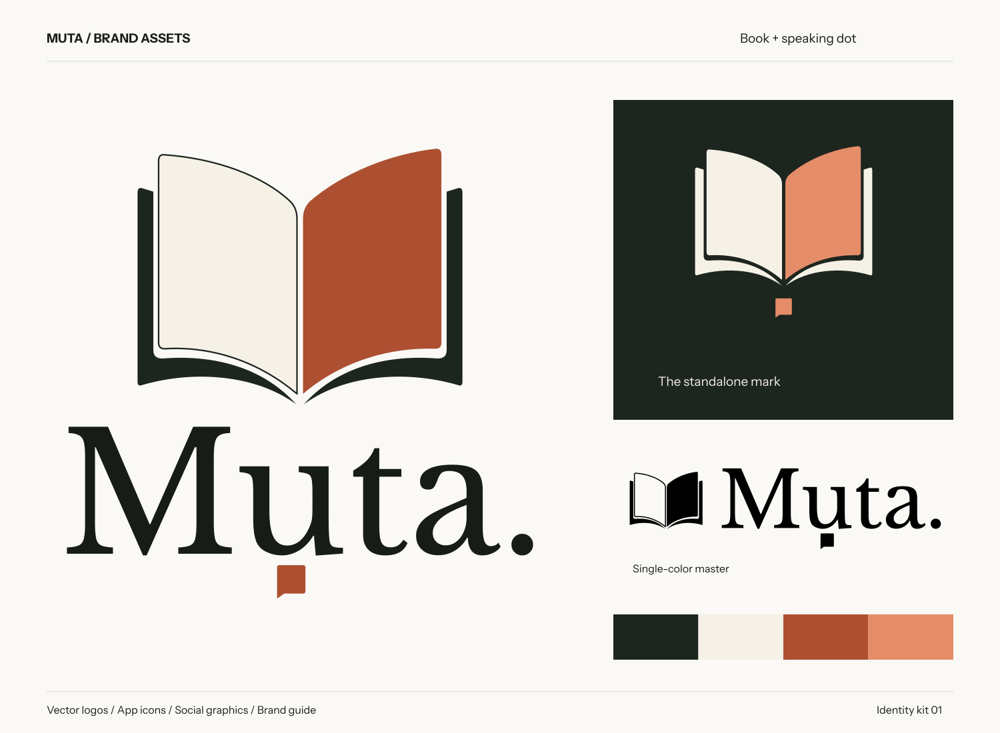

# Muta branding

The selected open-book logo with a compact speaking dot, prepared as reusable vector artwork, raster exports and branded layouts. The square stays beneath the `u` in the wordmark and beneath the book in the standalone symbol.

[Open the visual gallery](index.html) · [Read the brand guide](BRAND-GUIDE.md) · [Asset manifest](manifest.json)



The kit contains 70 artwork exports: 20 logo SVGs and their PNG counterparts, 20 icon files, four SVG/PNG collateral pairs, and an SVG/PNG overview board. The gallery is a local file; the included fonts and images allow it to work without a network connection.

## Main assets

| Asset | Vector | PNG |
|---|---|---|
| Stacked logo on light | [SVG](logos/muta-stacked-on-light.svg) | [PNG](logos/muta-stacked-on-light.png) |
| Horizontal logo on light | [SVG](logos/muta-horizontal-on-light.svg) | [PNG](logos/muta-horizontal-on-light.png) |
| Wordmark on light | [SVG](logos/muta-wordmark-on-light.svg) | [PNG](logos/muta-wordmark-on-light.png) |
| Standalone symbol on light | [SVG](logos/muta-symbol-on-light.svg) | [PNG](logos/muta-symbol-on-light.png) |
| Opaque app master | [SVG](icons/muta-app-master.svg) | [1024 px PNG](icons/muta-app-master.png) |

The [logos/](logos/) folder also includes dark-background, black and white versions. Use [icons/](icons/) for avatars and optical favicons, and [social/](social/) for share cards, square graphics, a wide header and a presentation title background. [tokens.json](tokens.json) and [tokens.css](tokens.css) supply the palette.

Logo exports are transparent; the app master is opaque. Lettering in the logo and collateral SVGs is outlined, so opening them does not require a font installation. Libre Baskerville Regular and Instrument Sans Regular/Bold are bundled in [fonts/](fonts/), together with their OFL licenses, for live text and regeneration.

## Regenerate

The build scripts in [source/](source/) are the editable source of the kit. They require **Python 3.9+**, the Python packages **fonttools** and **Pillow**, and **hb-shape** and **rsvg-convert** on `PATH`.

Run these commands from the repository root with a Python environment that has those dependencies:

```sh
python branding/source/build_assets.py
python branding/source/build_collateral.py
python branding/source/build_manifest.py
```

The working interpreter used for this kit is `/opt/homebrew/opt/python@3.9/bin/python3.9`; substitute that full path for `python` to use the same local environment.

Make geometry, typography or palette changes in [build_assets.py](source/build_assets.py), and layout changes in [build_collateral.py](source/build_collateral.py). Rebuild in the order above so collateral uses the current logos and [build_manifest.py](source/build_manifest.py) records the current exports. Inspect [index.html](index.html), especially the 16/24/32 px icons, transparent variants and dark backgrounds.

Do not hand-edit only one generated logo variant: it will drift from the others and the builder may replace it. Preserve the bundled font licenses when distributing source material.

This package is a clean optical redraw of the [approved concept](reference/approved-concept.png), following [option D in the design exploration](../docs/design-reviews/muta-book-m-sweep-2026-09-12/index.html#d). Preparing this kit does not replace production assets or deploy branding changes.
