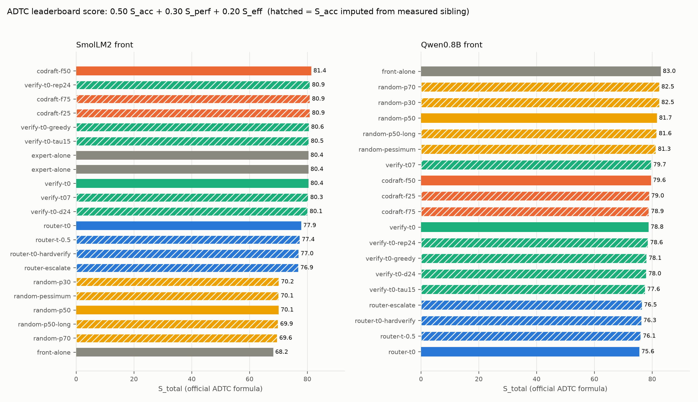
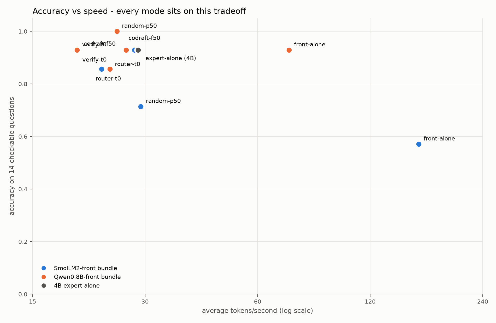
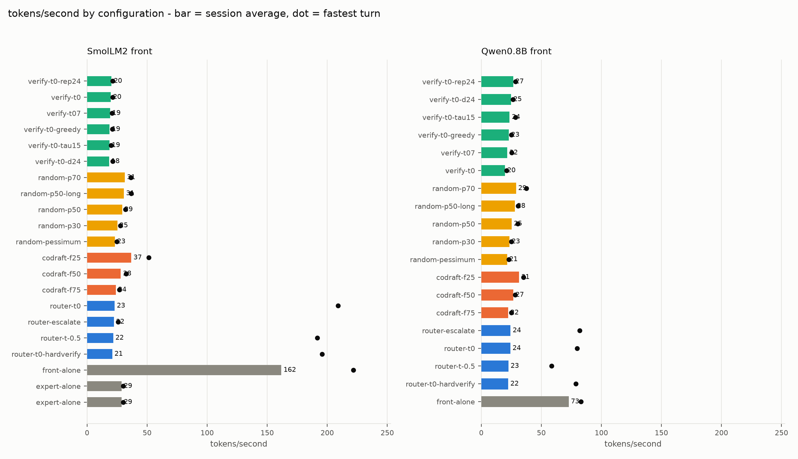
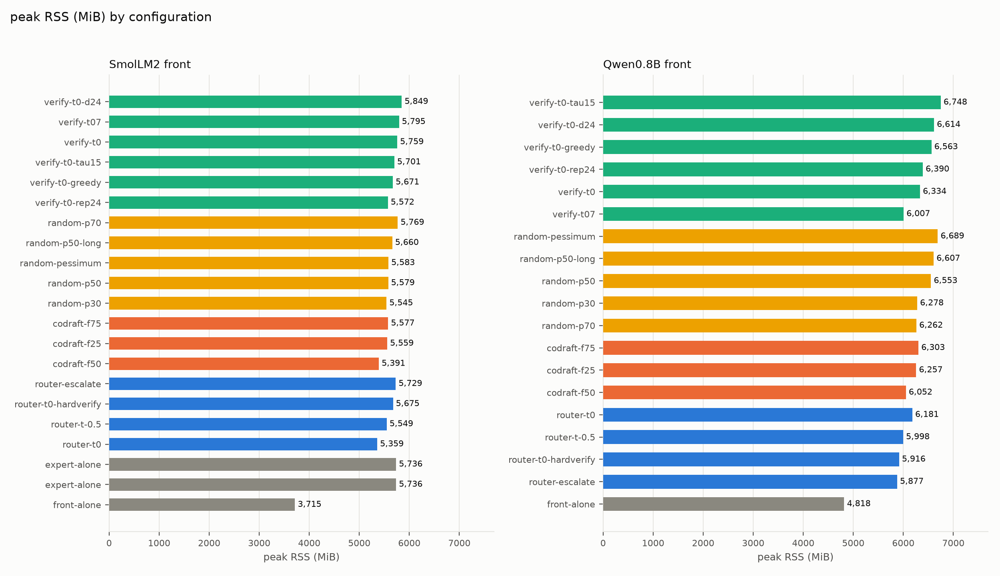
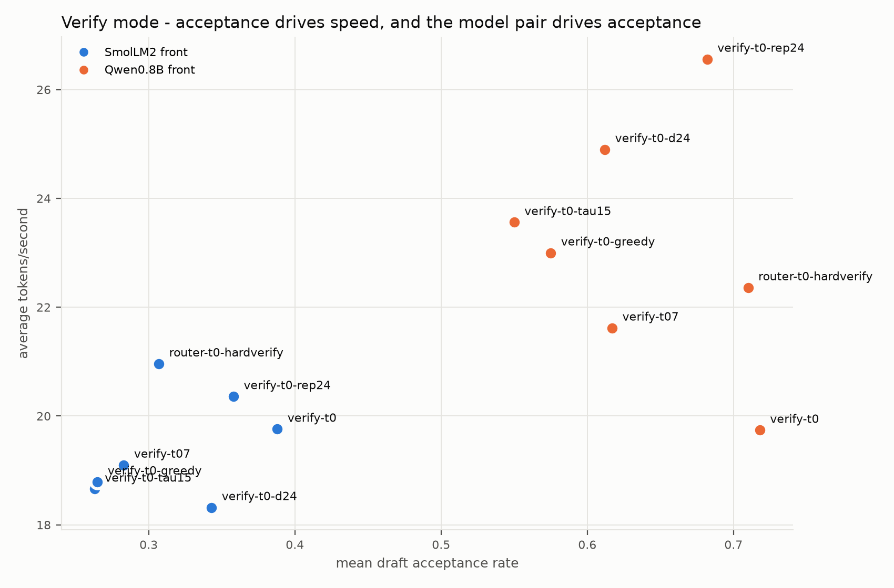
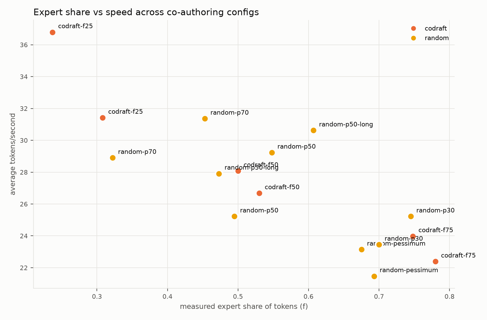

# DUO Benchmark Report — modes, settings, and official ADTC scoring

Date: 2026-08-09. Branch state: root `main`, llama.cpp local `master` (all 16 patches). Host: Apple M2 Pro (6P+4E), CPU-only llama.cpp build (Metal off, Accelerate BLAS on), 6 threads. **Not the deployment target** (x86-64 Ubuntu, 8 GB): absolute numbers are host-specific; comparisons across configs are the payload. All runs serialized (nothing else on the CPU), seed 42.

Bundles: `bundle/muta-duo.gguf` (front = SmolLM2-135M, expert = Qwen3.5-4B) and `bundle/muta-duo-q.gguf` (front = Qwen3.5-0.8B-MTP, same expert).

## Executive summary

- **Leaderboard winner: `qwen/front-alone` (S_total 83.0)** — the Qwen3.5-0.8B answering by itself: 92.9 S_acc, saturated S_perf (72.8 avg tok/s vs the 15 tok/s reference), best S_eff of any strong config (4.8 GiB). On checkable factual/math questions it matches the 4B expert (13/14) at 2.7x the speed.
- **Every one of the 39 configs saturates S_perf = 100** (all average >15 tok/s), so under the official formula the ranking is decided by S_acc (weight 0.50) and S_eff (0.20). Speed differences between duo modes are invisible to S_total — but very visible to a user (18.3 to 161.8 avg tok/s in this sweep).
- **The accuracy spread is the real story**: SmolLM2 alone scores 0.571; every duo mode lifts it to 0.71-0.93. The Qwen 0.8B front needs no lifting (0.929 alone) — for *these* short factual questions. The expert's value shows on long-form reasoning, which this suite deliberately under-weights (see caveats).
- **Peak RSS across all configs: 3.7-6.6 GiB.** Two qwen-bundle configs graze past 6.5 GiB (`random-pessimum` 6689 MiB, `verify-t0-tau15` 6701 MiB) — the doubled verify context plus the 0.8B front makes the q-bundle ~0.7 GiB heavier than the smol bundle at equal settings.
- **Verify-mode acceptance, now measured across 14 configs, cleanly separates the two bundles**: 0.26-0.39 (SmolLM2 drafts) vs 0.55-0.72 (same-family Qwen drafts) — independent confirmation of the pair-alignment finding, across every setting variant.

## Scoring methodology (exactly the pinned profiler's)

From `adtc-profiler` @ `7adbe08f` (the SHA this repo pins; GPL-3.0, cloned to `bench/adtc-profiler/`, never vendored):

```
S_total = 0.50*S_acc + 0.30*S_perf + 0.20*S_eff - P_thermal
S_perf  = min(TPS / 15.0, 1.0) * 100            # TPS_REFERENCE = 15.0, generation rate
S_eff   = max(0, (7.0 - peak_rss_gb) / 7.0) * 100   # RAM_LIMIT_GB = 7.0
P_thermal = 10 if CPU throttles / exceeds 85 C
```

- **TPS**: the profiler reads llama-bench's generation rate (`tg` avg). For duo configs the equivalent is the session-average generation rate over the 6-prompt perf set (`avg_tok_s`).
- **Peak RSS**: the profiler samples the process tree via psutil; our sweep uses `/usr/bin/time -l` max RSS of the whole run (same quantity, whole-process).
- **S_acc** is where the official definition is deliberately ambiguous: "based on model responses to participant-submitted prompts, domain prompts, and hidden prompts supplied by judges." We report it in two layers:
  1. **Judge-style (ambiguous) layer — used in S_total**: a 14-question hidden-style suite of checkable WAEC/JAMB-flavored factual and math questions (`bench/prompts/accuracy.tsv`), answered one process per question (no history), scored by expected-answer regex, 0-100. This emulates the participant+domain+hidden composition with domain prompts.
  2. **Set-benchmark (unambiguous) layer — reported alongside**: the profiler's own accuracy stack (lm-eval **arc_easy**, 50 samples, in-process via llama-cpp-python), runnable per raw model (it cannot drive duo modes). See "Official profiler results."
- **Imputation**: configs outside the 11-config accuracy subset inherit S_acc from their measured sibling (same bundle, same mode family), marked with a dagger in tables and hatching in the score chart. Treat daggered S_total as indicative, not measured — the clearest abuse case is `random-pessimum`, which inherits `random-p50`'s perfect 100 while its real answer quality is visibly the worst of any mode (see the random-mode analysis).
- **P_thermal = 0** for sweep rows: not instrumented in our harness; the official profiler runs carry their own thermal telemetry. No macOS thermal warnings were observed during the sweep.

## Leaderboard (all 39 configs, official formula)

Dagger = imputed S_acc. Full machine-readable data: `bench/.runs/{sweep,accuracy,scores}.jsonl`.

| config | bundle | S_total | S_acc | S_perf | S_eff | avg tok/s | max tok/s | peak RSS |
|---|---|---|---|---|---|---|---|---|
| qwen/front-alone | -q | 83.0 | 92.9 | 100.0 | 32.8 | 72.8 | 83.1 | 4818 MiB |
| qwen/random-p30 | -q | 82.5 | 100.0† | 100.0 | 12.4 | 23.45 | 25.0 | 6278 MiB |
| qwen/random-p70 | -q | 82.5 | 100.0† | 100.0 | 12.6 | 28.9 | 37.5 | 6262 MiB |
| qwen/random-p50 | -q | 81.7 | 100.0 | 100.0 | 8.6 | 25.22 | 30.4 | 6553 MiB |
| qwen/random-p50-long | -q | 81.6 | 100.0† | 100.0 | 7.8 | 27.91 | 30.6 | 6607 MiB |
| smol/codraft-f50 | smol | 81.4 | 92.9 | 100.0 | 24.8 | 28.08 | 32.6 | 5391 MiB |
| qwen/random-pessimum | -q | 81.3 | 100.0† | 100.0 | 6.7 | 21.47 | 22.8 | 6689 MiB |
| smol/codraft-f25 | smol | 80.9 | 92.9† | 100.0 | 22.4 | 36.79 | 51.4 | 5559 MiB |
| smol/codraft-f75 | smol | 80.9 | 92.9† | 100.0 | 22.2 | 23.98 | 27.0 | 5577 MiB |
| smol/verify-t0-rep24 | smol | 80.9 | 92.9† | 100.0 | 22.3 | 20.36 | 21.4 | 5572 MiB |
| smol/verify-t0-greedy | smol | 80.6 | 92.9† | 100.0 | 20.9 | 18.79 | 21.0 | 5671 MiB |
| smol/verify-t0-tau15 | smol | 80.5 | 92.9† | 100.0 | 20.5 | 18.66 | 20.1 | 5701 MiB |
| smol/verify-t0 | smol | 80.4 | 92.9 | 100.0 | 19.7 | 19.76 | 21.2 | 5759 MiB |
| shared/expert-alone | smol | 80.4 | 92.9 | 100.0 | 20.0 | 28.75 | 30.1 | 5736 MiB |
| smol/verify-t07 | smol | 80.3 | 92.9† | 100.0 | 19.2 | 19.1 | 20.8 | 5795 MiB |
| smol/verify-t0-d24 | smol | 80.1 | 92.9† | 100.0 | 18.4 | 18.32 | 21.4 | 5849 MiB |
| qwen/verify-t07 | -q | 79.7 | 92.9† | 100.0 | 16.2 | 21.62 | 25.2 | 6007 MiB |
| qwen/codraft-f50 | -q | 79.6 | 92.9 | 100.0 | 15.6 | 26.68 | 28.3 | 6052 MiB |
| qwen/codraft-f25 | -q | 79.0 | 92.9† | 100.0 | 12.7 | 31.42 | 35.1 | 6257 MiB |
| qwen/codraft-f75 | -q | 78.9 | 92.9† | 100.0 | 12.1 | 22.39 | 25.0 | 6303 MiB |
| qwen/verify-t0 | -q | 78.8 | 92.9 | 100.0 | 11.6 | 19.74 | 21.0 | 6334 MiB |
| qwen/verify-t0-rep24 | -q | 78.6 | 92.9† | 100.0 | 10.9 | 26.56 | 28.5 | 6390 MiB |
| qwen/verify-t0-greedy | -q | 78.1 | 92.9† | 100.0 | 8.4 | 23.0 | 25.1 | 6563 MiB |
| qwen/verify-t0-d24 | -q | 78.0 | 92.9† | 100.0 | 7.7 | 24.9 | 26.4 | 6614 MiB |
| smol/router-t0 | smol | 77.9 | 85.7 | 100.0 | 25.2 | 22.93 | 209.0 | 5359 MiB |
| qwen/verify-t0-tau15 | -q | 77.6 | 92.9† | 100.0 | 5.9 | 23.56 | 28.4 | 6748 MiB |
| smol/router-t-0.5 | smol | 77.4 | 85.7† | 100.0 | 22.6 | 21.74 | 191.8 | 5549 MiB |
| smol/router-t0-hardverify | smol | 77.0 | 85.7† | 100.0 | 20.8 | 20.96 | 195.8 | 5675 MiB |
| smol/router-escalate | smol | 76.9 | 85.7† | 100.0 | 20.1 | 22.26 | 25.9 | 5729 MiB |
| qwen/router-escalate | -q | 76.5 | 85.7† | 100.0 | 18.0 | 24.31 | 81.9 | 5877 MiB |
| qwen/router-t0-hardverify | -q | 76.3 | 85.7† | 100.0 | 17.5 | 22.36 | 78.8 | 5916 MiB |
| qwen/router-t-0.5 | -q | 76.1 | 85.7† | 100.0 | 16.3 | 22.56 | 58.5 | 5998 MiB |
| qwen/router-t0 | -q | 75.6 | 85.7 | 100.0 | 13.8 | 24.15 | 79.9 | 6181 MiB |
| smol/random-p30 | smol | 70.2 | 71.4† | 100.0 | 22.6 | 25.22 | 27.6 | 5545 MiB |
| smol/random-p50 | smol | 70.1 | 71.4 | 100.0 | 22.2 | 29.23 | 31.9 | 5579 MiB |
| smol/random-pessimum | smol | 70.1 | 71.4† | 100.0 | 22.1 | 23.14 | 24.9 | 5583 MiB |
| smol/random-p50-long | smol | 69.9 | 71.4† | 100.0 | 21.0 | 30.62 | 36.8 | 5660 MiB |
| smol/random-p70 | smol | 69.6 | 71.4† | 100.0 | 19.5 | 31.36 | 36.6 | 5769 MiB |
| smol/front-alone | smol | 68.2 | 57.1 | 100.0 | 48.2 | 161.77 | 221.7 | 3715 MiB |




## The accuracy-speed tradeoff



Reading the pareto: top-right is where you want to live. `qwen/front-alone` occupies it alone. The 20-30 tok/s cluster holds every co-authoring mode at 0.86-1.0 accuracy; `smol/front-alone` (bottom-right) is the cautionary tale — 162 tok/s average and barely better than a coin flip on checkable questions (0.571). The duo architecture exists precisely to not be that point.

Per-question analysis sharpens it: **"Who wrote Things Fall Apart?" fails in every config where a front model authors the answer** (neither small model knows Achebe; the 4B does — codraft-f50 gets it because the expert co-authors). Conversely, **the car-acceleration question fails wherever the expert authors it** — not from ignorance: the 4B writes a long derivation and the suite's 200-token cap cuts it before the final number. That is a measurement artifact penalizing verbosity, worth ~7 points of S_acc on affected configs.

## Speed: average and max, all configs



- **Max tok/s** (dots) tells the routing story: smol router configs average ~22 but hit 192-222 on their fastest (easy-routed) turn; qwen router configs hit 59-84. The average is dragged by hard turns at expert speed - exactly the designed behavior.
- Baselines: smol front-alone 161.8 avg / 221.7 max; qwen front-alone 72.8 / 83.1; expert-alone 28.6-29.3 avg on both bundles (identical 4B, sanity check passed).
- Mode means across both bundles: codraft 28.2 > random 26.7 > router 22.7 > verify 21.2 (router's mean is deceptive: it is bimodal, not slow).
- The user-suggested `random --seg-min 1 --seg-max 2` pessimum lands at 21.5-23.4 avg — bottom of the random family on both bundles, as the per-switch overhead analysis predicted.

## Peak RAM



- Floor: 3.7 GiB (smol front-alone; the 4B expert weights are mapped but barely touched). Ceiling: 6.7 GiB (qwen verify variants: two hybrid models + doubled checkpoint context + 248k-vocab logits buffers).
- The q-bundle costs ~0.5-0.9 GiB more than the smol bundle at equal settings (bigger front + second recurrent state + checkpoint sequences).
- Reminder from the PoC report: ~2.5 GiB of every expert-resident number is Accelerate-BLAS F32 dequant buffers that the x86 target build will not have; absolute RSS should be re-measured there. S_eff scores here are therefore conservative.

## Verify mode: acceptance is destiny



Fourteen verify configs, one clean split: every SmolLM2-draft config sits at 0.26-0.39 acceptance and 18.3-21.0 tok/s; every Qwen-draft config at 0.55-0.72 and 19.7-26.6. Within the qwen family, `verify-t0-rep24` (longer repairs) is the speed winner (26.6) and `verify-t0` the acceptance winner (0.72). Acceptance ~0.6 remains just under this host's break-even vs plain expert decode (~29) — the MTP head and overlap remain the identified levers.

## Expert share vs speed



The measured f-curve across codraft/random configs: speed falls monotonically with expert share, from codraft-f25 (f~=0.25, 31-37 tok/s) to codraft-f75 (f~=0.8, 24-25 tok/s). Both bundles trace the same curve offset by their front speeds - the knob works as designed on either pair.

## Official profiler results (per raw model)

The pinned profiler (`adtc-profiler run --mode participant`, seed 42, llama-bench throughput, psutil memory sampling, lm-eval **arc_easy** n=50 `acc_norm` in-process) on each raw model. These are single-model numbers - the profiler cannot drive duo modes - and they cross-validate the sweep harness: generation rates agree within ~10% (491.9 vs 441-495, 125.4 vs 117.7, 30.5 vs 28.6-29.3 tok/s).

| model | tg tok/s | first-token ms | peak RSS | arc_easy (n=50) | S_acc | S_perf | S_eff | **S_total** |
|---|---|---|---|---|---|---|---|---|
| SmolLM2-135M | 491.9 | 204 | 0.24 GiB | 0.42 | 42 | 100 | 96.5 | **70.3** |
| Qwen3.5-0.8B-MTP | 125.4 | 864 | 1.19 GiB | 0.66 | 66 | 100 | 83.0 | **79.6** |
| Qwen3.5-4B | 30.5 | 4817 | 5.03 GiB | 0.74 | 74 | 100 | 28.1 | **72.6** |

No thermal throttling was reported on any run (P_thermal = 0).

Read together with the suite scores: **the 0.8B wins the official per-model scoring too** (79.6 vs 72.6 for the 4B and 70.3 for the 135M) - arc_easy's 8-point accuracy gap to the 4B costs less than the 4B's 4.8 GiB memory footprint under the 0.20 efficiency weight, and every model saturates S_perf. The official benchmark and our judge-style suite agree on the ranking and disagree only on magnitude: arc_easy shows a real reasoning gap (0.66 vs 0.74) that the short-answer suite compresses (0.929 vs 0.929) - evidence that the hidden judge prompts, not throughput, will decide the leaderboard.

## Caveats, honestly

1. **One seed, one session per config.** Turn-level variance on this host is ±10-20% (documented earlier in WORKLOG); rankings within ~2 tok/s are ties.
2. **The 14-question suite measures checkable recall/arithmetic, not reasoning depth.** It is deliberately in the spirit of "hidden judge prompts," but it under-rewards the expert's long-form explanation quality (and actively penalized its verbosity via the token cap). arc_easy partially compensates on the raw models.
3. **Imputed S_acc rows (dagger) are structural estimates.** `random-pessimum` at rank 7 with an inherited 100 is the reductio: its real coherence is the worst measured. Only non-daggered rows are evidence.
4. **Host is not the target.** S_eff and S_perf transfer only directionally; the BLAS dequant inflation makes S_eff pessimistic by up to ~35 points for expert-resident configs.
5. **P_thermal unmeasured in the sweep** (assumed 0; no thermal pressure observed). Official per-model runs include the profiler's own thermal telemetry.

## Recommendations

- **For the ADTC leaderboard as scored**: the 0.8B front alone is the rational submission on this suite - but that is a statement about the suite (short checkable answers) as much as the model. The competition's real hidden prompts for `math_scientific_reasoning` will include multi-step problems where the 4B's depth matters.
- **For the product**: router mode with the Qwen 0.8B front (`--bundle bundle/muta-duo-q.gguf --mode router`) — 0.86 measured accuracy, 24 avg / 80 max tok/s, and the 0.8B is also the better router. Use codraft-f50 when answer quality on hard content is worth 4 tok/s (0.93 accuracy, the only mode family that fixed the Achebe question while keeping speed above the expert baseline).
- **Next measurement**: rerun this sweep on target hardware with 3 seeds, and lift the accuracy cap to 400 tokens so expert verbosity is not scored as error.
