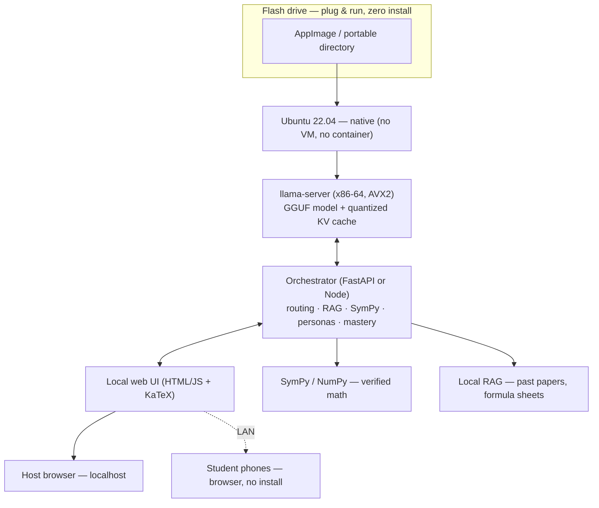

# ADTC 2026 Build Roadmap — Offline Math Tutor

**Window:** Mon 13 Jul → Tue 12 Aug 2026 (31 days, ~4.4 weeks)
**Dev machine:** MacBook Pro M2 Pro, 16 GB (Apple Silicon / ARM64)
**Target machine:** i5 10th–12th gen or Ryzen 5 3000–5000, 8 GB DDR4, integrated graphics, Ubuntu 22.04, no GPU (x86-64)
**Delivery model:** portable app on a flash drive → plug into target → runs zero-shot

Every phase below closes with a **Resources** block, split into *Papers* (the why), *Docs & tools* (the how), and *Video* (the fastest way in). Links are to primary sources; arXiv IDs are given so they stay findable if a URL rots.

---

## 0. Read this first

**One deadline flag before anything else.** Your message sets the target at **12 Aug**, but the README's own "Next Step" says the thin slice tells the full story **by 25 Aug**. That is a 13-day gap, which is enormous on a project this size. This roadmap builds to the *tighter* date (12 Aug) on purpose: if the real submission deadline is 25 Aug, you inherit ~2 weeks of buffer and can pull post-competition items (Lean, more languages, the full learning-twin) forward. Confirm the official ADTC deadline before you commit the calendar — everything downstream keys off it.

**The scoring function is your compass, not a footnote.** Every design argument below traces back to this one line:

$$
S_{\text{total}} = 0.50\,S_{\text{acc}} + 0.30\,S_{\text{perf}} + 0.20\,S_{\text{eff}} - P_{\text{thermal}}
$$

Read it as a budget of where effort buys points. Accuracy is half the score, so correctness work (SymPy routing, RAG, self-consistency) is the highest-leverage engineering you can do. Performance and efficiency together are the other half:

$$
S_{\text{perf}} = 100 \times \frac{\mathrm{TPS}_{\text{act}}}{\mathrm{TPS}_{\text{max}}}, \qquad \mathrm{TPS}_{\text{max}} \approx 15 \text{ (provisional)}
$$

$$
S_{\text{eff}} = 100 \times \frac{7\,\mathrm{GB} - \mathrm{Peak\,RAM}}{7\,\mathrm{GB}}
$$

The efficiency term is why "small model + retrieval + verified tools" beats "big model crammed onto 8 GB": shrinking peak RAM from 4 GB to 3 GB alone lifts $S_{\text{eff}}$ from 42.9 to 57.1, and the freed memory buys you a bigger KV cache or a second sidecar. Meanwhile $P_{\text{thermal}}$ subtracts a flat **−10** the moment the package temperature crosses 85 °C or throttling is flagged — a self-inflicted wound you avoid by capping threads, not by tuning the model.

**Three things are not penalties — they end your run.** An out-of-memory kill, a sandbox execution crash, or an illegal-instruction fault (from compiling with an instruction set the target CPU lacks) is *disqualification*, not lost points. Phase 0 exists entirely to make these three impossible before you write a single feature.

---

## 1. Architecture: what you are actually building

You asked the right question — *application, container, or VM?* — and the answer shapes the flash-drive story, the RAM budget, and the porting workflow all at once. Here is the reasoning, then the stack.

### 1.1 The cross-architecture problem (this is the trap)

Your dev machine and your target are different CPU architectures: the M2 Pro is ARM64 with a Metal GPU and fast unified memory; the target is x86-64 with no usable GPU and slow DDR4. That split has three consequences you must internalize on Day 1.

- **What ports cleanly:** the model file (GGUF is just data), training data, the RAG corpus, all frontend code, all Python orchestration logic, and config. None of these care about CPU architecture.
- **What does *not* port:** the compiled inference binary. A `llama.cpp` build made on your Mac is an ARM64 Mach-O executable; it will not run on Ubuntu x86-64 at all. You must produce an **x86-64 ELF binary**, compiled for the target's instruction set.
- **What is actively misleading:** every performance number from the Mac. The M2 Pro will feel 5–10× faster than the target because of Metal and memory bandwidth. If you tune to Mac numbers you will ship something that scores far worse than you expect. **All $S_{\text{perf}}$ and $S_{\text{eff}}$ numbers in your report must come from the target box via the ADTC profiler — no exceptions.**

The instruction-set point deserves its own warning, because it is a disqualifier. Ryzen 5000 (Zen 3) has **no AVX-512**, and 12th-gen Intel disabled AVX-512 on consumer parts; several 10th–12th-gen chips also vary. So **compile for AVX2 as the baseline**, detect wider instructions at runtime, and never assume AVX-512 — a binary built with `-mavx512` will fault with an illegal instruction on half your target field.

### 1.2 Application — not a container, not a VM

Walk the three options against the 8 GB constraint and the flash-drive story, and only one survives.

- **A VM is out.** It would eat 1–2 GB of your 7 GB budget before the model loads, directly crushing $S_{\text{eff}}$, and it adds boot friction that kills the plug-and-run demo.
- **A container is out *at deployment*.** Docker demands the daemon be installed on the target (it usually isn't on a fresh classroom laptop), the image is architecture-specific anyway, and "install Docker first" breaks zero-shot. Keep containers only for *dev-side* reproducibility and CI builds.
- **A portable native application wins.** Package the x86-64 binaries plus the model, corpus, and web UI as an **AppImage** (or a self-contained portable directory) on the flash drive. Plug in, run one command, done — no install, no daemon, no VM.

### 1.3 The stack, top to bottom

The natural design falls out of `llama.cpp` shipping an HTTP server with an OpenAI-compatible API. The host laptop runs the model; a browser is the only client anyone needs — which means the **shared-laptop classroom mode (Section 7) is free**: the same server that answers the host's browser answers thirty phones on the LAN.

Read the layers in dependency order: the flash drive carries a portable app; the app runs natively on Ubuntu; `llama-server` hosts the GGUF model behind a localhost API; a thin orchestrator sits between the model and the UI doing the actual *product* work (deciding when to call SymPy, retrieving from RAG, assembling the persona prompt, tracking mastery); and the browser renders it for host and phones alike. That orchestrator is where pedagogy lives — the model is a component inside it, not the whole app.

### 1.4 Can you build on the Mac and port? Yes, with one discipline

Build *logic* on the Mac freely — it is your fast iteration loop for the orchestrator, UI, RAG, and SymPy routing, all of which are architecture-agnostic. But produce the **shippable binary and every benchmark on x86-64**. The clean way to do that without owning a second machine full-time is CI: GitHub Actions' `ubuntu-latest` runners *are* x86-64, so let them compile the AVX2 `llama.cpp` build and package the AppImage on every push. You get a reproducible, correctly-architected artifact without ever trusting a Mac binary — which also seeds the README's "offline signed-patch updates" ambition.

**Resources for the architecture layer**
- *Docs & tools:* [llama.cpp (ggml-org/llama.cpp)](https://github.com/ggml-org/llama.cpp) — build system, `llama-server`, GGUF; [AppImage packaging](https://docs.appimage.org/) and [`linuxdeploy`](https://github.com/linuxdeploy/linuxdeploy); [Hugging Face GGUF format docs](https://huggingface.co/docs/hub/gguf); [GitHub Actions Ubuntu runners](https://docs.github.com/actions/using-github-hosted-runners/about-github-hosted-runners).
- *Video:* Andrej Karpathy, **"Deep Dive into LLMs like ChatGPT"** (~3.5 h; full chapter list at [Class Central](https://www.classcentral.com/course/youtube-deep-dive-into-llms-like-chatgpt-428188)) — the single best mental model of the whole pipeline before you touch code.

---

## 2. The roadmap

Dependency-ordered, matching the README's own layering (Constraint → Model → Inference → Correctness → Pedagogy → Exam → Interface → Distribution). Phases overlap on purpose — the overlap columns are where a two- or three-person team parallelizes (see §4).

### Phase 0 — De-risk the foundation · **13–16 Jul (Days 1–4)**

*Goal: make the three disqualifiers impossible before writing feature code.*

1. **Procure a target-class x86-64 box (13 Jul, Day 1).** Ranked options: (a) a physical 8 GB i5/Ryzen laptop on Ubuntu 22.04 — best, because it doubles as your profiler and demo machine with real thermals and battery; (b) a cloud x86-64 VM capped near 8 GB — fine for correctness and RAM, useless for thermal/battery; (c) Docker `--platform linux/amd64` on the Mac (Rosetta/QEMU) — build-correctness smoke tests only, far too slow to trust for speed.
2. **Stand up the cross-arch build pipeline (13–14 Jul, Days 1–2).** GitHub Actions `ubuntu-latest` → CMake build of `llama.cpp` with **AVX2 baseline** → artifact = the x86-64 binary and a first AppImage. This retires the "built on Mac, won't run on target" risk permanently.
3. **Post the golden rule where the team sees it (14 Jul, Day 2).** *Mac numbers are directional for correctness only; every score comes from the target box.*
4. **Run the ADTC profiler on a stock model (15–16 Jul, Days 3–4).** Load a known-good small GGUF (e.g. a 1.5B-class Q4 model) via `llama-server`, run the profiler, and record baseline TPS / peak RAM / temperature. This calibrates what $S_{\text{perf}}$ and $S_{\text{eff}}$ realistically look like *on your hardware*.

**Resources**
- *Docs & tools:* [llama.cpp build guide](https://github.com/ggml-org/llama.cpp/blob/master/docs/build.md); [`llama-server` README](https://github.com/ggml-org/llama.cpp/tree/master/tools/server); [AppImage docs](https://docs.appimage.org/); the **ADTC local profiler + rules** on the [Devpost page](https://adtc-2026.devpost.com/); [Intel AVX-512 support notes](https://www.intel.com/content/www/us/en/support/articles/000058054/processors.html) (confirm your exact target CPUs).
- *Background:* [GGUF / quantization type naming (`Q4_K_M`, `Q8_0`, …)](https://huggingface.co/docs/hub/gguf).

### Phase 1 — Model + inference baseline · **16–21 Jul (Days 4–9)**

*Goal: pick the model that maximizes accuracy-per-GB on the target, served through a stable API.*

5. **Build the bake-off harness (16–17 Jul).** Validation set = ADTC-provided math/reasoning validation + a WASSCE past-paper subset. Score each candidate on **accuracy AND TPS AND peak RAM on the target box** — one command, one table row per model.
6. **Run the bake-off (17–20 Jul).** Candidates: Qwen3 (0.6B / 1.7B / 4B), Phi-4-mini (3.8B) and Phi-4-mini-reasoning, DeepSeek-R1-Distill-Qwen-1.5B, a small Gemma. Score on **accuracy ÷ GB**, not raw accuracy. Note two facts from the model reports that matter here: DeepSeek's R1-Distill-Qwen-1.5B posts strong MATH scores for its size (it reports beating far larger general models on math), and Phi-4-mini-reasoning reaches ~o1-mini-level MATH-500 at 3.8B — but reasoning distills "think" out loud, spending tokens and KV-cache RAM, so they can win accuracy while *losing* $S_{\text{perf}}$. Quantify both. (The field moves monthly; re-check for newer small reasoning models the week you run this.)
7. **Lock the inference server (20–21 Jul).** Freeze `llama-server` with the OpenAI-compatible API; confirm the web UI answers on localhost *and* over the LAN from a phone.

**Resources**
- *Papers / model reports:* [Qwen3 Technical Report (arXiv:2505.09388)](https://arxiv.org/abs/2505.09388) + [Qwen3 blog](https://qwenlm.github.io/blog/qwen3/); [Phi-4-Mini Technical Report (arXiv:2503.01743)](https://arxiv.org/abs/2503.01743) and [Phi-4-Mini-Reasoning (arXiv:2504.21233)](https://arxiv.org/abs/2504.21233); [DeepSeek-R1 (arXiv:2501.12948)](https://arxiv.org/abs/2501.12948).
- *Docs & tools:* model cards — [Qwen3-0.6B](https://huggingface.co/Qwen/Qwen3-0.6B), [Qwen3-4B](https://huggingface.co/Qwen/Qwen3-4B), [DeepSeek-R1-Distill-Qwen-1.5B](https://huggingface.co/deepseek-ai/DeepSeek-R1-Distill-Qwen-1.5B); [Unsloth "What model should I use?"](https://unsloth.ai/docs/get-started/fine-tuning-llms-guide) model directory; [`emmanuelalo52/QWEN0.6B`](https://github.com/emmanuelalo52/QWEN0.6B) to understand small-Qwen internals; [`llama-server` API reference](https://github.com/ggml-org/llama.cpp/tree/master/tools/server).

### Phase 2 — Inference optimization · **21–26 Jul (Days 9–14)**

*Goal: raise $S_{\text{perf}}$ and $S_{\text{eff}}$ without breaking accuracy; every change logged before/after (feeds the Section 9 table).*

8. **Climb the quantization ladder (21–23 Jul).** FP16 → Q8_0 → Q4_K_M, measuring the accuracy cliff at each rung; then **adaptive precision** — Q4 for arithmetic (harmless error), Q8 for multi-step proofs (where error corrupts intermediate steps). If time allows, test AWQ / quant-aware training.
9. **Quantize the KV cache (23–24 Jul).** The *biggest hidden RAM cost*; 8-bit KV reclaims a large slice of the 7 GB budget → higher $S_{\text{eff}}$. Measure accuracy impact.
10. **Tune runtime knobs (24 Jul).** `mmap` loading, context-length trimming, and a **thread cap** to stay under the 85 °C throttle line — a scoring decision, not a nicety.
11. **Speculative decoding + stretch tricks (24–26 Jul).** Pair a tiny draft model with the main model; measure TPS. Add MTP if the model supports it; treat pruning as stretch. Log each with/without.

**Resources**
- *Papers — speculative decoding:* [Leviathan et al., *Fast Inference from Transformers via Speculative Decoding* (arXiv:2211.17192)](https://arxiv.org/abs/2211.17192); [Chen et al., *Accelerating LLM Decoding with Speculative Sampling* (arXiv:2302.01318)](https://arxiv.org/abs/2302.01318); modern draft-tree variants [EAGLE-2 (arXiv:2406.16858)](https://arxiv.org/abs/2406.16858) and [EAGLE-3 (arXiv:2503.01840)](https://arxiv.org/abs/2503.01840); [Gloeckle et al., *Multi-token Prediction* (arXiv:2404.19737)](https://arxiv.org/abs/2404.19737).
- *Papers — quantization:* [AWQ (arXiv:2306.00978)](https://arxiv.org/abs/2306.00978) + [mit-han-lab/llm-awq](https://github.com/mit-han-lab/llm-awq); [GPTQ (arXiv:2210.17323)](https://arxiv.org/abs/2210.17323); [LLM.int8() (arXiv:2208.07339)](https://arxiv.org/abs/2208.07339); [SmoothQuant (arXiv:2211.10438)](https://arxiv.org/abs/2211.10438).
- *Docs & tools:* [nor-blog quantization walkthrough](https://nor-blog.pages.dev/posts/2025-05-14-quantization/); [microsoft/BitNet (bitnet.cpp)](https://github.com/microsoft/BitNet); KV-cache + `mmap` flags in the [llama.cpp server docs](https://github.com/ggml-org/llama.cpp/tree/master/tools/server); [Hugging Face quantization overview](https://huggingface.co/docs/transformers/main/en/quantization/overview). Kernel-worklog shelf from your README for AVX intuition (transfers to CPU even with no GPU to deploy).

### Phase 3 — Correctness + fine-tune · **24–31 Jul (Days 12–19, parallel with Phase 2 tail)**

*Goal: make math answers trustworthy — half the score lives here.*

12. **SymPy/NumPy tool-routing (24–26 Jul) — do this first, cheapest accuracy in the project.** Detect arithmetic/algebra/calculus intent, compute the exact result with SymPy, and have the model *narrate* the verified answer. A model that routes $\int x^2 e^x\,dx$ to SymPy cannot hallucinate the antiderivative.
13. **Local RAG (26–28 Jul).** Lightweight embeddings + a small FAISS index over past papers, worked solutions, formula sheets. Grounding raises $S_{\text{acc}}$ and lets the base model stay small (helps $S_{\text{eff}}$). Keep the corpus lean.
14. **Self-consistency pass (28–29 Jul).** For hard problems already routed to 8-bit, solve twice and check agreement. (Same "parallel test-time compute / Majority@N" idea that lifts small models in the Phi-4-mini-reasoning report.)
15. **Minimal LoRA fine-tune (29–31 Jul) — scope it tightly.** Fine-tune for **exam format and Socratic style**, *not* raw math correctness (SymPy owns that). Fine-tuning is far faster on GPU, so run it on the **Udutech credits or a Colab GPU**, then export the merged model to GGUF for CPU inference. (Unsloth's docs now list Intel/CPU/Mac support in addition to NVIDIA — confirm the current backend, but the cloud GPU is still the sane fast path in this window.)
16. **Safety guardrails (31 Jul).** Educational-only mode, age-appropriate calibration, misinformation and medical/science-claim boundaries.

**Resources**
- *Papers:* [Lewis et al., *Retrieval-Augmented Generation* (arXiv:2005.11401)](https://arxiv.org/abs/2005.11401); [Wang et al., *Self-Consistency* (arXiv:2203.11171)](https://arxiv.org/abs/2203.11171) and the underlying [*Chain-of-Thought Prompting* (arXiv:2201.11903)](https://arxiv.org/abs/2201.11903); [LoRA (arXiv:2106.09685)](https://arxiv.org/abs/2106.09685) and [QLoRA (arXiv:2305.14314)](https://arxiv.org/abs/2305.14314).
- *Docs & tools:* [SymPy docs](https://docs.sympy.org/latest/index.html) (solving, calculus, simplify); [FAISS](https://github.com/facebookresearch/faiss) + [Sentence-Transformers (SBERT)](https://www.sbert.net/); [Unsloth fine-tuning guide](https://unsloth.ai/docs/get-started/fine-tuning-llms-guide) and [LoRA hyperparameter guide](https://unsloth.ai/docs/get-started/fine-tuning-llms-guide/lora-hyperparameters-guide); [unslothai/unsloth](https://github.com/unslothai/unsloth). For a tiny local embedder to keep RAM low, see Unsloth's [embedding fine-tuning](https://unsloth.ai/docs/basics/embedding-finetuning) (EmbeddingGemma-300M class).

> **Scope call on Lean 4.** Full Lean 4 + Mathlib + Lean Copilot proof automation on an 8 GB CPU box inside this window is unrealistic — Mathlib is enormous (180k+ theorems) and the learning curve is steep. Mark it **post-competition**. If you want a proof-verification *moment* in the demo, ship a handful of pre-verified proofs and show the checker confirming them; do not attempt live Mathlib automation on target hardware. Read the ecosystem now so the team is ready to build it after: [LeanDojo (arXiv:2306.15626)](https://arxiv.org/abs/2306.15626) and [leandojo.org](https://leandojo.org/); [Lean Copilot (arXiv:2404.12534)](https://arxiv.org/abs/2404.12534) and [lean-dojo/LeanCopilot](https://github.com/lean-dojo/LeanCopilot); Yang et al.'s survey *Formal Mathematical Reasoning: A New Frontier in AI* (2024) — which frames exactly the gap your project sits in.

### Phase 4 — Pedagogy + exam-prep thin slice · **28 Jul–5 Aug (Days 16–24)**

*Goal: the thin slice of Sections 4–5 that tells the whole story — two modes, one exam.*

17. **Two modes only for MVP (28–31 Jul).** Socratic tutor ("what do we know first?") and subgoal worked-solutions — showcase the latter with the README's integration-by-parts example, which is correct and clean:

$$
\int x^2 e^x\,dx = x^2 e^x - 2\int x e^x\,dx, \qquad \int x e^x\,dx = x e^x - e^x + C
$$

$$
\Rightarrow \ \int x^2 e^x\,dx = e^x\bigl(x^2 - 2x + 2\bigr) + C
$$

18. **Minimal curriculum graph (31 Jul–2 Aug).** A small prerequisite DAG (algebra → quadratics → calculus) — enough nodes to demo "diagnose weak spot → next lesson." The full learning-twin is later.
19. **One exam: WAEC/WASSCE math (2–5 Aug).** Question generator (item + worked solution + marking scheme), past-question tutor with common-mistake notes, one adaptive 7-day plan for a single weak topic (e.g. the chain rule).
20. **One "inspire first" flagship moment (5 Aug).** Open a concept the way Veritasium would — a speedometer → the derivative → "this is the gradient that trains modern AI."

**Resources**
- *Evidence base (this is also your pitch ammunition):* J-PAL, [Teaching at the Right Level](https://www.povertyactionlab.org/evidence-effect/teaching-at-the-right-level) and the [TaRL case study](https://www.povertyactionlab.org/case-study/teaching-right-level-improve-learning); [teachingattherightlevel.org](https://teachingattherightlevel.org/); [Pratham TaRL](https://www.pratham.org/about/teaching-at-the-right-level/). Headline stat worth quoting: Youth Impact reports TaRL delivering ~[1.85 years of learning gains in a 30-hour program across 11 RCTs](https://www.youth-impact.org/teaching-at-the-right-level), and GEEAP named it a "best buy" intervention.
- *Existence proof:* [Cartesian.app](https://cartesian.app) — offline interactive learning on near-ADTC hardware.

### Phase 5 — Interface + shared-laptop demo · **1–8 Aug (Days 20–27)**

*Goal: a bare but real UI, plus the moment judges remember.*

21. **Bare web UI (1–4 Aug).** Chat + KaTeX/MathJax math rendering + a stub interactive canvas. Adaptive-UI = one or two toggles (language, difficulty), not the full "change me" system.
22. **Shared-laptop mode (4–7 Aug) — the differentiator.** `llama-server` + LAN discovery; phones join by browser, zero install. This *is* the "Best African Use Case" argument.
23. **Multilingual thin slice (6–7 Aug).** English + one African language (Yoruba or Swahili) with *locally grounded* examples — markets, farming, transport.
24. **Voice, only if the core is solid (7–8 Aug, stretch).** On-device STT → model → offline TTS.

**Resources**
- *Papers:* [Moonshine (arXiv:2410.15608)](https://arxiv.org/abs/2410.15608) — 5× less compute than Whisper-tiny, edge-optimized STT. (If you need many languages on-device, weigh Moonshine's mono-lingual "Flavors" against a 52-language on-device ASR like Qwen3-ASR-0.6B.)
- *Docs & tools:* [`moonshine-ai/moonshine`](https://github.com/moonshine-ai/moonshine); [KaTeX](https://katex.org/) / [MathJax](https://www.mathjax.org/); [`llama-server` host/LAN serving](https://github.com/ggml-org/llama.cpp/tree/master/tools/server); [OpenClaw](https://openclaw.ai) as proof that "talk to your tutor via a chat app" works with zero cloud; adaptive-UI references from your README ([Claude Dispatch](https://www.oneusefulthing.org/p/claude-dispatch-and-the-power-of), [YC Dynamic Software Interfaces](https://www.ycombinator.com/rfs)).

### Phase 6 — Package, report, rehearse · **7–12 Aug (Days 26–31)**

*Goal: a zero-shot flash-drive deliverable, the report, and a rehearsed demo.*

25. **Package and test on a virgin machine (7–9 Aug).** Build the AppImage / portable dir on the flash drive; run it on a *clean* Ubuntu box with no dev tools. A fresh target is the only honest test of zero-shot.
26. **Final profiler run + fill the report table (9–10 Aug).** Real target numbers; compute $S_{\text{total}}$:

| Optimization | Before | After |
|---|---|---|
| FP16 → INT4 quantization | baseline RAM | reduced RAM |
| KV-cache quantization | baseline latency | reduced latency |
| Speculative decoding | baseline TPS | increased TPS |
| Model pruning | baseline size | reduced size |

27. **Write the report + open-source the repo (10–11 Aug).** Use the ADTC template; document constraints, rejected alternatives, and why (the §1 reasoning above is most of this).
28. **Rehearse the live demo + lock the story (11–12 Aug).** Judges connect phones; narrate energy consumption across the session; land the story — Cambridge, HCI/UDO as TARL proof, the shared-laptop moment.
29. **Buffer (11–12 Aug).** Contingency only. Ship nothing new here.

**Resources**
- *Docs & tools:* [AppImage packaging](https://docs.appimage.org/) + [`linuxdeploy`](https://github.com/linuxdeploy/linuxdeploy); the **ADTC report template + rules** on [Devpost](https://adtc-2026.devpost.com/). Presentation reference video from your README for delivery energy.

---

## 3. What you are deliberately NOT building before 12 Aug

Cutting is a design act. Everything here is real value, sequenced *after* the competition so it doesn't sink the MVP: the full per-student learning-twin; full Lean 4 + Mathlib proof automation; all nine languages (ship two); every exam board (ship WAEC/WASSCE math); the full persona set (ship Socratic + subgoal); voice as a hard requirement (stretch); the teacher dashboard and offline signed-patch updates — exactly as your README already flags.

## 4. Team split (parallel workstreams)

Three lanes running at once. **Lane A (systems):** Phases 0, 2, 6 — build pipeline, quantization, packaging, profiler. **Lane B (ML/correctness):** Phases 1, 3 — bake-off, SymPy routing, RAG, fine-tune. **Lane C (product):** Phases 4, 5 — pedagogy modes, exam generator, UI, shared-laptop demo. Critical path is A→B→C; a blocked lane pulls from the "Resources" lists so no one idles.

## 5. Risk register — the disqualifiers, in priority order

1. **OOM kill / sandbox crash → disqualification.** Profile peak RAM every commit; keep hard headroom under 7 GB; quantize the KV cache early.
2. **Illegal instruction on target → crash.** AVX2 baseline, runtime feature detection, test on real x86-64, never `-mavx512`.
3. **Thermal −10.** Cap threads, tune the governor, verify temperature in every profiler run.
4. **Trusting Mac benchmarks → shipping something slow.** Target numbers only.
5. **Zero-shot fails on a clean machine.** The virgin-machine test in Step 25, not on 12 Aug.

---

## Appendix — Master Resource Index

### Foundational understanding (watch/read first)
- Andrej Karpathy, **"Deep Dive into LLMs like ChatGPT"** — full pipeline, ~3.5 h ([chapters](https://www.classcentral.com/course/youtube-deep-dive-into-llms-like-chatgpt-428188)).
- Karpathy, **"Let's build GPT from scratch"** + [nanoGPT](https://github.com/karpathy/nanoGPT) — if anyone on the team wants transformer internals hands-on.
- 3Blue1Brown, **Neural Networks** series (incl. "But what is a GPT?") — the best visual intuition for attention.

### Papers by layer
| Layer | Paper | ID |
|---|---|---|
| Speculative decoding | Leviathan et al., *Fast Inference via Speculative Decoding* | [2211.17192](https://arxiv.org/abs/2211.17192) |
| Speculative decoding | Chen et al., *Accelerating LLM Decoding w/ Speculative Sampling* | [2302.01318](https://arxiv.org/abs/2302.01318) |
| Speculative decoding | EAGLE-2 / EAGLE-3 (draft trees) | [2406.16858](https://arxiv.org/abs/2406.16858) / [2503.01840](https://arxiv.org/abs/2503.01840) |
| Faster decoding | Gloeckle et al., *Multi-token Prediction* | [2404.19737](https://arxiv.org/abs/2404.19737) |
| Quantization | Lin et al., *AWQ* | [2306.00978](https://arxiv.org/abs/2306.00978) |
| Quantization | Frantar et al., *GPTQ* | [2210.17323](https://arxiv.org/abs/2210.17323) |
| Quantization | Dettmers et al., *LLM.int8()* | [2208.07339](https://arxiv.org/abs/2208.07339) |
| Quantization | Xiao et al., *SmoothQuant* | [2211.10438](https://arxiv.org/abs/2211.10438) |
| Correctness | Lewis et al., *Retrieval-Augmented Generation* | [2005.11401](https://arxiv.org/abs/2005.11401) |
| Correctness | Wang et al., *Self-Consistency* | [2203.11171](https://arxiv.org/abs/2203.11171) |
| Reasoning | Wei et al., *Chain-of-Thought Prompting* | [2201.11903](https://arxiv.org/abs/2201.11903) |
| Fine-tuning | Hu et al., *LoRA* / Dettmers et al., *QLoRA* | [2106.09685](https://arxiv.org/abs/2106.09685) / [2305.14314](https://arxiv.org/abs/2305.14314) |
| Proof (post-comp) | Yang et al., *LeanDojo* / Song et al., *Lean Copilot* | [2306.15626](https://arxiv.org/abs/2306.15626) / [2404.12534](https://arxiv.org/abs/2404.12534) |
| Speech | Jeffries et al., *Moonshine* | [2410.15608](https://arxiv.org/abs/2410.15608) |

### Model reports
- Qwen3 [2505.09388](https://arxiv.org/abs/2505.09388) · Phi-4-mini [2503.01743](https://arxiv.org/abs/2503.01743) / Phi-4-mini-reasoning [2504.21233](https://arxiv.org/abs/2504.21233) · DeepSeek-R1 [2501.12948](https://arxiv.org/abs/2501.12948)

### Docs & tooling
- Inference/runtime: [llama.cpp](https://github.com/ggml-org/llama.cpp) · [llama-server](https://github.com/ggml-org/llama.cpp/tree/master/tools/server) · [GGUF](https://huggingface.co/docs/hub/gguf) · [BitNet](https://github.com/microsoft/BitNet) · [AWQ](https://github.com/mit-han-lab/llm-awq)
- Fine-tuning: [Unsloth docs](https://unsloth.ai/docs) · [unslothai/unsloth](https://github.com/unslothai/unsloth)
- Correctness/RAG: [SymPy](https://docs.sympy.org/latest/index.html) · [FAISS](https://github.com/facebookresearch/faiss) · [SBERT](https://www.sbert.net/)
- Proof (post-comp): [leandojo.org](https://leandojo.org/) · [LeanCopilot](https://github.com/lean-dojo/LeanCopilot)
- Interface/speech: [KaTeX](https://katex.org/) · [Moonshine](https://github.com/moonshine-ai/moonshine) · [OpenClaw](https://openclaw.ai)
- Packaging: [AppImage](https://docs.appimage.org/) · [linuxdeploy](https://github.com/linuxdeploy/linuxdeploy)
- Competition: [ADTC 2026 Devpost](https://adtc-2026.devpost.com/) (profiler, rules, report template)

### Pedagogy & evidence
- J-PAL [TaRL evidence](https://www.povertyactionlab.org/evidence-effect/teaching-at-the-right-level) · [case study](https://www.povertyactionlab.org/case-study/teaching-right-level-improve-learning) · [TaRL Africa](https://teachingattherightlevel.org/) · [Pratham](https://www.pratham.org/about/teaching-at-the-right-level/) · [Youth Impact stat](https://www.youth-impact.org/teaching-at-the-right-level) · [Cartesian.app](https://cartesian.app)

---

*Sequenced to the README's dependency order. Confirm the official ADTC deadline first — if it is 25 Aug, pull Lean, a third language, and the learning-twin forward into the extra fortnight.*